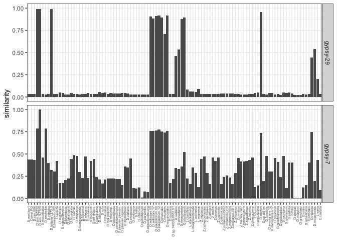

01-origin-gypsy7/29
================
roko
8/28/2023

# The Repeat Library

Just the sequences of gypsy7 and gypsy29

``` bash
# first minor formatting issue
fasta-reader.py seqs-gypsy.fasta |fasta-writter.py > seqs-rm.fasta
head seqs-rm.fasta
# >gypsy-7
#TATGAGTGTGAGGCATTTCGCAGGAATGTTATTTCATCATTATTTGGCAATTGCATCAGCCTTTAATTGAGTTGCGATTG
#GCTGATGGCATTTGGTAGTTTTGGAAGGTACCGTTTTAGCGCGGCGACAGCGCCACAACGCTGTCGCCGAGCGTGGTTCG
#ATGGTAGGCACAAAAGAAGAAGTGTGCGACGCAAGTCAGTTCAATTCTAGACTTCGACCACCGAAACTCGCTGCGCGATT
#....
# which sequences + length
fasta-reader.py seqs-rm.fasta |fasta-length.py
#gypsy-7    5087
#gypsy-29   6634
```

# RepeatMask

## Droso

``` bash
for i in *.fa; do RepeatMasker -pa 20 -no_is -s -nolow -dir out-gypsy -lib replib-gypsy/seqs-rm.fasta $i;done 
```

## Self masking to get the max score for each TE

``` bash
RepeatMasker -pa 20 -no_is -s -nolow -dir selfmask -lib seqs-rm.fasta seqs-rm.fasta
```

## 99 insects

``` bash
for i in *.fa; do RepeatMasker -pa 20 -no_is -s -nolow -dir out-gypsy -lib replib-gypsy/seqs-rm.fasta $i;done
```

# Process (merge and score)

## Merge Droso

``` bash
 awk '{print $0,FILENAME}' *.ori.out|perl -pe 's/\.fa\.ori\.out//' >tmp-merged-101.ori.out
 # merge with self
 cat tmp-merged-101.ori.out ../replib-gypsy/selfmask/self.ori.out > merged-101-self.ori.out
```

## score

``` bash
python ../process-score.py --rm merged-101-self.ori.out > Droso.score
```

# Visualize

## Droso

``` r
sortorder<-c( 
  # melanogaster group
  "D.mel.Iso1","D.mel.Pi2","D.sim.006","D.sim.SZ232","D.sim.SZ129","D.mauritiana","D.sechellia", "D.yakuba", "D.teissieri.273.3","D.teissieri.ct02","D.erecta", # melanogaster subgroup
  "D.eugracilis", "D.subpulchrella", "D.biarmipes", "D.takahashii", "D.ficusphila", # several subroups
  "D.carrolli", "D.rhopaloa","D.kurseongensis", "D.fuyamai", #  rhopaloa subgroup
  "D.elegans", "D.oshimai", # elegans + suzuki subgroups
  "D.bocqueti","D.aff.chauv.","D.jambulina","D.kikkawai","D.rufa","D.triauraria", # montium subgroup
  "D.mal.pallens", "D.mal.mal.","D.bipectinata","D.parabipectinata","D.pseuan.pseuan.","D.pseuan.nigrens","D.ananassae","D.varians","D.ercepeae", # ananase subgroup
  # obscura group
  "D.ambigua","D.tristis", "D.obscura","D.subobscura", # obscura subgroup
  "D.persimilis", "D.pseudoobscura", # pseudoobscura subgroup
  # willistoni group 
  "D.willistoni.00","D.willistoni.17","D.paulistorum.06","D.paulistorum.12","D.tropicalis","D.insularis", "D.equinoxialis", # willistoni subgroup
  # saltans group
  "D.sucinea", "D.sp.14030-0761.01","D.saltans","D.prosaltans", # bocainensis + saltans subgroups
  "D.neocordata","D.sturtevanti", # neocordata + sturtevanti subgroup
  ### Lordiphosa (group?)
  "L.clarofinis", "L.stackelbergi","L.magnipectinata", # miki subgroup
  "L.collinella", "L.mommai", # fenestrarum + ? subgroup
  ### Zaprionus (group?)
  "Z.nigranus","Z.camerounensis","Z.lachaisei","Z.vittiger","Z.davidi","Z.taronus","Z.capensis", # vittiger subgroups
  "Z.gabonicus","Z.indianus.BS02","Z.indianus.D18","Z.indianus.R04","Z.indianus.V01","Z.africanus","Z.ornatus", # vittiger subgroup
  "Z.tsacasi.car7","Z.tsacasi.jd01t", # tuberculatus    subgroup
  "Z.kolodkinae", "Z.inermis","Z.ghesquierei", # inermis subgroup
  # D. cardini group
  "D.dunni","D.arawakana","D.cardini", # dunni + cardini subgroup
  # D. funebris group
  "D.sp.st01m","D.funebris",
  # D. immigrans group
  "D.immigrans.12","D.immigrans.k17","D.pruinosa","D.quadrilineata",
  # D. tumiditarsus group
  "D.repletoides",
  # Scaptomyza (group?)
  "S.montana","S.graminum","S.pallida","S.hsui",
  # Hawaiian Droso
  "D.sproati","D.murphyi","D.grimshawi",
  # D.virilis group
  "D.virilis","D.americana","D.littoralis",
  # D.repleta group
  "D.repleta","D.mojavensis",
  # genus Leucophengia
  "L.varia",
  # genus Chymomyza
  "C.costata"
)

library(tidyverse)
```

    ## ── Attaching packages ─────────────────────────────────────── tidyverse 1.3.1 ──

    ## ✔ ggplot2 3.3.6     ✔ purrr   0.3.4
    ## ✔ tibble  3.1.7     ✔ dplyr   1.0.9
    ## ✔ tidyr   1.2.0     ✔ stringr 1.4.0
    ## ✔ readr   2.1.2     ✔ forcats 0.5.1

    ## ── Conflicts ────────────────────────────────────────── tidyverse_conflicts() ──
    ## ✖ dplyr::filter() masks stats::filter()
    ## ✖ dplyr::lag()    masks stats::lag()

``` r
theme_set(theme_bw())

h<-read.table("/Users/rokofler/analysis/simulans-clade-TEs/2023-08-Repeatmask_Droso_insects/raw-ori-out/Droso.score",header=F)
names(h)<-c("te","species","score")
h$spec <- factor(h$spec, levels=sortorder)

# the three new ones
t<-subset(h,te %in% c("gypsy-7","gypsy-29"))

p<- ggplot(t,aes(y=score,x=spec))+geom_bar(stat="identity")+facet_grid(te~.)+ylab("similarity")+
  theme(axis.title.x=element_blank(),axis.text.x = element_text(angle = 90, vjust = 0.5, hjust=1,size=5))


plot(p)
```

<!-- -->
