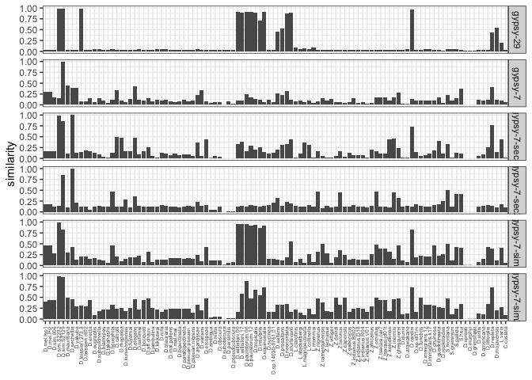
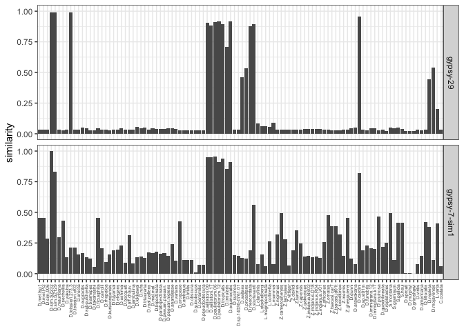

02-hunt-better-gypsy7
================
roko
8/29/2023

# Hunt for a better gypsy-7

## Dsec

``` bash
# RepeatMasker Hit 1
  2926 1.25 0.00 0.00    JAEIGV010000528.1  17425995  17426315 (2339392) +              gypsy-7     Unspecified    4767    5087     (0)    
 37166 0.20 0.02 0.64    JAEIGV010000528.1  17426467  17430549 (2335158) +              gypsy-7     Unspecified     272    4329   (758)    
  7805 0.89 1.56 0.11    JAEIGV010000528.1  17430321  17431217 (2334490) +              gypsy-7     Unspecified    4178    5087     (0)  
  
# RepeatMasker Hit 2
    2907 1.55 0.00 0.00    JAEIGV010000163.1   1594933   1595254 (5065360) +              gypsy-7     Unspecified    4766    5087     (0)    
 37303 0.20 0.02 0.64    JAEIGV010000163.1   1595406   1599488 (5061126) +              gypsy-7     Unspecified     272    4329   (758)    
  7807 0.90 2.13 0.00    JAEIGV010000163.1   1599260   1600150 (5060464) +              gypsy-7     Unspecified    4178    5087     (0)    
  
  
# BED
JAEIGV010000528.1   17425995    17431217    gypsy-7-sec1
JAEIGV010000163.1   1594933 1600150 gypsy-7-sec2
```

## Dsim

``` bash
# cat D.sim.SZ232.fa.ori.out|grep gypsy-7|less
 2893 1.24 0.31 0.00 tig00000776_pilon_pilon    180209    180530 (4180264) +              gypsy-7     Unspecified    4765    5087     (0)    
 36897 0.17 0.10 0.65 tig00000776_pilon_pilon    180682    184722 (4176072) +              gypsy-7     Unspecified     272    4290   (797)    
  7242 0.46 0.21 7.46 tig00000776_pilon_pilon    184533    185466 (4175328) +              gypsy-7     Unspecified    4217    5087     (0)    
  
  2734 0.93 0.00 0.00 tig00000128_pilon_pilon     30767     31087  (33741) +              gypsy-7     Unspecified    4767    5087     (0)    
 18549 0.05 0.09 1.07 tig00000128_pilon_pilon     31239     33414  (31414) +              gypsy-7     Unspecified     272    2426  (2661)    
 33800 0.15 0.03 0.18 tig00000128_pilon_pilon     31415     35318  (29510) +              gypsy-7     Unspecified     432    4329   (758)    
  7538 0.44 0.22 0.44 tig00000128_pilon_pilon     35090     36001  (28827) +              gypsy-7     Unspecified    4178    5087     (0)    

# BED
tig00000776_pilon_pilon   180209    185466    gypsy-7-sim1
tig00000128_pilon_pilon   30767   36001   gypsy-7-sim2
```

## Extract the sequences

``` bahs
fasta-reader.py D.sechellia.fa |fasta-subsequences.py --bed sech.bed |fasta-writter.py > gypsy-sec.fa
fasta-reader.py D.sim.SZ232.fa |fasta-subsequences.py --bed simsz232.bed |fasta-writter.py > gypsy-simsz232.fa
```

# generate new reference

``` bash
# I is fed up, lets use all gypsy..
cat ../rawseqs/seqs-rm.fasta ../assemblies/gypsy-sec.fa ../assemblies/gypsy-simsz232.fa > gypsy-ext.fa
```

# RepeatMasking

## Droso

``` bash
for i in *.fa; do RepeatMasker -pa 20 -no_is -s -nolow -dir out-gypsy-v2 -lib replib-gypsy-v2/gypsy-ext.fa $i;done > /dev/null 
```

## Self

``` bash
RepeatMasker -pa 20 -no_is -s -nolow -dir selfmask -lib gypsy-ext.fa gypsy-ext.fa 
```

# Merge + Score

``` bash
awk '{print $0,FILENAME}' *.ori.out|perl -pe 's/\.fa\.ori\.out//' >tmp-merged-Dros.sum 
awk '{print $0,"self"}' selfmask/gypsy-ext.fa.ori.out |perl -pe 's/\.fa\.ori\.out//' >tmp-merged-self.sum 
cat tmp-merged-Dros.sum ../replib-gypsy-v2/tmp-merged-self.sum > merged-Droso.sum 
python ../process-score.py --rm merged-Droso.sum > Droso.score
```

# Visualize

``` r
sortorder<-c( 
  # melanogaster group
  "D.mel.Iso1","D.mel.Pi2","D.sim.006","D.sim.SZ232","D.sim.SZ129","D.mauritiana","D.sechellia", "D.yakuba", "D.teissieri.273.3","D.teissieri.ct02","D.erecta", # melanogaster subgroup
  "D.eugracilis", "D.subpulchrella", "D.biarmipes", "D.takahashii", "D.ficusphila", # several subroups
  "D.carrolli", "D.rhopaloa","D.kurseongensis", "D.fuyamai", #  rhopaloa subgroup
  "D.elegans", "D.oshimai", # elegans + suzuki subgroups
  "D.bocqueti","D.aff.chauv.","D.jambulina","D.kikkawai","D.rufa","D.triauraria", # montium subgroup
  "D.mal.pallens", "D.mal.mal.","D.bipectinata","D.parabipectinata","D.pseuan.pseuan.","D.pseuan.nigrens","D.ananassae","D.varians","D.ercepeae", # ananase subgroup
  # obscura group
  "D.ambigua","D.tristis", "D.obscura","D.subobscura", # obscura subgroup
  "D.persimilis", "D.pseudoobscura", # pseudoobscura subgroup
  # willistoni group 
  "D.willistoni.00","D.willistoni.17","D.paulistorum.06","D.paulistorum.12","D.tropicalis","D.insularis", "D.equinoxialis", # willistoni subgroup
  # saltans group
  "D.sucinea", "D.sp.14030-0761.01","D.saltans","D.prosaltans", # bocainensis + saltans subgroups
  "D.neocordata","D.sturtevanti", # neocordata + sturtevanti subgroup
  ### Lordiphosa (group?)
  "L.clarofinis", "L.stackelbergi","L.magnipectinata", # miki subgroup
  "L.collinella", "L.mommai", # fenestrarum + ? subgroup
  ### Zaprionus (group?)
  "Z.nigranus","Z.camerounensis","Z.lachaisei","Z.vittiger","Z.davidi","Z.taronus","Z.capensis", # vittiger subgroups
  "Z.gabonicus","Z.indianus.BS02","Z.indianus.D18","Z.indianus.R04","Z.indianus.V01","Z.africanus","Z.ornatus", # vittiger subgroup
  "Z.tsacasi.car7","Z.tsacasi.jd01t", # tuberculatus    subgroup
  "Z.kolodkinae", "Z.inermis","Z.ghesquierei", # inermis subgroup
  # D. cardini group
  "D.dunni","D.arawakana","D.cardini", # dunni + cardini subgroup
  # D. funebris group
  "D.sp.st01m","D.funebris",
  # D. immigrans group
  "D.immigrans.12","D.immigrans.k17","D.pruinosa","D.quadrilineata",
  # D. tumiditarsus group
  "D.repletoides",
  # Scaptomyza (group?)
  "S.montana","S.graminum","S.pallida","S.hsui",
  # Hawaiian Droso
  "D.sproati","D.murphyi","D.grimshawi",
  # D.virilis group
  "D.virilis","D.americana","D.littoralis",
  # D.repleta group
  "D.repleta","D.mojavensis",
  # genus Leucophengia
  "L.varia",
  # genus Chymomyza
  "C.costata"
)

library(tidyverse)
```

    ## ── Attaching packages ─────────────────────────────────────── tidyverse 1.3.1 ──

    ## ✔ ggplot2 3.3.6     ✔ purrr   0.3.4
    ## ✔ tibble  3.1.7     ✔ dplyr   1.0.9
    ## ✔ tidyr   1.2.0     ✔ stringr 1.4.0
    ## ✔ readr   2.1.2     ✔ forcats 0.5.1

    ## ── Conflicts ────────────────────────────────────────── tidyverse_conflicts() ──
    ## ✖ dplyr::filter() masks stats::filter()
    ## ✖ dplyr::lag()    masks stats::lag()

``` r
theme_set(theme_bw())

h<-read.table("/Users/rokofler/analysis/simulans-clade-TEs/2023-08-Repeatmask_Droso_insects/raw-ori-out-v2/Droso.score",header=F)
names(h)<-c("te","species","score")
h$spec <- factor(h$spec, levels=sortorder)

# the three new ones
t<-subset(h,te %in% c("gypsy-7","gypsy-29","gypsy-7-sim1","gypsy-7-sim2","gypsy-7-sec1","gypsy-7-sec2"))

p<- ggplot(t,aes(y=score,x=spec))+geom_bar(stat="identity")+facet_grid(te~.)+ylab("similarity")+
  theme(axis.title.x=element_blank(),axis.text.x = element_text(angle = 90, vjust = 0.5, hjust=1,size=5))


plot(p)
```

<!-- -->

**Conclusion gypsy29 is fine and gypsy-7-sim1 is best representation of
gypsy**

``` r
# ok gy
t<-subset(h,te %in% c("gypsy-29","gypsy-7-sim1"))

p<- ggplot(t,aes(y=score,x=spec))+geom_bar(stat="identity")+facet_grid(te~.)+ylab("similarity")+
  theme(axis.title.x=element_blank(),axis.text.x = element_text(angle = 90, vjust = 0.5, hjust=1,size=5))

plot(p)
```

<!-- -->

# Final sequence of gypsy-7-sim1

``` remark
>gypsy-7-sim1
CATGTCGGCGCGGGCAGTTCGTGCTGTGTATGAGTGTGAGGCATTTCCCACGAATCTGGCCGACGCGGGCAGTTCGTTGT
ATGAGTGTGAGGCATTTCGCAGGAATGTTATTTCATCATTATTTGGCAATTGCATCAGCCTTTAATTGAGTTGCGATTGG
CTGATGGCATTTGGTAGTTTTGGAAGGTACCGTTTTAGCGCGGCGACAGCGCCACAACGCTGTCGCCGAGCGTGGTTCGA
TGGTAGGCACAAAGAAGAAGTGTGCGACGCAAGTCAGTTCAATTCTAGACTTCGACCACCGAAACTCGCTGCGCGATTAG
AAAATGGAACAGTTTAATGACGCGTTTATATCAGAAGTGGGATCGGGCTCGGCACCTAACAACGAAGCTGAGCCGTGGAA
AGCTCTAATAGAGTTGCAAAATAAAAACTTAACAGAACTCGTTAAAACATTTCAAGCAACGATTTCCGAAAAAACAAACA
AAATCGCGGTTGTGCTGCCAAAATTCAATGCAGACCTTGTTGGCGCCGATGCGTCGGCATGGTGCTCTACTGCGAACATT
ATTTTGGCAGAAAATGATATAAAAGGTAGTGCCCTTGTGACGGTGTTAAGTGCAGCGATGGAAGGTAGTGCCTCACAATG
GCTTGCGCGGACTTGTTATCCAGAAATGAATTGGCCCGAGTTCAAGCAACTATTCATTCAACAGTTCACTAATGTTGAAA
CACCAGCGGCTATATGTTTCTGACAATGCTAACTAACAGTCCGAGCGACGGTGAATGCCTTTCGAATTATGCTGGTCGTA
TGATGACGTCGCTTATGGTGAAATGGCGTGAAATGGATGTAGAGGAGATCGCAGCTTCCGTAACGCTTGCTAGGCTGGCT
CAAGTTGATAGCAGATTGCAGCGCATGACCTTCACCTCAAATGTGCGCACCAGAAGTGATTTGCAAACCGAGTTAAAAGC
ATTCACATTCAACAAAAGGAAGATGACGTCGCGGGAAGAAATGTCTTTGCTTGACATCAAGAGGCAAAAACTTTCAACAA
TTAAGTGTCACTTCTGTGGAAAGTTAGGCCACAAGATCAACGAATGCAGAGTTAGACAGCTGCAAAATTTTTCGTCTCGT
GCTATGGACCGTAATGGCAGCAGCGCATTTGGTCACCGTCAAAAATCTGATGTAACCTGCTTCAAGTGTGGAGAGCGTGG
CCATATTTCTACACAATGCAGTAAACAAAAACGGACAACAGCAAGGATACACATACTGTAAAGAGAGTGCAACTGTGCGA
AGTTGTTGAGCCTAAAGGAGAGATGGTTCATCAAGGAATGACATTTGCTACAACGTTTGACTCTGGCGCGGAGTGTTCAT
TAATCAAACAACAGATAAGTGCTAAGCTAGCTGGTAAAAGATTAAATAATGTTGTGAGGTTGGAAGGTATTGGCAATGGC
AGCGTTTGCAGCACATTGCAAATACTTACCAACGTAAATATTAATAATTATCAGATTGAGATTTTGTTTCATGTTTTAGA
CAATAATTATATGAAAAATGACATAATTATTGGTCGAGAAATATTGTCGCCTGGATTTAATGTCATAATTTCACCAGGGA
AATTTGAAATTGTTAAAACAAAAACTGTTAATAATTGTGTTAACGAAGATAAATTTTATGACTTAGACACAGGTCTTGTT
GGTGAAGACTGTGATGAATTAAAAAGTTTGTTGGAAAATTATTCAAAATATTTTATCAATGGGATTCCTTTGTCTAGAGT
TAGTTCGGGTAAAATGAAAATTAAACTAAATGACCCAAGAAAAATTGTCCAAAGGAGACCATACAGGCTCAGTCCAAGTG
AAAGGGAATTGGTTCGAAATAAGATTAGGGAGCTATTGGAATGCAAAGTAATAAAGCCGAGTTGCTCACCCTTCGCAAGT
CCCATAATGCTGGTAAACAAAAAAGACGGCTCCCATCGCTTGTGTGTAGATTACCGGGAATTAAATGGTAATACCGTTGC
AGATAGATACCCTTTGCCCCTTATATCAGACCAGATAGCCAGGCTTCATGGAGCAAAATATTTCACATGCTTAGATATGG
CAAGTGGATATTATCAAATACCCATGCATGAAGACTCAGTAGAGTGTACAGCGTTCGTCACTCCAGACGGACAATATGAA
TTCTTAGCAATGCCGTTTGGGCTTAAAAATGCGCCTTCAGTTTTTCAGCGTACCGTTATACAAGCCCTGGGAGATCTTGC
TAATACATTTGTGGTCGTTTATATGGACGACGTAATGGTGGCTGCTTCAACGAAAACTGAGGCTTTAGAGAGATTAAAGA
TTACTCTTGACTGTCTTACGTGTGCCGGATTTTCCTTTAATATAAAAAAATGTTCTTTTCTTAAGTCAACAGTACAATAT
TTGGGATACGAAGTGAGTGCAGGTGAAATTCGTCCAAATCCGCTTAAAATTGCTGCGTTAACTGCATTACCACCTCCTCA
GTCGATCCCAGCTTTAAGACAATTTATAGGGCTGGCGTCTTATTTTAGGCAATTTATTCAAGGATTTTCTTGTTTTATGA
AGCCCTTATATCTGTTGACCTCAGGGAAGAACGAGTTTGTTTGGGAACCAGAACATGAGCAAATAAGAAAGAAGGTTGTC
TCTATACTTACACAGAAGCCAGTCTTGGTAATTTTCGACCCGCAGTATCCAATCGAGTTGCATACTGATGCAAGTTCTCG
TGGATACGGTGCCATCTTGTTACATAAAATCAACAACAAGTCGCATGTCATTGAATATTTCAGTAAAGCTGCTTCACCTG
CAGAGTCTCGGTACCATTCTTACGAATTGGAGACTCTTGCTGTTGTTTTGTCCATAAAACATTTTCGCCATTATTTACTG
GGTAGAAATTTTGTTGTTTTCACTGACTGTAATTCCCTTAAGGCATCAAGGACTAAACATGATCTGTCTCCTAGGGCGCA
AAGATGGTGGGCTTACTTACAATCGTTTACGTTTGAATTACAGTATAGAGAAGGTAAACGAATGGCTCACGCTGATTTCT
TTTCAAGAAATTTACCTTCAACTAAGTTGCTGGCCACAAATTGTAAAGCTTCTGAAAAACGAGTTTGCTTGGCAGAAATT
TCCAGCAACTGGCTTTTGGCTGAACAACGTCAAGATTCAGAAATAGTTAGCATCGTAAAGAAATTAAAAGACAATTCTCT
TTCCATAGACGTTGCAAAAACTTATGAGTTGAGAGCAGGAATACTTTATAGAAAAATTCAGCGTAATGGTAGAACTCGAT
CCTTAGCAATTGTTCCTCGAGTGTTTAGATGGTCCGTGATAAACCAAATTCATGAATCGATTATGCATTTAGGATGGGAA
AAGACGCTAGACAAGGCCTATGACTATTATTGGTTCGATAATATGTCCAAATATATTCGAAAATTTGTTGAAAATTGTAT
CACCTGCAAAATGTCAAAGTCCTCTTCTGGCAAAATTCAAGCTAGTCTTCATCCTATACCAAAAGTAAGCACACCTTGGC
ATACTATTCACATAGACATAAGTGGGAAGTTGAGTGGGAAGTCTGATCAAAAAGAGTATATCATCGTTCAAGTAGATGCC
TTTACTAAATTTGTTTTGTTAACTCACACCCTTAAAATAGATGCTGAAAATTGCATAAATGCTGTGACGGCGGCAATATC
TTTATTTGGAGTACCAAATCGTATAATAGCAGATCAGGGTAGGTGTTTTGCTAGCACAAGATTCAGTGAGTTTTGTGCAC
AACAAAAGATAAATTTGCATTTGATTGCAACAGGTGCAAGCAGAGCAAATGGGCAGGTTGAACGCACTATGTTTACTTTG
AAAAATTTATTAACCGCAGTCGAAACTAGCAGCAGGTCTTGGCAAGATGCATTGGGAGAAATTCAGTTGGCCTTAAACTG
TACGGTGAGCCGAGTGACAAAGGCAAGTCCTTTAGAATTATTTATTGGTAAAGTTGCTCGACCATTGGGGTTACTTCCAC
TCTGCGACACGGTTGATGAGATTGATTTGCCAGCAGTACGAGCTCAAGCAAGTCAAAATATTTCGGCTTCAGCAACATAT
AGCAAGACACAATTTGATAAAAACAAAGCTAGAGTTGTGGAATGCAAAGTTGGCGATTTCGTATTATTAAAAATGAGGAG
AGGCATCAAACAAAGCTTGACCCAAAGTTTAGAGGCCCTTTTGAAATAACGGAATTATTAGACGGGAATAGGTGTGCTGA
GGTCATTGACAAACAATAGGAAATATAAATATGCCCATGACGATGTGCGGAAAATGCCAGATGGTTATGTACCAGTTGAA
TATGAAAATGTTGGAAATGAAACTGTTGAAACAGACAGTAGTCAAAATGTTGAAAATGAAACTGTTGAAACAGACAGTAG
TCAAAATGTTGAAAGTGAAACTGTTGAAACAGACAGTAGTCAAAATGTTGAAAGTGAAACTGTTGAAACAGACAGTAGTT
AAAATATTAAAAGTTAAACTGTTGAAACAGACAGGACAGGGGTCCTGTAGCCTGAAGGGCTAGAAATGAAATGCAAGCAC
AAATGCAAAACAGTTGTTTTGATCATGGCGTGTAGAGCATAAGATATGATGTTTAAAATTTTTTTTTTTTTTTAGGTTTA
AGGATAATAAAAAAAAAAAAAAAAAAAAATGTATATGGATTATGTTAAAATAAAATGTTTGTTTAAGAATAAAAAAAAAA
AAAAAAAAAAAAAAAAAAAATAATAATAATAATAATAATAATAATAATAATGAATGAATTTGAAGATTACGTTTGTCAAT
GTTTAGTAGCGGTTTTGTAAGAAAACTTATCCTTGTTAAACTGAAATTTTTATAATTTGTTAATAAAAATGTTTTATGTA
TATCGCAAAGTATATTTTGGAAGTATTGCACGAGGTCGTGTAATGGTCAGGATGGCCGTGTCGGCGCGGGCAGTTCGTGC
TGTGTATGAGTGTGAGGCATTTCCCACGAATCTGGCCGACGCGGGCAGTTCGTTGTATGAGTGTGAGGCATTTCGCAGGA
ATGTTATTTCATCATTATTTGGCAATTGCATCAGCCTTTAATTGAGTTGCGATTGGCTGATGGCATTTGGTAGTTTTGGA
AGGTACCGTTTTAGCGCGGCGACAGCGCCACAACGCTGTCGCCGAGCGTGGTTCGATGGTAGGCACAAAGAAGAAGTGTG
CGACGCAAGTCAGTTCAATTCTAGACTTCGACCACCGAAACTCGCTGCGCGATTAGAA
```

# Concluding Remark

It is necessary to perform one further round of Repeatmasking just using
gypsy29 and gypsy-7-sim1 (and removing the other 4 gypsy-7). Why?
Because RepeatMasker always provides the best match for overlapping
sequences, that is why the gypys-7-sim1 does not show a hit in
D.sechellia; obviously the gypsy-7-sec1 and gypsy-7-sec2 which were
extracted from Dsech, match better than gypsy-7-sim1 which was extracted
from Dsim.
