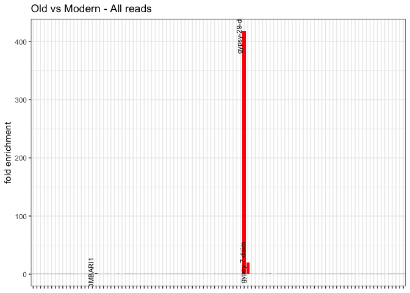
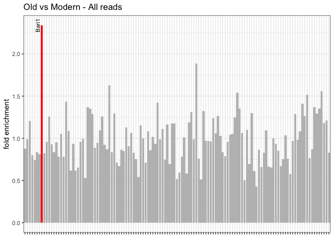

Drosophila mauritiana - Copynumber analysis
================

``` r
suppressPackageStartupMessages(library(tidyverse))
suppressPackageStartupMessages(library(knitr))
suppressPackageStartupMessages(library(kableExtra))
theme_set(theme_bw())

knitr::opts_knit$set(root.dir = "/Volumes/Temp1/simulans-old-strains/analysis/plots")
```

## Dmel library (+ Gypsy7 and Gypsy29 from Dsim)

``` r
analysis <- function(csv, old, new) {
  
copynumbers <- read_csv(csv, show_col_types = FALSE) %>% filter(Sample!="Sample") %>% type_convert() %>% mutate(age = ifelse(Sample %in% old, "old", "new"))

avg_museum_modern <- copynumbers %>% group_by(age, TE) %>% summarise(All_reads=mean(All_reads))
museum <- avg_museum_modern %>% filter(age == "old") %>% ungroup() %>% select(TE, All_reads) %>% rename(old_cn = All_reads)
modern <- avg_museum_modern %>% filter(age == "new") %>% ungroup() %>% select(TE, All_reads) %>% rename(new_cn = All_reads)
fold <- inner_join(museum, modern, by="TE") %>% type_convert() %>% mutate(fold_enrichment = new_cn/old_cn) %>% filter(new_cn > 2)

plot_fold <- ggplot(data = fold, aes(x = TE, y = fold_enrichment)) +
  geom_bar(stat = "identity", position = "dodge", aes(fill = fold_enrichment > 2)) +
  scale_fill_manual(values = c("FALSE" = "gray", "TRUE" = "red")) +
  xlab("TE") +
  ylab("fold enrichment") +
  theme(legend.position = "none", axis.title.x = element_blank(), axis.text.x = element_blank()) +
  geom_text(aes(label = ifelse(fold_enrichment > 2, as.character(TE), "")), 
            position = position_dodge(width = 1),
            vjust = -0.5, size = 3, angle=90)+
  ggtitle("Old vs Modern - All reads")

fold_enriched <- fold %>% filter(fold_enrichment>2) %>% arrange(desc(fold_enrichment))

comparison_foldenriched <- copynumbers %>% ungroup() %>% select(-HQ_reads, -age) %>% pivot_wider(names_from = Sample, values_from = All_reads) %>% filter(TE %in% fold_enriched$TE)# %>% inner_join(fold_enriched, by="fold_enrichment")

list(plot = plot_fold, table = fold_enriched, each_sample = comparison_foldenriched)
}
```

``` r
old_mau <- c("SRR6425993","SRR19973828")
new_mau <- c("SRR1560097","SRR1560268","SRR1560103")
```

``` r
dmel_TEs <- analysis("/Volumes/Temp1/simulans-old-strains/analysis/csv/Dmau/dmel_TEs/Dmau-dmel_TEs.csv", old_mau, new_mau)
```

    ## 
    ## ── Column specification ────────────────────────────────────────────────────────
    ## cols(
    ##   Sample = col_character(),
    ##   TE = col_character(),
    ##   All_reads = col_double(),
    ##   HQ_reads = col_double()
    ## )

    ## `summarise()` has grouped output by 'age'. You can override using the `.groups`
    ## argument.
    ## ── Column specification
    ## ──────────────────────────────────────────────────────── cols( TE =
    ## col_character() )

``` r
dmel_TEs$plot
```

<!-- -->

``` r
kable(dmel_TEs$table)
```

<table>
<thead>
<tr>
<th style="text-align:left;">
TE
</th>
<th style="text-align:right;">
old_cn
</th>
<th style="text-align:right;">
new_cn
</th>
<th style="text-align:right;">
fold_enrichment
</th>
</tr>
</thead>
<tbody>
<tr>
<td style="text-align:left;">
gypsy-29-dsim
</td>
<td style="text-align:right;">
0.03
</td>
<td style="text-align:right;">
12.54667
</td>
<td style="text-align:right;">
418.222222
</td>
</tr>
<tr>
<td style="text-align:left;">
gypsy-7-dsim
</td>
<td style="text-align:right;">
2.57
</td>
<td style="text-align:right;">
52.06667
</td>
<td style="text-align:right;">
20.259403
</td>
</tr>
<tr>
<td style="text-align:left;">
DMBARI1
</td>
<td style="text-align:right;">
5.50
</td>
<td style="text-align:right;">
12.86667
</td>
<td style="text-align:right;">
2.339394
</td>
</tr>
</tbody>
</table>

``` r
kable(dmel_TEs$each_sample)
```

<table>
<thead>
<tr>
<th style="text-align:left;">
TE
</th>
<th style="text-align:right;">
SRR1560097
</th>
<th style="text-align:right;">
SRR1560103
</th>
<th style="text-align:right;">
SRR1560268
</th>
<th style="text-align:right;">
SRR19973828
</th>
<th style="text-align:right;">
SRR6425993
</th>
</tr>
</thead>
<tbody>
<tr>
<td style="text-align:left;">
DMBARI1
</td>
<td style="text-align:right;">
11.42
</td>
<td style="text-align:right;">
15.54
</td>
<td style="text-align:right;">
11.64
</td>
<td style="text-align:right;">
6.00
</td>
<td style="text-align:right;">
5.00
</td>
</tr>
<tr>
<td style="text-align:left;">
gypsy-29-dsim
</td>
<td style="text-align:right;">
13.14
</td>
<td style="text-align:right;">
15.60
</td>
<td style="text-align:right;">
8.90
</td>
<td style="text-align:right;">
0.04
</td>
<td style="text-align:right;">
0.02
</td>
</tr>
<tr>
<td style="text-align:left;">
gypsy-7-dsim
</td>
<td style="text-align:right;">
33.67
</td>
<td style="text-align:right;">
46.93
</td>
<td style="text-align:right;">
75.60
</td>
<td style="text-align:right;">
2.74
</td>
<td style="text-align:right;">
2.40
</td>
</tr>
</tbody>
</table>

## Clark library

``` r
clark <- analysis("/Volumes/Temp1/simulans-old-strains/analysis/csv/Dmau/clark/Dmau-clark.csv", old_mau, new_mau)
```

    ## 
    ## ── Column specification ────────────────────────────────────────────────────────
    ## cols(
    ##   Sample = col_character(),
    ##   TE = col_character(),
    ##   All_reads = col_double(),
    ##   HQ_reads = col_double()
    ## )

    ## `summarise()` has grouped output by 'age'. You can override using the `.groups`
    ## argument.
    ## ── Column specification
    ## ──────────────────────────────────────────────────────── cols( TE =
    ## col_character() )

``` r
clark$plot
```

<!-- -->

``` r
kable(clark$table)
```

<table>
<thead>
<tr>
<th style="text-align:left;">
TE
</th>
<th style="text-align:right;">
old_cn
</th>
<th style="text-align:right;">
new_cn
</th>
<th style="text-align:right;">
fold_enrichment
</th>
</tr>
</thead>
<tbody>
<tr>
<td style="text-align:left;">
Bari1
</td>
<td style="text-align:right;">
5.5
</td>
<td style="text-align:right;">
12.87
</td>
<td style="text-align:right;">
2.34
</td>
</tr>
</tbody>
</table>

``` r
kable(clark$each_sample)
```

<table>
<thead>
<tr>
<th style="text-align:left;">
TE
</th>
<th style="text-align:right;">
SRR1560097
</th>
<th style="text-align:right;">
SRR1560103
</th>
<th style="text-align:right;">
SRR1560268
</th>
<th style="text-align:right;">
SRR19973828
</th>
<th style="text-align:right;">
SRR6425993
</th>
</tr>
</thead>
<tbody>
<tr>
<td style="text-align:left;">
Bari1
</td>
<td style="text-align:right;">
11.43
</td>
<td style="text-align:right;">
15.55
</td>
<td style="text-align:right;">
11.63
</td>
<td style="text-align:right;">
5.99
</td>
<td style="text-align:right;">
5.01
</td>
</tr>
</tbody>
</table>

## Chakraboty library

``` r
chak <- analysis("/Volumes/Temp1/simulans-old-strains/analysis/csv/Dmau/chakraboty/Dmau-chak.csv", old_mau, new_mau)
```

    ## 
    ## ── Column specification ────────────────────────────────────────────────────────
    ## cols(
    ##   Sample = col_character(),
    ##   TE = col_character(),
    ##   All_reads = col_double(),
    ##   HQ_reads = col_double()
    ## )

    ## `summarise()` has grouped output by 'age'. You can override using the `.groups`
    ## argument.
    ## ── Column specification
    ## ──────────────────────────────────────────────────────── cols( TE =
    ## col_character() )

``` r
chak$plot
```

<!-- -->

``` r
kable(chak$table)
```

<table>
<thead>
<tr>
<th style="text-align:left;">
TE
</th>
<th style="text-align:right;">
old_cn
</th>
<th style="text-align:right;">
new_cn
</th>
<th style="text-align:right;">
fold_enrichment
</th>
</tr>
</thead>
<tbody>
<tr>
<td style="text-align:left;">
Gypsy_29_DWil_I\_LTR_Gypsy
</td>
<td style="text-align:right;">
0.065
</td>
<td style="text-align:right;">
12.100000
</td>
<td style="text-align:right;">
186.153846
</td>
</tr>
<tr>
<td style="text-align:left;">
Gypsy_7\_DEl_I\_LTR_Gypsy
</td>
<td style="text-align:right;">
0.110
</td>
<td style="text-align:right;">
2.473333
</td>
<td style="text-align:right;">
22.484848
</td>
</tr>
<tr>
<td style="text-align:left;">
Gypsy_12_DVir_I\_LTR_Gypsy
</td>
<td style="text-align:right;">
0.815
</td>
<td style="text-align:right;">
3.250000
</td>
<td style="text-align:right;">
3.987730
</td>
</tr>
<tr>
<td style="text-align:left;">
BARI_DM_DNA_TcMar_Tc1
</td>
<td style="text-align:right;">
5.485
</td>
<td style="text-align:right;">
12.883333
</td>
<td style="text-align:right;">
2.348830
</td>
</tr>
<tr>
<td style="text-align:left;">
Jockey_1\_DEr_Non_LTR_retrotransposon_Jockey
</td>
<td style="text-align:right;">
1.745
</td>
<td style="text-align:right;">
3.883333
</td>
<td style="text-align:right;">
2.225406
</td>
</tr>
<tr>
<td style="text-align:left;">
Gypsy5_I\_LTR_Gypsy
</td>
<td style="text-align:right;">
1.185
</td>
<td style="text-align:right;">
2.513333
</td>
<td style="text-align:right;">
2.120956
</td>
</tr>
</tbody>
</table>

``` r
kable(chak$each_sample)
```

<table>
<thead>
<tr>
<th style="text-align:left;">
TE
</th>
<th style="text-align:right;">
SRR1560097
</th>
<th style="text-align:right;">
SRR1560103
</th>
<th style="text-align:right;">
SRR1560268
</th>
<th style="text-align:right;">
SRR19973828
</th>
<th style="text-align:right;">
SRR6425993
</th>
</tr>
</thead>
<tbody>
<tr>
<td style="text-align:left;">
BARI_DM_DNA_TcMar_Tc1
</td>
<td style="text-align:right;">
11.44
</td>
<td style="text-align:right;">
15.56
</td>
<td style="text-align:right;">
11.65
</td>
<td style="text-align:right;">
5.97
</td>
<td style="text-align:right;">
5.00
</td>
</tr>
<tr>
<td style="text-align:left;">
Gypsy5_I\_LTR_Gypsy
</td>
<td style="text-align:right;">
2.53
</td>
<td style="text-align:right;">
3.69
</td>
<td style="text-align:right;">
1.32
</td>
<td style="text-align:right;">
0.97
</td>
<td style="text-align:right;">
1.40
</td>
</tr>
<tr>
<td style="text-align:left;">
Gypsy_12_DVir_I\_LTR_Gypsy
</td>
<td style="text-align:right;">
2.56
</td>
<td style="text-align:right;">
3.55
</td>
<td style="text-align:right;">
3.64
</td>
<td style="text-align:right;">
0.79
</td>
<td style="text-align:right;">
0.84
</td>
</tr>
<tr>
<td style="text-align:left;">
Gypsy_29_DWil_I\_LTR_Gypsy
</td>
<td style="text-align:right;">
12.59
</td>
<td style="text-align:right;">
15.02
</td>
<td style="text-align:right;">
8.69
</td>
<td style="text-align:right;">
0.06
</td>
<td style="text-align:right;">
0.07
</td>
</tr>
<tr>
<td style="text-align:left;">
Gypsy_7\_DEl_I\_LTR_Gypsy
</td>
<td style="text-align:right;">
1.60
</td>
<td style="text-align:right;">
2.16
</td>
<td style="text-align:right;">
3.66
</td>
<td style="text-align:right;">
0.11
</td>
<td style="text-align:right;">
0.11
</td>
</tr>
<tr>
<td style="text-align:left;">
Jockey_1\_DEr_Non_LTR_retrotransposon_Jockey
</td>
<td style="text-align:right;">
2.86
</td>
<td style="text-align:right;">
4.34
</td>
<td style="text-align:right;">
4.45
</td>
<td style="text-align:right;">
1.52
</td>
<td style="text-align:right;">
1.97
</td>
</tr>
</tbody>
</table>
