Drosophila melanogaster - Copynumber analysis
================

``` r
suppressPackageStartupMessages(library(tidyverse))
suppressPackageStartupMessages(library(knitr))
suppressPackageStartupMessages(library(kableExtra))
suppressPackageStartupMessages(library(ggpubr))
theme_set(theme_bw())

knitr::opts_knit$set(root.dir = "/Volumes/Temp1/simulans-old-strains/analysis/plots")
```

``` r
analysis <- function(csv, old, new, year, titlee) {
  
copynumbers <- read_csv(csv, show_col_types = FALSE) %>% filter(Sample!="Sample", Sample%in%c(old, new)) %>% type_convert() %>% mutate(age = ifelse(Sample %in% old, "old", "new")) %>% inner_join(year, by="Sample") %>% arrange(collection_year) %>% mutate(Sample = paste0(Sample, "_", collection_year)) %>% select(-collection_year)

avg_museum_modern <- copynumbers %>% group_by(age, TE) %>% summarise(All_reads=mean(All_reads))
museum <- avg_museum_modern %>% filter(age == "old") %>% ungroup() %>% select(TE, All_reads) %>% rename(old_cn = All_reads)
modern <- avg_museum_modern %>% filter(age == "new") %>% ungroup() %>% select(TE, All_reads) %>% rename(new_cn = All_reads)
fold <- inner_join(museum, modern, by="TE") %>% type_convert() %>% mutate(fold_enrichment = new_cn/old_cn) %>% filter(new_cn > 2)

plot_fold <- ggplot(data = fold, aes(x = TE, y = fold_enrichment)) +
  geom_bar(stat = "identity", position = "dodge", aes(fill = fold_enrichment > 2)) +
  scale_fill_manual(values = c("FALSE" = "gray", "TRUE" = "red")) +
  xlab("TE") +
  ylab("fold enrichment") +
  theme(legend.position = "none", axis.title.x = element_blank(), axis.text.x = element_blank()) +
  geom_text(aes(label = ifelse(fold_enrichment > 2, as.character(TE), "")), 
            position = position_dodge(width = 1),
            vjust = -0.5, size = 3, angle=90)+
  ggtitle(titlee)

fold_enriched <- fold %>% filter(fold_enrichment>2) %>% arrange(desc(fold_enrichment))

comparison_foldenriched <- copynumbers %>% ungroup() %>% select(-HQ_reads, -age) %>% pivot_wider(names_from = Sample, values_from = All_reads) %>% filter(TE %in% fold_enriched$TE)# %>% inner_join(fold_enriched, by="fold_enrichment")

list(plot = plot_fold, table = fold_enriched, each_sample = comparison_foldenriched)
}
```

``` r
timeline <- function(csv, age, transposon) {
  single_te <- read_csv(csv, show_col_types = FALSE) %>% filter(Sample!="Sample") %>% type_convert() %>% filter(TE==transposon) %>% inner_join(age, by="Sample") %>% arrange(collection_year)
  
  plot <- ggplot(single_te, aes(x = reorder(Sample, collection_year), y = HQ_reads)) +
    geom_point(size = 1.5) +
    scale_x_discrete(labels = single_te$collection_year) +
    labs(y = "copynumber", x = "collection_year") + ggtitle(transposon)
}
```

``` r
samples <- c("SRR23876563", "SRR23876564", "SRR23876562", "SRR23876569", "SRR23876586", "SRR11846555", "SRR11846565", "SRR11846559", "SRR9951090") 
years <- c(1800, 1800, 1850, 1850, 1933, 1936, 1958, 1987, 2015)
age_dmel <- tibble(collection_year = years, Sample = samples)

pre1900 <- c("SRR6425993","SRR19973828","SRR23876562","SRR23876569")
pre1950 <- c("SRR23876586","SRR11846555","SRR11846565")
modern <- c("SRR11846559","SRR9951090")
```

## Dmel library (+ Gypsy7 and Gypsy29 from Dsim)

``` r
dmel_TEs <- analysis("/Volumes/Temp1/simulans-old-strains/analysis/csv/Dmel/Dmel-TEs/Dmel-dmel_TEs.csv", pre1900, modern, age_dmel, "Pre-1900 vs Post-1980")
```

    ## 
    ## ── Column specification ────────────────────────────────────────────────────────
    ## cols(
    ##   Sample = col_character(),
    ##   TE = col_character(),
    ##   All_reads = col_double(),
    ##   HQ_reads = col_double()
    ## )

    ## `summarise()` has grouped output by 'age'. You can override using the `.groups`
    ## argument.
    ## ── Column specification
    ## ──────────────────────────────────────────────────────── cols( TE =
    ## col_character() )

``` r
dmel_TEs$plot
```

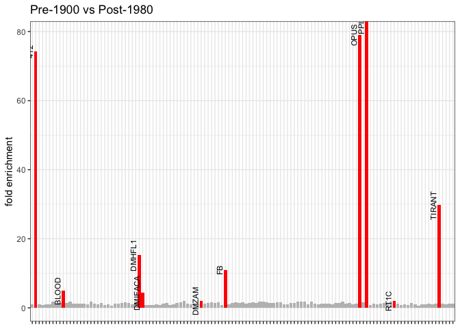<!-- -->

``` r
kable(dmel_TEs$table)
```

<table>
<thead>
<tr>
<th style="text-align:left;">
TE
</th>
<th style="text-align:right;">
old_cn
</th>
<th style="text-align:right;">
new_cn
</th>
<th style="text-align:right;">
fold_enrichment
</th>
</tr>
</thead>
<tbody>
<tr>
<td style="text-align:left;">
PPI251
</td>
<td style="text-align:right;">
0.000
</td>
<td style="text-align:right;">
11.310
</td>
<td style="text-align:right;">
Inf
</td>
</tr>
<tr>
<td style="text-align:left;">
OPUS
</td>
<td style="text-align:right;">
0.345
</td>
<td style="text-align:right;">
27.270
</td>
<td style="text-align:right;">
79.043478
</td>
</tr>
<tr>
<td style="text-align:left;">
412
</td>
<td style="text-align:right;">
0.655
</td>
<td style="text-align:right;">
48.620
</td>
<td style="text-align:right;">
74.229008
</td>
</tr>
<tr>
<td style="text-align:left;">
TIRANT
</td>
<td style="text-align:right;">
0.150
</td>
<td style="text-align:right;">
4.455
</td>
<td style="text-align:right;">
29.700000
</td>
</tr>
<tr>
<td style="text-align:left;">
DMHFL1
</td>
<td style="text-align:right;">
2.375
</td>
<td style="text-align:right;">
36.175
</td>
<td style="text-align:right;">
15.231579
</td>
</tr>
<tr>
<td style="text-align:left;">
FB
</td>
<td style="text-align:right;">
0.800
</td>
<td style="text-align:right;">
8.800
</td>
<td style="text-align:right;">
11.000000
</td>
</tr>
<tr>
<td style="text-align:left;">
BLOOD
</td>
<td style="text-align:right;">
4.925
</td>
<td style="text-align:right;">
24.265
</td>
<td style="text-align:right;">
4.926904
</td>
</tr>
<tr>
<td style="text-align:left;">
DMIFACA
</td>
<td style="text-align:right;">
9.485
</td>
<td style="text-align:right;">
41.615
</td>
<td style="text-align:right;">
4.387454
</td>
</tr>
<tr>
<td style="text-align:left;">
RT1C
</td>
<td style="text-align:right;">
2.680
</td>
<td style="text-align:right;">
5.515
</td>
<td style="text-align:right;">
2.057836
</td>
</tr>
<tr>
<td style="text-align:left;">
DMZAM
</td>
<td style="text-align:right;">
2.685
</td>
<td style="text-align:right;">
5.405
</td>
<td style="text-align:right;">
2.013035
</td>
</tr>
</tbody>
</table>

``` r
kable(dmel_TEs$each_sample)
```

<table>
<thead>
<tr>
<th style="text-align:left;">
TE
</th>
<th style="text-align:right;">
SRR23876562_1850
</th>
<th style="text-align:right;">
SRR23876569_1850
</th>
<th style="text-align:right;">
SRR11846559_1987
</th>
<th style="text-align:right;">
SRR9951090_2015
</th>
</tr>
</thead>
<tbody>
<tr>
<td style="text-align:left;">
412
</td>
<td style="text-align:right;">
0.65
</td>
<td style="text-align:right;">
0.66
</td>
<td style="text-align:right;">
61.21
</td>
<td style="text-align:right;">
36.03
</td>
</tr>
<tr>
<td style="text-align:left;">
BLOOD
</td>
<td style="text-align:right;">
4.10
</td>
<td style="text-align:right;">
5.75
</td>
<td style="text-align:right;">
22.77
</td>
<td style="text-align:right;">
25.76
</td>
</tr>
<tr>
<td style="text-align:left;">
DMHFL1
</td>
<td style="text-align:right;">
2.17
</td>
<td style="text-align:right;">
2.58
</td>
<td style="text-align:right;">
36.39
</td>
<td style="text-align:right;">
35.96
</td>
</tr>
<tr>
<td style="text-align:left;">
DMIFACA
</td>
<td style="text-align:right;">
9.32
</td>
<td style="text-align:right;">
9.65
</td>
<td style="text-align:right;">
38.54
</td>
<td style="text-align:right;">
44.69
</td>
</tr>
<tr>
<td style="text-align:left;">
DMZAM
</td>
<td style="text-align:right;">
2.56
</td>
<td style="text-align:right;">
2.81
</td>
<td style="text-align:right;">
5.92
</td>
<td style="text-align:right;">
4.89
</td>
</tr>
<tr>
<td style="text-align:left;">
FB
</td>
<td style="text-align:right;">
0.99
</td>
<td style="text-align:right;">
0.61
</td>
<td style="text-align:right;">
16.89
</td>
<td style="text-align:right;">
0.71
</td>
</tr>
<tr>
<td style="text-align:left;">
OPUS
</td>
<td style="text-align:right;">
0.33
</td>
<td style="text-align:right;">
0.36
</td>
<td style="text-align:right;">
33.14
</td>
<td style="text-align:right;">
21.40
</td>
</tr>
<tr>
<td style="text-align:left;">
PPI251
</td>
<td style="text-align:right;">
0.00
</td>
<td style="text-align:right;">
0.00
</td>
<td style="text-align:right;">
0.00
</td>
<td style="text-align:right;">
22.62
</td>
</tr>
<tr>
<td style="text-align:left;">
RT1C
</td>
<td style="text-align:right;">
2.73
</td>
<td style="text-align:right;">
2.63
</td>
<td style="text-align:right;">
5.94
</td>
<td style="text-align:right;">
5.09
</td>
</tr>
<tr>
<td style="text-align:left;">
TIRANT
</td>
<td style="text-align:right;">
0.15
</td>
<td style="text-align:right;">
0.15
</td>
<td style="text-align:right;">
3.73
</td>
<td style="text-align:right;">
5.18
</td>
</tr>
</tbody>
</table>

``` r
dmel_TEs <- analysis("/Volumes/Temp1/simulans-old-strains/analysis/csv/Dmel/Dmel-TEs/Dmel-dmel_TEs.csv", pre1900, pre1950, age_dmel, "Pre-1900 vs Pre-1980")
```

    ## 
    ## ── Column specification ────────────────────────────────────────────────────────
    ## cols(
    ##   Sample = col_character(),
    ##   TE = col_character(),
    ##   All_reads = col_double(),
    ##   HQ_reads = col_double()
    ## )
    ## 
    ## `summarise()` has grouped output by 'age'. You can override using the `.groups` argument.
    ## 
    ## ── Column specification ────────────────────────────────────────────────────────
    ## cols(
    ##   TE = col_character()
    ## )

``` r
dmel_TEs$plot
```

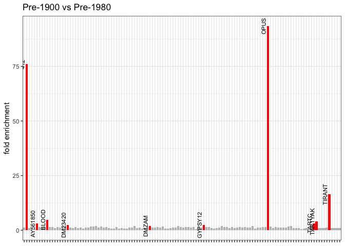<!-- -->

``` r
kable(dmel_TEs$table)
```

<table>
<thead>
<tr>
<th style="text-align:left;">
TE
</th>
<th style="text-align:right;">
old_cn
</th>
<th style="text-align:right;">
new_cn
</th>
<th style="text-align:right;">
fold_enrichment
</th>
</tr>
</thead>
<tbody>
<tr>
<td style="text-align:left;">
OPUS
</td>
<td style="text-align:right;">
0.345
</td>
<td style="text-align:right;">
32.250000
</td>
<td style="text-align:right;">
93.478261
</td>
</tr>
<tr>
<td style="text-align:left;">
412
</td>
<td style="text-align:right;">
0.655
</td>
<td style="text-align:right;">
49.800000
</td>
<td style="text-align:right;">
76.030534
</td>
</tr>
<tr>
<td style="text-align:left;">
TIRANT
</td>
<td style="text-align:right;">
0.150
</td>
<td style="text-align:right;">
2.473333
</td>
<td style="text-align:right;">
16.488889
</td>
</tr>
<tr>
<td style="text-align:left;">
BLOOD
</td>
<td style="text-align:right;">
4.925
</td>
<td style="text-align:right;">
23.800000
</td>
<td style="text-align:right;">
4.832487
</td>
</tr>
<tr>
<td style="text-align:left;">
TARTYAK
</td>
<td style="text-align:right;">
0.825
</td>
<td style="text-align:right;">
3.233333
</td>
<td style="text-align:right;">
3.919192
</td>
</tr>
<tr>
<td style="text-align:left;">
TARTC
</td>
<td style="text-align:right;">
1.615
</td>
<td style="text-align:right;">
5.150000
</td>
<td style="text-align:right;">
3.188855
</td>
</tr>
<tr>
<td style="text-align:left;">
AY561850
</td>
<td style="text-align:right;">
1.970
</td>
<td style="text-align:right;">
5.936667
</td>
<td style="text-align:right;">
3.013536
</td>
</tr>
<tr>
<td style="text-align:left;">
GYPSY12
</td>
<td style="text-align:right;">
4.515
</td>
<td style="text-align:right;">
10.993333
</td>
<td style="text-align:right;">
2.434847
</td>
</tr>
<tr>
<td style="text-align:left;">
DM23420
</td>
<td style="text-align:right;">
7.700
</td>
<td style="text-align:right;">
18.566667
</td>
<td style="text-align:right;">
2.411255
</td>
</tr>
<tr>
<td style="text-align:left;">
DMZAM
</td>
<td style="text-align:right;">
2.685
</td>
<td style="text-align:right;">
5.426667
</td>
<td style="text-align:right;">
2.021105
</td>
</tr>
</tbody>
</table>

``` r
kable(dmel_TEs$each_sample)
```

<table>
<thead>
<tr>
<th style="text-align:left;">
TE
</th>
<th style="text-align:right;">
SRR23876562_1850
</th>
<th style="text-align:right;">
SRR23876569_1850
</th>
<th style="text-align:right;">
SRR23876586_1933
</th>
<th style="text-align:right;">
SRR11846555_1936
</th>
<th style="text-align:right;">
SRR11846565_1958
</th>
</tr>
</thead>
<tbody>
<tr>
<td style="text-align:left;">
412
</td>
<td style="text-align:right;">
0.65
</td>
<td style="text-align:right;">
0.66
</td>
<td style="text-align:right;">
62.95
</td>
<td style="text-align:right;">
43.63
</td>
<td style="text-align:right;">
42.82
</td>
</tr>
<tr>
<td style="text-align:left;">
AY561850
</td>
<td style="text-align:right;">
2.66
</td>
<td style="text-align:right;">
1.28
</td>
<td style="text-align:right;">
7.60
</td>
<td style="text-align:right;">
5.48
</td>
<td style="text-align:right;">
4.73
</td>
</tr>
<tr>
<td style="text-align:left;">
BLOOD
</td>
<td style="text-align:right;">
4.10
</td>
<td style="text-align:right;">
5.75
</td>
<td style="text-align:right;">
27.56
</td>
<td style="text-align:right;">
30.89
</td>
<td style="text-align:right;">
12.95
</td>
</tr>
<tr>
<td style="text-align:left;">
DM23420
</td>
<td style="text-align:right;">
8.73
</td>
<td style="text-align:right;">
6.67
</td>
<td style="text-align:right;">
19.63
</td>
<td style="text-align:right;">
13.36
</td>
<td style="text-align:right;">
22.71
</td>
</tr>
<tr>
<td style="text-align:left;">
DMZAM
</td>
<td style="text-align:right;">
2.56
</td>
<td style="text-align:right;">
2.81
</td>
<td style="text-align:right;">
6.18
</td>
<td style="text-align:right;">
4.81
</td>
<td style="text-align:right;">
5.29
</td>
</tr>
<tr>
<td style="text-align:left;">
GYPSY12
</td>
<td style="text-align:right;">
4.61
</td>
<td style="text-align:right;">
4.42
</td>
<td style="text-align:right;">
12.00
</td>
<td style="text-align:right;">
10.41
</td>
<td style="text-align:right;">
10.57
</td>
</tr>
<tr>
<td style="text-align:left;">
OPUS
</td>
<td style="text-align:right;">
0.33
</td>
<td style="text-align:right;">
0.36
</td>
<td style="text-align:right;">
38.20
</td>
<td style="text-align:right;">
28.48
</td>
<td style="text-align:right;">
30.07
</td>
</tr>
<tr>
<td style="text-align:left;">
TARTC
</td>
<td style="text-align:right;">
2.54
</td>
<td style="text-align:right;">
0.69
</td>
<td style="text-align:right;">
2.41
</td>
<td style="text-align:right;">
12.77
</td>
<td style="text-align:right;">
0.27
</td>
</tr>
<tr>
<td style="text-align:left;">
TARTYAK
</td>
<td style="text-align:right;">
1.33
</td>
<td style="text-align:right;">
0.32
</td>
<td style="text-align:right;">
1.45
</td>
<td style="text-align:right;">
8.07
</td>
<td style="text-align:right;">
0.18
</td>
</tr>
<tr>
<td style="text-align:left;">
TIRANT
</td>
<td style="text-align:right;">
0.15
</td>
<td style="text-align:right;">
0.15
</td>
<td style="text-align:right;">
0.15
</td>
<td style="text-align:right;">
0.39
</td>
<td style="text-align:right;">
6.88
</td>
</tr>
</tbody>
</table>

``` r
dmel_TEs <- analysis("/Volumes/Temp1/simulans-old-strains/analysis/csv/Dmel/Dmel-TEs/Dmel-dmel_TEs.csv", pre1950, modern, age_dmel, "Pre-1980 vs Post-1980")
```

    ## 
    ## ── Column specification ────────────────────────────────────────────────────────
    ## cols(
    ##   Sample = col_character(),
    ##   TE = col_character(),
    ##   All_reads = col_double(),
    ##   HQ_reads = col_double()
    ## )
    ## 
    ## `summarise()` has grouped output by 'age'. You can override using the `.groups` argument.
    ## 
    ## ── Column specification ────────────────────────────────────────────────────────
    ## cols(
    ##   TE = col_character()
    ## )

``` r
dmel_TEs$plot
```

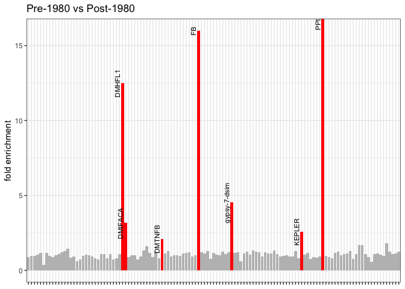<!-- -->

``` r
kable(dmel_TEs$table)
```

<table>
<thead>
<tr>
<th style="text-align:left;">
TE
</th>
<th style="text-align:right;">
old_cn
</th>
<th style="text-align:right;">
new_cn
</th>
<th style="text-align:right;">
fold_enrichment
</th>
</tr>
</thead>
<tbody>
<tr>
<td style="text-align:left;">
PPI251
</td>
<td style="text-align:right;">
0.000000
</td>
<td style="text-align:right;">
11.310
</td>
<td style="text-align:right;">
Inf
</td>
</tr>
<tr>
<td style="text-align:left;">
FB
</td>
<td style="text-align:right;">
0.550000
</td>
<td style="text-align:right;">
8.800
</td>
<td style="text-align:right;">
16.000000
</td>
</tr>
<tr>
<td style="text-align:left;">
DMHFL1
</td>
<td style="text-align:right;">
2.896667
</td>
<td style="text-align:right;">
36.175
</td>
<td style="text-align:right;">
12.488492
</td>
</tr>
<tr>
<td style="text-align:left;">
gypsy-7-dsim
</td>
<td style="text-align:right;">
4.240000
</td>
<td style="text-align:right;">
19.190
</td>
<td style="text-align:right;">
4.525943
</td>
</tr>
<tr>
<td style="text-align:left;">
DMIFACA
</td>
<td style="text-align:right;">
13.170000
</td>
<td style="text-align:right;">
41.615
</td>
<td style="text-align:right;">
3.159833
</td>
</tr>
<tr>
<td style="text-align:left;">
KEPLER
</td>
<td style="text-align:right;">
8.926667
</td>
<td style="text-align:right;">
23.050
</td>
<td style="text-align:right;">
2.582151
</td>
</tr>
<tr>
<td style="text-align:left;">
DMTNFB
</td>
<td style="text-align:right;">
80.656667
</td>
<td style="text-align:right;">
170.085
</td>
<td style="text-align:right;">
2.108753
</td>
</tr>
</tbody>
</table>

``` r
kable(dmel_TEs$each_sample)
```

<table>
<thead>
<tr>
<th style="text-align:left;">
TE
</th>
<th style="text-align:right;">
SRR23876586_1933
</th>
<th style="text-align:right;">
SRR11846555_1936
</th>
<th style="text-align:right;">
SRR11846565_1958
</th>
<th style="text-align:right;">
SRR11846559_1987
</th>
<th style="text-align:right;">
SRR9951090_2015
</th>
</tr>
</thead>
<tbody>
<tr>
<td style="text-align:left;">
DMHFL1
</td>
<td style="text-align:right;">
1.37
</td>
<td style="text-align:right;">
2.99
</td>
<td style="text-align:right;">
4.33
</td>
<td style="text-align:right;">
36.39
</td>
<td style="text-align:right;">
35.96
</td>
</tr>
<tr>
<td style="text-align:left;">
DMIFACA
</td>
<td style="text-align:right;">
11.13
</td>
<td style="text-align:right;">
13.60
</td>
<td style="text-align:right;">
14.78
</td>
<td style="text-align:right;">
38.54
</td>
<td style="text-align:right;">
44.69
</td>
</tr>
<tr>
<td style="text-align:left;">
DMTNFB
</td>
<td style="text-align:right;">
112.46
</td>
<td style="text-align:right;">
69.89
</td>
<td style="text-align:right;">
59.62
</td>
<td style="text-align:right;">
253.55
</td>
<td style="text-align:right;">
86.62
</td>
</tr>
<tr>
<td style="text-align:left;">
FB
</td>
<td style="text-align:right;">
1.00
</td>
<td style="text-align:right;">
0.22
</td>
<td style="text-align:right;">
0.43
</td>
<td style="text-align:right;">
16.89
</td>
<td style="text-align:right;">
0.71
</td>
</tr>
<tr>
<td style="text-align:left;">
gypsy-7-dsim
</td>
<td style="text-align:right;">
6.52
</td>
<td style="text-align:right;">
3.90
</td>
<td style="text-align:right;">
2.30
</td>
<td style="text-align:right;">
3.58
</td>
<td style="text-align:right;">
34.80
</td>
</tr>
<tr>
<td style="text-align:left;">
KEPLER
</td>
<td style="text-align:right;">
15.52
</td>
<td style="text-align:right;">
7.70
</td>
<td style="text-align:right;">
3.56
</td>
<td style="text-align:right;">
34.10
</td>
<td style="text-align:right;">
12.00
</td>
</tr>
<tr>
<td style="text-align:left;">
PPI251
</td>
<td style="text-align:right;">
0.00
</td>
<td style="text-align:right;">
0.00
</td>
<td style="text-align:right;">
0.00
</td>
<td style="text-align:right;">
0.00
</td>
<td style="text-align:right;">
22.62
</td>
</tr>
</tbody>
</table>

``` r
candidates <- c("412", "BLOOD", "DMHFL1", "DMIFACA", "OPUS", "PPI251", "TIRANT", "gypsy-7-dsim")

for (t in candidates){
 dmel_TEs_timeline <- timeline("/Volumes/Temp1/simulans-old-strains/analysis/csv/Dmel/Dmel-TEs/Dmel-dmel_TEs.csv", age_dmel, t)
  print(dmel_TEs_timeline)
}
```

    ## 
    ## ── Column specification ────────────────────────────────────────────────────────
    ## cols(
    ##   Sample = col_character(),
    ##   TE = col_character(),
    ##   All_reads = col_double(),
    ##   HQ_reads = col_double()
    ## )
    ## 
    ## 
    ## ── Column specification ────────────────────────────────────────────────────────
    ## cols(
    ##   Sample = col_character(),
    ##   TE = col_character(),
    ##   All_reads = col_double(),
    ##   HQ_reads = col_double()
    ## )

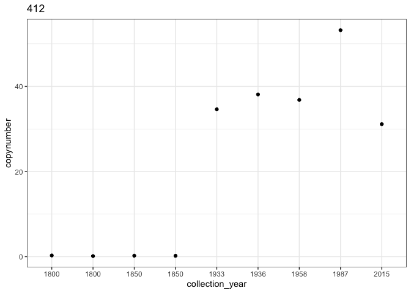<!-- -->

    ## 
    ## ── Column specification ────────────────────────────────────────────────────────
    ## cols(
    ##   Sample = col_character(),
    ##   TE = col_character(),
    ##   All_reads = col_double(),
    ##   HQ_reads = col_double()
    ## )

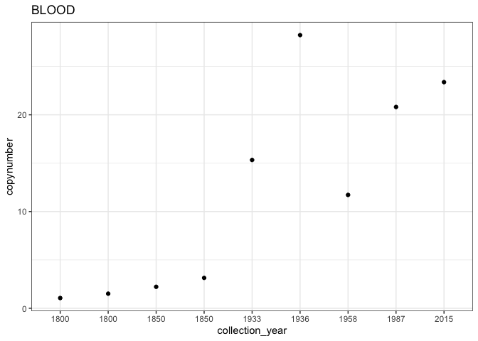<!-- -->

    ## 
    ## ── Column specification ────────────────────────────────────────────────────────
    ## cols(
    ##   Sample = col_character(),
    ##   TE = col_character(),
    ##   All_reads = col_double(),
    ##   HQ_reads = col_double()
    ## )

<!-- -->

    ## 
    ## ── Column specification ────────────────────────────────────────────────────────
    ## cols(
    ##   Sample = col_character(),
    ##   TE = col_character(),
    ##   All_reads = col_double(),
    ##   HQ_reads = col_double()
    ## )

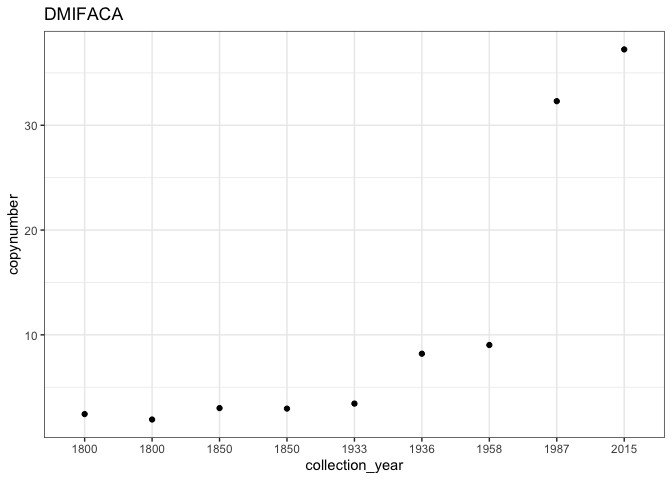<!-- -->

    ## 
    ## ── Column specification ────────────────────────────────────────────────────────
    ## cols(
    ##   Sample = col_character(),
    ##   TE = col_character(),
    ##   All_reads = col_double(),
    ##   HQ_reads = col_double()
    ## )

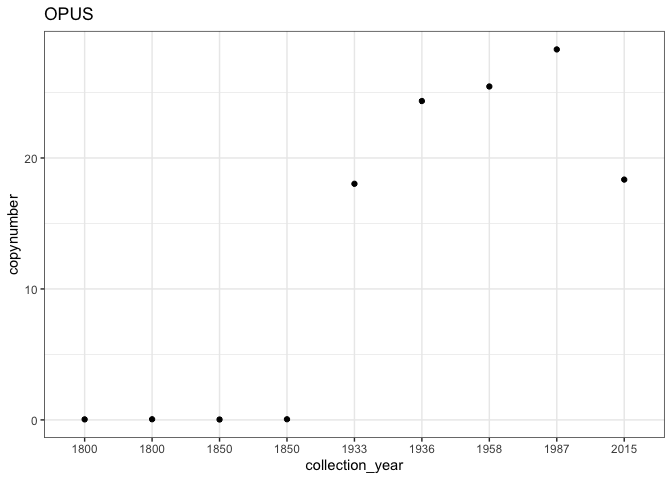<!-- -->

    ## 
    ## ── Column specification ────────────────────────────────────────────────────────
    ## cols(
    ##   Sample = col_character(),
    ##   TE = col_character(),
    ##   All_reads = col_double(),
    ##   HQ_reads = col_double()
    ## )

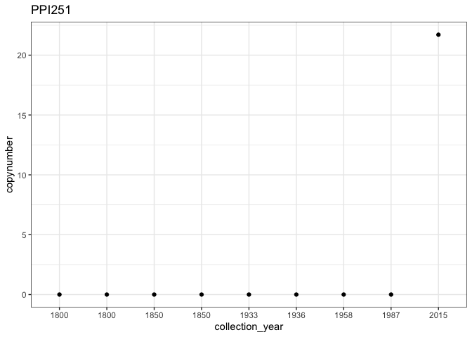<!-- -->

    ## 
    ## ── Column specification ────────────────────────────────────────────────────────
    ## cols(
    ##   Sample = col_character(),
    ##   TE = col_character(),
    ##   All_reads = col_double(),
    ##   HQ_reads = col_double()
    ## )

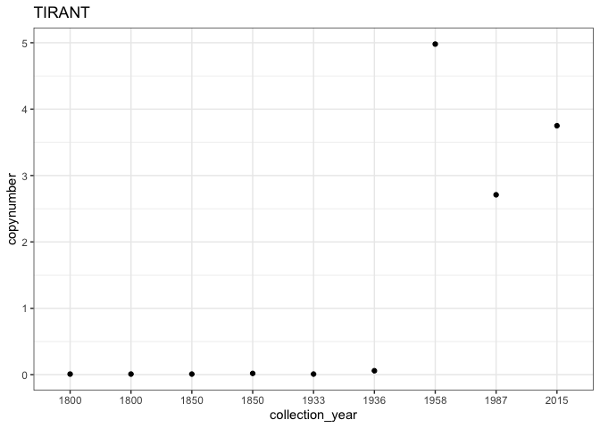<!-- -->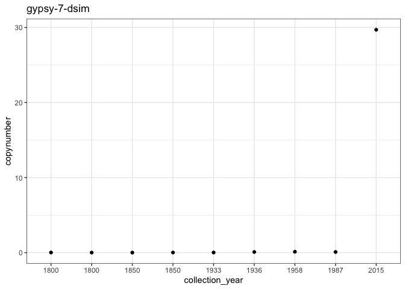<!-- -->

## Clark library

``` r
clark <- analysis("/Volumes/Temp1/simulans-old-strains/analysis/csv/Dmel/clark/Dmel-clark.csv", pre1900, modern, age_dmel, "Pre-1900 vs Post-1980")
```

    ## 
    ## ── Column specification ────────────────────────────────────────────────────────
    ## cols(
    ##   Sample = col_character(),
    ##   TE = col_character(),
    ##   All_reads = col_double(),
    ##   HQ_reads = col_double()
    ## )

    ## `summarise()` has grouped output by 'age'. You can override using the `.groups`
    ## argument.
    ## ── Column specification
    ## ──────────────────────────────────────────────────────── cols( TE =
    ## col_character() )

``` r
clark$plot
```

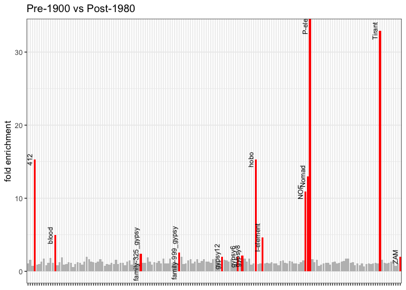<!-- -->

``` r
kable(clark$table)
```

<table>
<thead>
<tr>
<th style="text-align:left;">
TE
</th>
<th style="text-align:right;">
old_cn
</th>
<th style="text-align:right;">
new_cn
</th>
<th style="text-align:right;">
fold_enrichment
</th>
</tr>
</thead>
<tbody>
<tr>
<td style="text-align:left;">
P-element
</td>
<td style="text-align:right;">
0.000
</td>
<td style="text-align:right;">
11.315
</td>
<td style="text-align:right;">
Inf
</td>
</tr>
<tr>
<td style="text-align:left;">
Tirant
</td>
<td style="text-align:right;">
0.135
</td>
<td style="text-align:right;">
4.445
</td>
<td style="text-align:right;">
32.925926
</td>
</tr>
<tr>
<td style="text-align:left;">
412
</td>
<td style="text-align:right;">
1.615
</td>
<td style="text-align:right;">
24.775
</td>
<td style="text-align:right;">
15.340557
</td>
</tr>
<tr>
<td style="text-align:left;">
hobo
</td>
<td style="text-align:right;">
2.365
</td>
<td style="text-align:right;">
36.200
</td>
<td style="text-align:right;">
15.306554
</td>
</tr>
<tr>
<td style="text-align:left;">
Nomad
</td>
<td style="text-align:right;">
2.110
</td>
<td style="text-align:right;">
27.490
</td>
<td style="text-align:right;">
13.028436
</td>
</tr>
<tr>
<td style="text-align:left;">
NOF
</td>
<td style="text-align:right;">
0.810
</td>
<td style="text-align:right;">
8.815
</td>
<td style="text-align:right;">
10.882716
</td>
</tr>
<tr>
<td style="text-align:left;">
blood
</td>
<td style="text-align:right;">
4.920
</td>
<td style="text-align:right;">
24.330
</td>
<td style="text-align:right;">
4.945122
</td>
</tr>
<tr>
<td style="text-align:left;">
I-element
</td>
<td style="text-align:right;">
8.575
</td>
<td style="text-align:right;">
39.985
</td>
<td style="text-align:right;">
4.662974
</td>
</tr>
<tr>
<td style="text-align:left;">
family-999_gypsy
</td>
<td style="text-align:right;">
1.465
</td>
<td style="text-align:right;">
3.715
</td>
<td style="text-align:right;">
2.535836
</td>
</tr>
<tr>
<td style="text-align:left;">
family-325_gypsy
</td>
<td style="text-align:right;">
2.800
</td>
<td style="text-align:right;">
6.725
</td>
<td style="text-align:right;">
2.401786
</td>
</tr>
<tr>
<td style="text-align:left;">
gypsy8
</td>
<td style="text-align:right;">
2.470
</td>
<td style="text-align:right;">
5.285
</td>
<td style="text-align:right;">
2.139676
</td>
</tr>
<tr>
<td style="text-align:left;">
gypsy6
</td>
<td style="text-align:right;">
5.600
</td>
<td style="text-align:right;">
11.335
</td>
<td style="text-align:right;">
2.024107
</td>
</tr>
<tr>
<td style="text-align:left;">
gypsy12
</td>
<td style="text-align:right;">
3.100
</td>
<td style="text-align:right;">
6.250
</td>
<td style="text-align:right;">
2.016129
</td>
</tr>
<tr>
<td style="text-align:left;">
ZAM
</td>
<td style="text-align:right;">
2.685
</td>
<td style="text-align:right;">
5.405
</td>
<td style="text-align:right;">
2.013035
</td>
</tr>
</tbody>
</table>

``` r
kable(clark$each_sample)
```

<table>
<thead>
<tr>
<th style="text-align:left;">
TE
</th>
<th style="text-align:right;">
SRR23876562_1850
</th>
<th style="text-align:right;">
SRR23876569_1850
</th>
<th style="text-align:right;">
SRR11846559_1987
</th>
<th style="text-align:right;">
SRR9951090_2015
</th>
</tr>
</thead>
<tbody>
<tr>
<td style="text-align:left;">
412
</td>
<td style="text-align:right;">
1.41
</td>
<td style="text-align:right;">
1.82
</td>
<td style="text-align:right;">
31.51
</td>
<td style="text-align:right;">
18.04
</td>
</tr>
<tr>
<td style="text-align:left;">
blood
</td>
<td style="text-align:right;">
4.09
</td>
<td style="text-align:right;">
5.75
</td>
<td style="text-align:right;">
22.85
</td>
<td style="text-align:right;">
25.81
</td>
</tr>
<tr>
<td style="text-align:left;">
family-325_gypsy
</td>
<td style="text-align:right;">
2.84
</td>
<td style="text-align:right;">
2.76
</td>
<td style="text-align:right;">
3.53
</td>
<td style="text-align:right;">
9.92
</td>
</tr>
<tr>
<td style="text-align:left;">
family-999_gypsy
</td>
<td style="text-align:right;">
1.38
</td>
<td style="text-align:right;">
1.55
</td>
<td style="text-align:right;">
3.59
</td>
<td style="text-align:right;">
3.84
</td>
</tr>
<tr>
<td style="text-align:left;">
gypsy12
</td>
<td style="text-align:right;">
3.05
</td>
<td style="text-align:right;">
3.15
</td>
<td style="text-align:right;">
6.06
</td>
<td style="text-align:right;">
6.44
</td>
</tr>
<tr>
<td style="text-align:left;">
gypsy6
</td>
<td style="text-align:right;">
5.18
</td>
<td style="text-align:right;">
6.02
</td>
<td style="text-align:right;">
10.61
</td>
<td style="text-align:right;">
12.06
</td>
</tr>
<tr>
<td style="text-align:left;">
gypsy8
</td>
<td style="text-align:right;">
2.51
</td>
<td style="text-align:right;">
2.43
</td>
<td style="text-align:right;">
5.56
</td>
<td style="text-align:right;">
5.01
</td>
</tr>
<tr>
<td style="text-align:left;">
hobo
</td>
<td style="text-align:right;">
2.17
</td>
<td style="text-align:right;">
2.56
</td>
<td style="text-align:right;">
36.39
</td>
<td style="text-align:right;">
36.01
</td>
</tr>
<tr>
<td style="text-align:left;">
I-element
</td>
<td style="text-align:right;">
8.35
</td>
<td style="text-align:right;">
8.80
</td>
<td style="text-align:right;">
36.99
</td>
<td style="text-align:right;">
42.98
</td>
</tr>
<tr>
<td style="text-align:left;">
NOF
</td>
<td style="text-align:right;">
1.00
</td>
<td style="text-align:right;">
0.62
</td>
<td style="text-align:right;">
16.92
</td>
<td style="text-align:right;">
0.71
</td>
</tr>
<tr>
<td style="text-align:left;">
Nomad
</td>
<td style="text-align:right;">
1.53
</td>
<td style="text-align:right;">
2.69
</td>
<td style="text-align:right;">
33.47
</td>
<td style="text-align:right;">
21.51
</td>
</tr>
<tr>
<td style="text-align:left;">
P-element
</td>
<td style="text-align:right;">
0.00
</td>
<td style="text-align:right;">
0.00
</td>
<td style="text-align:right;">
0.00
</td>
<td style="text-align:right;">
22.63
</td>
</tr>
<tr>
<td style="text-align:left;">
Tirant
</td>
<td style="text-align:right;">
0.14
</td>
<td style="text-align:right;">
0.13
</td>
<td style="text-align:right;">
3.73
</td>
<td style="text-align:right;">
5.16
</td>
</tr>
<tr>
<td style="text-align:left;">
ZAM
</td>
<td style="text-align:right;">
2.56
</td>
<td style="text-align:right;">
2.81
</td>
<td style="text-align:right;">
5.92
</td>
<td style="text-align:right;">
4.89
</td>
</tr>
</tbody>
</table>

``` r
clark <- analysis("/Volumes/Temp1/simulans-old-strains/analysis/csv/Dmel/clark/Dmel-clark.csv", pre1900, pre1950, age_dmel, "Pre-1900 vs Pre-1980")
```

    ## 
    ## ── Column specification ────────────────────────────────────────────────────────
    ## cols(
    ##   Sample = col_character(),
    ##   TE = col_character(),
    ##   All_reads = col_double(),
    ##   HQ_reads = col_double()
    ## )
    ## 
    ## `summarise()` has grouped output by 'age'. You can override using the `.groups` argument.
    ## 
    ## ── Column specification ────────────────────────────────────────────────────────
    ## cols(
    ##   TE = col_character()
    ## )

``` r
clark$plot
```

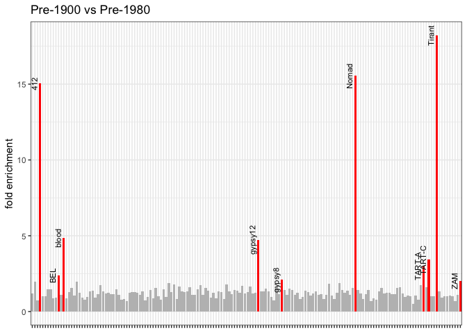<!-- -->

``` r
kable(clark$table)
```

<table>
<thead>
<tr>
<th style="text-align:left;">
TE
</th>
<th style="text-align:right;">
old_cn
</th>
<th style="text-align:right;">
new_cn
</th>
<th style="text-align:right;">
fold_enrichment
</th>
</tr>
</thead>
<tbody>
<tr>
<td style="text-align:left;">
Tirant
</td>
<td style="text-align:right;">
0.135
</td>
<td style="text-align:right;">
2.460000
</td>
<td style="text-align:right;">
18.222222
</td>
</tr>
<tr>
<td style="text-align:left;">
Nomad
</td>
<td style="text-align:right;">
2.110
</td>
<td style="text-align:right;">
32.803333
</td>
<td style="text-align:right;">
15.546603
</td>
</tr>
<tr>
<td style="text-align:left;">
412
</td>
<td style="text-align:right;">
1.615
</td>
<td style="text-align:right;">
24.296667
</td>
<td style="text-align:right;">
15.044376
</td>
</tr>
<tr>
<td style="text-align:left;">
blood
</td>
<td style="text-align:right;">
4.920
</td>
<td style="text-align:right;">
23.876667
</td>
<td style="text-align:right;">
4.852981
</td>
</tr>
<tr>
<td style="text-align:left;">
gypsy12
</td>
<td style="text-align:right;">
3.100
</td>
<td style="text-align:right;">
14.680000
</td>
<td style="text-align:right;">
4.735484
</td>
</tr>
<tr>
<td style="text-align:left;">
TART-C
</td>
<td style="text-align:right;">
2.185
</td>
<td style="text-align:right;">
7.483333
</td>
<td style="text-align:right;">
3.424866
</td>
</tr>
<tr>
<td style="text-align:left;">
TART-A
</td>
<td style="text-align:right;">
1.975
</td>
<td style="text-align:right;">
5.960000
</td>
<td style="text-align:right;">
3.017721
</td>
</tr>
<tr>
<td style="text-align:left;">
BEL
</td>
<td style="text-align:right;">
7.660
</td>
<td style="text-align:right;">
18.246667
</td>
<td style="text-align:right;">
2.382071
</td>
</tr>
<tr>
<td style="text-align:left;">
gypsy8
</td>
<td style="text-align:right;">
2.470
</td>
<td style="text-align:right;">
5.210000
</td>
<td style="text-align:right;">
2.109312
</td>
</tr>
<tr>
<td style="text-align:left;">
ZAM
</td>
<td style="text-align:right;">
2.685
</td>
<td style="text-align:right;">
5.446667
</td>
<td style="text-align:right;">
2.028554
</td>
</tr>
</tbody>
</table>

``` r
kable(clark$each_sample)
```

<table>
<thead>
<tr>
<th style="text-align:left;">
TE
</th>
<th style="text-align:right;">
SRR23876562_1850
</th>
<th style="text-align:right;">
SRR23876569_1850
</th>
<th style="text-align:right;">
SRR23876586_1933
</th>
<th style="text-align:right;">
SRR11846555_1936
</th>
<th style="text-align:right;">
SRR11846565_1958
</th>
</tr>
</thead>
<tbody>
<tr>
<td style="text-align:left;">
412
</td>
<td style="text-align:right;">
1.41
</td>
<td style="text-align:right;">
1.82
</td>
<td style="text-align:right;">
29.06
</td>
<td style="text-align:right;">
22.05
</td>
<td style="text-align:right;">
21.78
</td>
</tr>
<tr>
<td style="text-align:left;">
BEL
</td>
<td style="text-align:right;">
8.57
</td>
<td style="text-align:right;">
6.75
</td>
<td style="text-align:right;">
18.92
</td>
<td style="text-align:right;">
13.28
</td>
<td style="text-align:right;">
22.54
</td>
</tr>
<tr>
<td style="text-align:left;">
blood
</td>
<td style="text-align:right;">
4.09
</td>
<td style="text-align:right;">
5.75
</td>
<td style="text-align:right;">
27.68
</td>
<td style="text-align:right;">
30.95
</td>
<td style="text-align:right;">
13.00
</td>
</tr>
<tr>
<td style="text-align:left;">
gypsy12
</td>
<td style="text-align:right;">
3.05
</td>
<td style="text-align:right;">
3.15
</td>
<td style="text-align:right;">
18.78
</td>
<td style="text-align:right;">
12.16
</td>
<td style="text-align:right;">
13.10
</td>
</tr>
<tr>
<td style="text-align:left;">
gypsy8
</td>
<td style="text-align:right;">
2.51
</td>
<td style="text-align:right;">
2.43
</td>
<td style="text-align:right;">
3.36
</td>
<td style="text-align:right;">
5.56
</td>
<td style="text-align:right;">
6.71
</td>
</tr>
<tr>
<td style="text-align:left;">
Nomad
</td>
<td style="text-align:right;">
1.53
</td>
<td style="text-align:right;">
2.69
</td>
<td style="text-align:right;">
39.21
</td>
<td style="text-align:right;">
29.02
</td>
<td style="text-align:right;">
30.18
</td>
</tr>
<tr>
<td style="text-align:left;">
TART-A
</td>
<td style="text-align:right;">
2.66
</td>
<td style="text-align:right;">
1.29
</td>
<td style="text-align:right;">
7.66
</td>
<td style="text-align:right;">
5.48
</td>
<td style="text-align:right;">
4.74
</td>
</tr>
<tr>
<td style="text-align:left;">
TART-C
</td>
<td style="text-align:right;">
3.46
</td>
<td style="text-align:right;">
0.91
</td>
<td style="text-align:right;">
3.35
</td>
<td style="text-align:right;">
18.73
</td>
<td style="text-align:right;">
0.37
</td>
</tr>
<tr>
<td style="text-align:left;">
Tirant
</td>
<td style="text-align:right;">
0.14
</td>
<td style="text-align:right;">
0.13
</td>
<td style="text-align:right;">
0.15
</td>
<td style="text-align:right;">
0.38
</td>
<td style="text-align:right;">
6.85
</td>
</tr>
<tr>
<td style="text-align:left;">
ZAM
</td>
<td style="text-align:right;">
2.56
</td>
<td style="text-align:right;">
2.81
</td>
<td style="text-align:right;">
6.22
</td>
<td style="text-align:right;">
4.82
</td>
<td style="text-align:right;">
5.30
</td>
</tr>
</tbody>
</table>

``` r
clark <- analysis("/Volumes/Temp1/simulans-old-strains/analysis/csv/Dmel/clark/Dmel-clark.csv", pre1950, modern, age_dmel, "Pre-1980 vs Post-1980")
```

    ## 
    ## ── Column specification ────────────────────────────────────────────────────────
    ## cols(
    ##   Sample = col_character(),
    ##   TE = col_character(),
    ##   All_reads = col_double(),
    ##   HQ_reads = col_double()
    ## )
    ## 
    ## `summarise()` has grouped output by 'age'. You can override using the `.groups` argument.
    ## 
    ## ── Column specification ────────────────────────────────────────────────────────
    ## cols(
    ##   TE = col_character()
    ## )

``` r
clark$plot
```

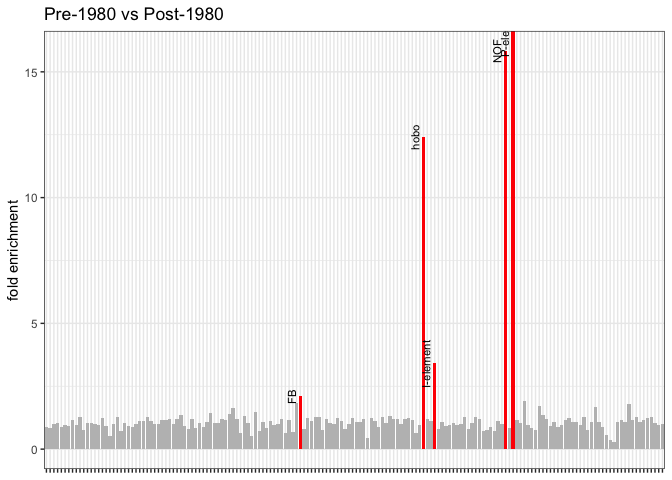<!-- -->

``` r
kable(clark$table)
```

<table>
<thead>
<tr>
<th style="text-align:left;">
TE
</th>
<th style="text-align:right;">
old_cn
</th>
<th style="text-align:right;">
new_cn
</th>
<th style="text-align:right;">
fold_enrichment
</th>
</tr>
</thead>
<tbody>
<tr>
<td style="text-align:left;">
P-element
</td>
<td style="text-align:right;">
0.0000000
</td>
<td style="text-align:right;">
11.315
</td>
<td style="text-align:right;">
Inf
</td>
</tr>
<tr>
<td style="text-align:left;">
NOF
</td>
<td style="text-align:right;">
0.5566667
</td>
<td style="text-align:right;">
8.815
</td>
<td style="text-align:right;">
15.835329
</td>
</tr>
<tr>
<td style="text-align:left;">
hobo
</td>
<td style="text-align:right;">
2.9133333
</td>
<td style="text-align:right;">
36.200
</td>
<td style="text-align:right;">
12.425629
</td>
</tr>
<tr>
<td style="text-align:left;">
I-element
</td>
<td style="text-align:right;">
11.7400000
</td>
<td style="text-align:right;">
39.985
</td>
<td style="text-align:right;">
3.405877
</td>
</tr>
<tr>
<td style="text-align:left;">
FB
</td>
<td style="text-align:right;">
79.0766667
</td>
<td style="text-align:right;">
167.620
</td>
<td style="text-align:right;">
2.119715
</td>
</tr>
</tbody>
</table>

``` r
kable(clark$each_sample)
```

<table>
<thead>
<tr>
<th style="text-align:left;">
TE
</th>
<th style="text-align:right;">
SRR23876586_1933
</th>
<th style="text-align:right;">
SRR11846555_1936
</th>
<th style="text-align:right;">
SRR11846565_1958
</th>
<th style="text-align:right;">
SRR11846559_1987
</th>
<th style="text-align:right;">
SRR9951090_2015
</th>
</tr>
</thead>
<tbody>
<tr>
<td style="text-align:left;">
FB
</td>
<td style="text-align:right;">
111.77
</td>
<td style="text-align:right;">
67.44
</td>
<td style="text-align:right;">
58.02
</td>
<td style="text-align:right;">
251.00
</td>
<td style="text-align:right;">
84.24
</td>
</tr>
<tr>
<td style="text-align:left;">
hobo
</td>
<td style="text-align:right;">
1.35
</td>
<td style="text-align:right;">
3.00
</td>
<td style="text-align:right;">
4.39
</td>
<td style="text-align:right;">
36.39
</td>
<td style="text-align:right;">
36.01
</td>
</tr>
<tr>
<td style="text-align:left;">
I-element
</td>
<td style="text-align:right;">
10.09
</td>
<td style="text-align:right;">
12.11
</td>
<td style="text-align:right;">
13.02
</td>
<td style="text-align:right;">
36.99
</td>
<td style="text-align:right;">
42.98
</td>
</tr>
<tr>
<td style="text-align:left;">
NOF
</td>
<td style="text-align:right;">
1.00
</td>
<td style="text-align:right;">
0.23
</td>
<td style="text-align:right;">
0.44
</td>
<td style="text-align:right;">
16.92
</td>
<td style="text-align:right;">
0.71
</td>
</tr>
<tr>
<td style="text-align:left;">
P-element
</td>
<td style="text-align:right;">
0.00
</td>
<td style="text-align:right;">
0.00
</td>
<td style="text-align:right;">
0.00
</td>
<td style="text-align:right;">
0.00
</td>
<td style="text-align:right;">
22.63
</td>
</tr>
</tbody>
</table>

``` r
candidates <- c("412", "blood", "hobo", "I-element", "NOF", "Nomad", "family-999_gypsy", "family-325_gypsy", "gypsy6", "gypsy8", "gypsy12", "BEL", "FB")

for (t in candidates){
 clark_timeline <- timeline("/Volumes/Temp1/simulans-old-strains/analysis/csv/Dmel/clark/Dmel-clark.csv", age_dmel, t)
  print(clark_timeline)
}
```

    ## 
    ## ── Column specification ────────────────────────────────────────────────────────
    ## cols(
    ##   Sample = col_character(),
    ##   TE = col_character(),
    ##   All_reads = col_double(),
    ##   HQ_reads = col_double()
    ## )
    ## 
    ## 
    ## ── Column specification ────────────────────────────────────────────────────────
    ## cols(
    ##   Sample = col_character(),
    ##   TE = col_character(),
    ##   All_reads = col_double(),
    ##   HQ_reads = col_double()
    ## )

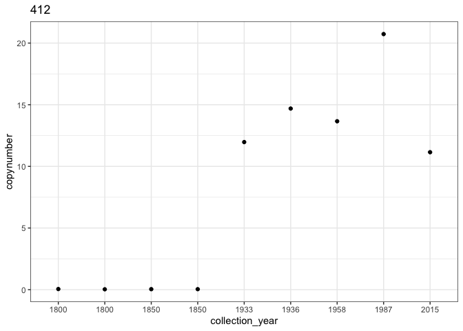<!-- -->

    ## 
    ## ── Column specification ────────────────────────────────────────────────────────
    ## cols(
    ##   Sample = col_character(),
    ##   TE = col_character(),
    ##   All_reads = col_double(),
    ##   HQ_reads = col_double()
    ## )

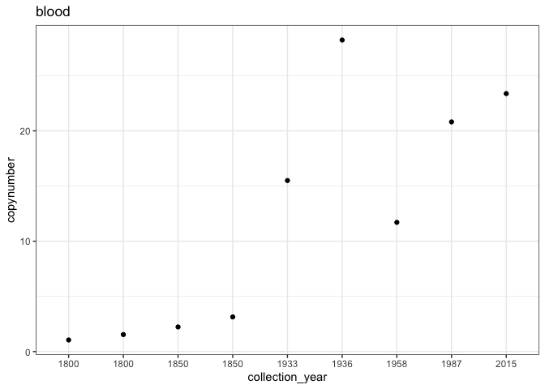<!-- -->

    ## 
    ## ── Column specification ────────────────────────────────────────────────────────
    ## cols(
    ##   Sample = col_character(),
    ##   TE = col_character(),
    ##   All_reads = col_double(),
    ##   HQ_reads = col_double()
    ## )

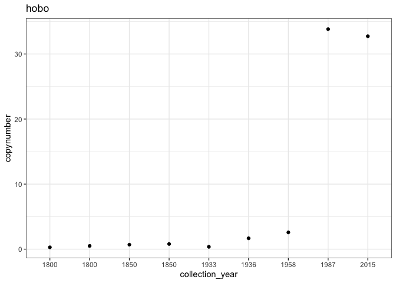<!-- -->

    ## 
    ## ── Column specification ────────────────────────────────────────────────────────
    ## cols(
    ##   Sample = col_character(),
    ##   TE = col_character(),
    ##   All_reads = col_double(),
    ##   HQ_reads = col_double()
    ## )

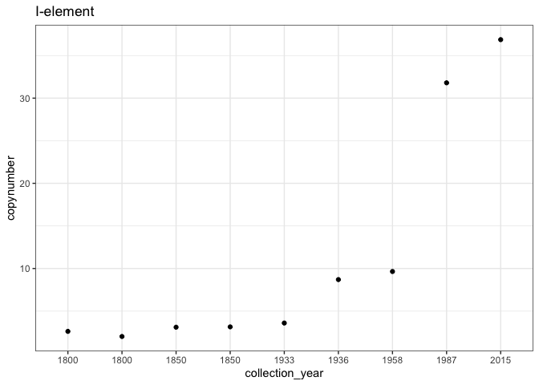<!-- -->

    ## 
    ## ── Column specification ────────────────────────────────────────────────────────
    ## cols(
    ##   Sample = col_character(),
    ##   TE = col_character(),
    ##   All_reads = col_double(),
    ##   HQ_reads = col_double()
    ## )

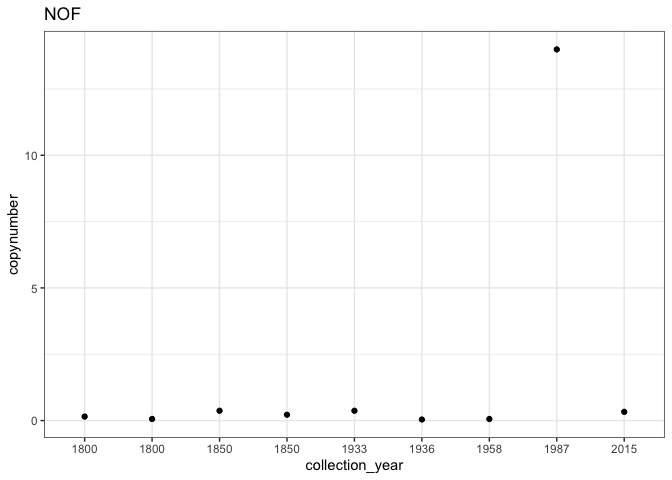<!-- -->

    ## 
    ## ── Column specification ────────────────────────────────────────────────────────
    ## cols(
    ##   Sample = col_character(),
    ##   TE = col_character(),
    ##   All_reads = col_double(),
    ##   HQ_reads = col_double()
    ## )

<!-- -->

    ## 
    ## ── Column specification ────────────────────────────────────────────────────────
    ## cols(
    ##   Sample = col_character(),
    ##   TE = col_character(),
    ##   All_reads = col_double(),
    ##   HQ_reads = col_double()
    ## )

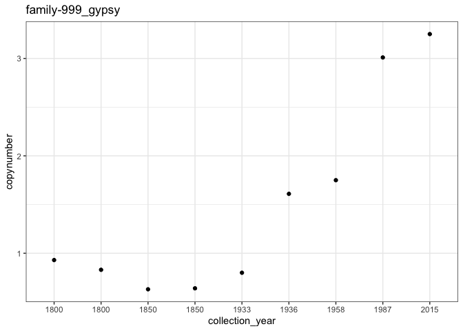<!-- -->

    ## 
    ## ── Column specification ────────────────────────────────────────────────────────
    ## cols(
    ##   Sample = col_character(),
    ##   TE = col_character(),
    ##   All_reads = col_double(),
    ##   HQ_reads = col_double()
    ## )

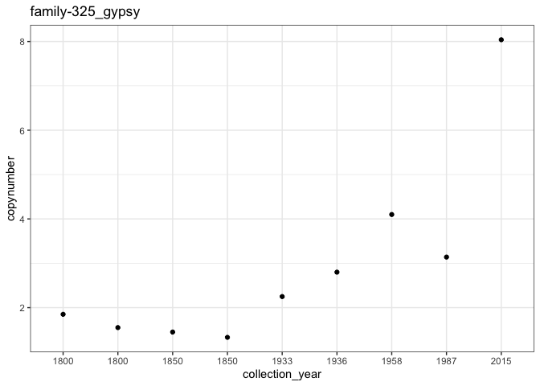<!-- -->

    ## 
    ## ── Column specification ────────────────────────────────────────────────────────
    ## cols(
    ##   Sample = col_character(),
    ##   TE = col_character(),
    ##   All_reads = col_double(),
    ##   HQ_reads = col_double()
    ## )

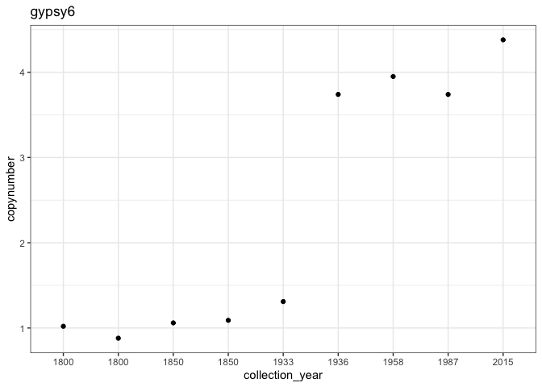<!-- -->

    ## 
    ## ── Column specification ────────────────────────────────────────────────────────
    ## cols(
    ##   Sample = col_character(),
    ##   TE = col_character(),
    ##   All_reads = col_double(),
    ##   HQ_reads = col_double()
    ## )

<!-- -->

    ## 
    ## ── Column specification ────────────────────────────────────────────────────────
    ## cols(
    ##   Sample = col_character(),
    ##   TE = col_character(),
    ##   All_reads = col_double(),
    ##   HQ_reads = col_double()
    ## )

<!-- -->

    ## 
    ## ── Column specification ────────────────────────────────────────────────────────
    ## cols(
    ##   Sample = col_character(),
    ##   TE = col_character(),
    ##   All_reads = col_double(),
    ##   HQ_reads = col_double()
    ## )

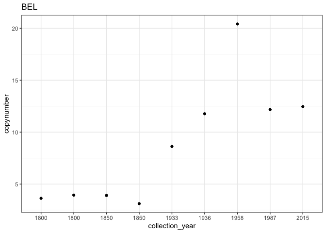<!-- -->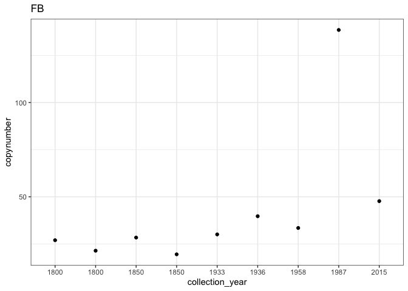<!-- -->
