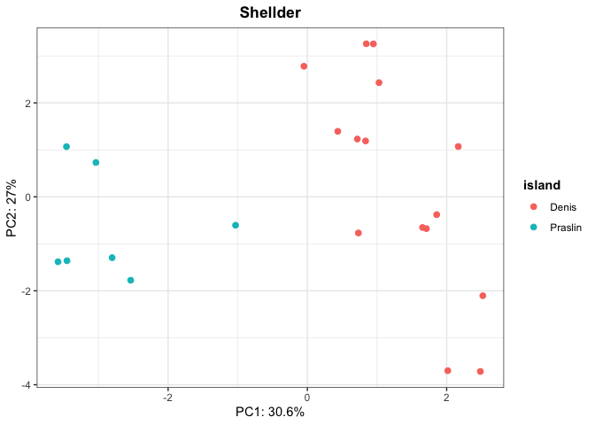
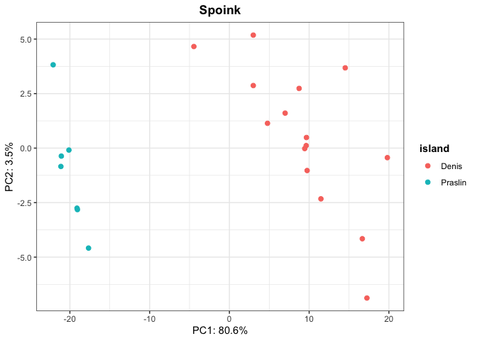
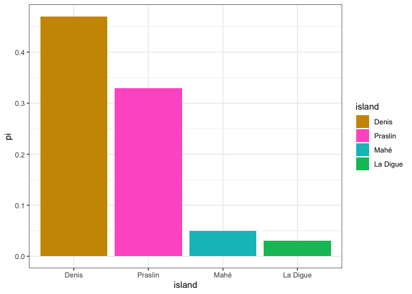
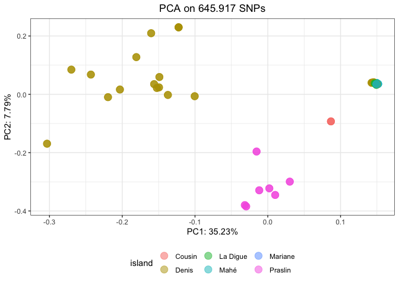
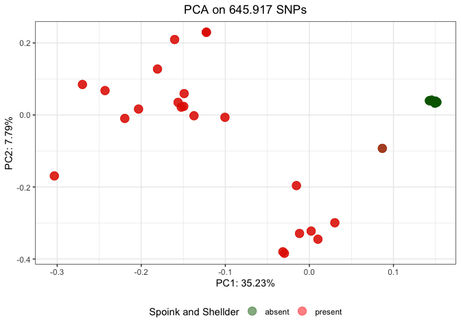

Drosophila sechellia - Copynumber analysis
================

``` r
suppressPackageStartupMessages(library(tidyverse))
suppressPackageStartupMessages(library(knitr))
suppressPackageStartupMessages(library(kableExtra))
suppressPackageStartupMessages(library(ggpubr))
suppressPackageStartupMessages(library(maps))
theme_set(theme_bw())

knitr::opts_knit$set(root.dir = "/Volumes/Temp1/simulans-old-strains/analysis/plots")
```

``` r
analysis <- function(csv, old, new, year, titlee) {
  
copynumbers <- read_csv(csv, show_col_types = FALSE) %>% filter(Sample!="Sample", Sample%in%c(old, new)) %>% type_convert() %>% mutate(age = ifelse(Sample %in% old, "old", "new")) %>% inner_join(year, by="Sample") %>% arrange(collection_year) %>% mutate(Sample = paste0(Sample, "_", collection_year)) %>% select(-collection_year)

avg_museum_modern <- copynumbers %>% group_by(age, TE) %>% summarise(HQ_reads=mean(HQ_reads))
museum <- avg_museum_modern %>% filter(age == "old") %>% ungroup() %>% select(TE, HQ_reads) %>% rename(old_cn = HQ_reads)
modern <- avg_museum_modern %>% filter(age == "new") %>% ungroup() %>% select(TE, HQ_reads) %>% rename(new_cn = HQ_reads)
fold <- inner_join(museum, modern, by="TE") %>% type_convert() %>% mutate(fold_enrichment = new_cn/old_cn) %>% filter(new_cn > 2)

plot_fold <- ggplot(data = fold, aes(x = TE, y = fold_enrichment)) +
  geom_bar(stat = "identity", position = "dodge", aes(fill = fold_enrichment > 2)) +
  scale_fill_manual(values = c("FALSE" = "gray", "TRUE" = "red")) +
  xlab("TE") +
  ylab("fold enrichment") +
  theme(legend.position = "none", axis.title.x = element_blank(), axis.text.x = element_blank()) +
  geom_text(aes(label = ifelse(fold_enrichment > 2, as.character(TE), "")), 
            position = position_dodge(width = 1),
            vjust = -0.5, size = 3, angle=90)+
  ggtitle(titlee)

fold_enriched <- fold %>% filter(fold_enrichment>2) %>% arrange(desc(fold_enrichment))

comparison_foldenriched <- copynumbers %>% ungroup() %>% select(-All_reads, -age) %>% pivot_wider(names_from = Sample, values_from = HQ_reads) %>% filter(TE %in% fold_enriched$TE)# %>% inner_join(fold_enriched, by="fold_enrichment")

list(plot = plot_fold, table = fold_enriched, each_sample = comparison_foldenriched)
}
```

``` r
timeline <- function(csv, age, transposon) {
  single_te <- read_csv(csv, show_col_types = FALSE) %>% filter(Sample!="Sample") %>% type_convert() %>% filter(TE==transposon) %>% inner_join(age, by="Sample") %>% arrange(collection_year)
  
  plot <- ggplot(single_te, aes(x = reorder(Sample, collection_year), y = HQ_reads)) +
    geom_point(size = 1.5) +
    scale_x_discrete(labels = paste0(single_te$collection_year)) +
    labs(y = "copynumber", x = "collection_year") + ggtitle(transposon)
}
```

``` r
samples <- c("SRR9913024","SRR7697345","SRR5514394","SRR14138506","SRR14138507","SRR5860658") 
years <- c(1980, 1980, 1980, 2012, 2012, 2012)
age_dsec <- tibble(collection_year = years, Sample = samples)

old <- c("SRR9913024","SRR7697345","SRR5514394")
new <- c("SRR14138506","SRR14138507","SRR5860658")
```

## Dmel library (+ Gypsy7 and Gypsy29 from Dsim)

``` r
dmel_TEs <- analysis("/Volumes/Temp1/simulans-old-strains/analysis/csv/Dsec/dmel_TEs/Dsec-dmel_TEs.csv", old, new, age_dsec, "Old vs New")
```

    ## 
    ## ── Column specification ────────────────────────────────────────────────────────
    ## cols(
    ##   Sample = col_character(),
    ##   TE = col_character(),
    ##   All_reads = col_double(),
    ##   HQ_reads = col_double()
    ## )

    ## `summarise()` has grouped output by 'age'. You can override using the `.groups`
    ## argument.
    ## ── Column specification
    ## ──────────────────────────────────────────────────────── cols( TE =
    ## col_character() )

``` r
dmel_TEs$plot
```

<!-- -->

``` r
kable(dmel_TEs$table)
```

<table>
<thead>
<tr>
<th style="text-align:left;">
TE
</th>
<th style="text-align:right;">
old_cn
</th>
<th style="text-align:right;">
new_cn
</th>
<th style="text-align:right;">
fold_enrichment
</th>
</tr>
</thead>
<tbody>
<tr>
</tr>
</tbody>
</table>

``` r
kable(dmel_TEs$each_sample)
```

<table>
<thead>
<tr>
<th style="text-align:left;">
TE
</th>
<th style="text-align:right;">
SRR5514394_1980
</th>
<th style="text-align:right;">
SRR7697345_1980
</th>
<th style="text-align:right;">
SRR9913024_1980
</th>
<th style="text-align:right;">
SRR14138506_2012
</th>
<th style="text-align:right;">
SRR14138507_2012
</th>
<th style="text-align:right;">
SRR5860658_2012
</th>
</tr>
</thead>
<tbody>
<tr>
</tr>
</tbody>
</table>

``` r
dmel_TEs <- analysis("/Volumes/Temp1/simulans-old-strains/analysis/csv/Dsec/dmel_TEs/Dsec-dmel_TEs.csv", new, old, age_dsec, "New vs Old")
```

    ## 
    ## ── Column specification ────────────────────────────────────────────────────────
    ## cols(
    ##   Sample = col_character(),
    ##   TE = col_character(),
    ##   All_reads = col_double(),
    ##   HQ_reads = col_double()
    ## )
    ## 
    ## `summarise()` has grouped output by 'age'. You can override using the `.groups` argument.
    ## 
    ## ── Column specification ────────────────────────────────────────────────────────
    ## cols(
    ##   TE = col_character()
    ## )

``` r
dmel_TEs$plot
```

<!-- -->

``` r
kable(dmel_TEs$table)
```

<table>
<thead>
<tr>
<th style="text-align:left;">
TE
</th>
<th style="text-align:right;">
old_cn
</th>
<th style="text-align:right;">
new_cn
</th>
<th style="text-align:right;">
fold_enrichment
</th>
</tr>
</thead>
<tbody>
<tr>
<td style="text-align:left;">
gypsy-7-dsim
</td>
<td style="text-align:right;">
0.07
</td>
<td style="text-align:right;">
9.11
</td>
<td style="text-align:right;">
130.1429
</td>
</tr>
</tbody>
</table>

``` r
kable(dmel_TEs$each_sample)
```

<table>
<thead>
<tr>
<th style="text-align:left;">
TE
</th>
<th style="text-align:right;">
SRR5514394_1980
</th>
<th style="text-align:right;">
SRR7697345_1980
</th>
<th style="text-align:right;">
SRR9913024_1980
</th>
<th style="text-align:right;">
SRR14138506_2012
</th>
<th style="text-align:right;">
SRR14138507_2012
</th>
<th style="text-align:right;">
SRR5860658_2012
</th>
</tr>
</thead>
<tbody>
<tr>
<td style="text-align:left;">
gypsy-7-dsim
</td>
<td style="text-align:right;">
3.66
</td>
<td style="text-align:right;">
10.35
</td>
<td style="text-align:right;">
13.32
</td>
<td style="text-align:right;">
0.07
</td>
<td style="text-align:right;">
0.08
</td>
<td style="text-align:right;">
0.06
</td>
</tr>
</tbody>
</table>

``` r
candidates <- c("gypsy-29-dsim", "gypsy-7-dsim")

for (t in candidates){
 dmel_TEs_timeline <- timeline("/Volumes/Temp1/simulans-old-strains/analysis/csv/Dsec/dmel_TEs/Dsec-dmel_TEs.csv", age_dsec, t)
  print(dmel_TEs_timeline)
}
```

    ## 
    ## ── Column specification ────────────────────────────────────────────────────────
    ## cols(
    ##   Sample = col_character(),
    ##   TE = col_character(),
    ##   All_reads = col_double(),
    ##   HQ_reads = col_double()
    ## )
    ## 
    ## 
    ## ── Column specification ────────────────────────────────────────────────────────
    ## cols(
    ##   Sample = col_character(),
    ##   TE = col_character(),
    ##   All_reads = col_double(),
    ##   HQ_reads = col_double()
    ## )

<!-- --><!-- -->

## Clark library

``` r
clark <- analysis("/Volumes/Temp1/simulans-old-strains/analysis/csv/Dsec/clark/Dsec-clark.csv", old, new, age_dsec, "Old vs New")
```

    ## 
    ## ── Column specification ────────────────────────────────────────────────────────
    ## cols(
    ##   Sample = col_character(),
    ##   TE = col_character(),
    ##   All_reads = col_double(),
    ##   HQ_reads = col_double()
    ## )

    ## `summarise()` has grouped output by 'age'. You can override using the `.groups`
    ## argument.
    ## ── Column specification
    ## ──────────────────────────────────────────────────────── cols( TE =
    ## col_character() )

``` r
clark$plot
```

<!-- -->

``` r
kable(clark$table)
```

<table>
<thead>
<tr>
<th style="text-align:left;">
TE
</th>
<th style="text-align:right;">
old_cn
</th>
<th style="text-align:right;">
new_cn
</th>
<th style="text-align:right;">
fold_enrichment
</th>
</tr>
</thead>
<tbody>
<tr>
</tr>
</tbody>
</table>

``` r
kable(clark$each_sample)
```

<table>
<thead>
<tr>
<th style="text-align:left;">
TE
</th>
<th style="text-align:right;">
SRR9913024_1980
</th>
<th style="text-align:right;">
SRR14138506_2012
</th>
<th style="text-align:right;">
SRR14138507_2012
</th>
<th style="text-align:right;">
SRR5860658_2012
</th>
</tr>
</thead>
<tbody>
<tr>
</tr>
</tbody>
</table>

``` r
clark <- analysis("/Volumes/Temp1/simulans-old-strains/analysis/csv/Dsec/clark/Dsec-clark.csv", new, old, age_dsec, "New vs Old")
```

    ## 
    ## ── Column specification ────────────────────────────────────────────────────────
    ## cols(
    ##   Sample = col_character(),
    ##   TE = col_character(),
    ##   All_reads = col_double(),
    ##   HQ_reads = col_double()
    ## )
    ## 
    ## `summarise()` has grouped output by 'age'. You can override using the `.groups` argument.
    ## 
    ## ── Column specification ────────────────────────────────────────────────────────
    ## cols(
    ##   TE = col_character()
    ## )

``` r
clark$plot
```

<!-- -->

``` r
kable(clark$table)
```

<table>
<thead>
<tr>
<th style="text-align:left;">
TE
</th>
<th style="text-align:right;">
old_cn
</th>
<th style="text-align:right;">
new_cn
</th>
<th style="text-align:right;">
fold_enrichment
</th>
</tr>
</thead>
<tbody>
<tr>
</tr>
</tbody>
</table>

``` r
kable(clark$each_sample)
```

<table>
<thead>
<tr>
<th style="text-align:left;">
TE
</th>
<th style="text-align:right;">
SRR9913024_1980
</th>
<th style="text-align:right;">
SRR14138506_2012
</th>
<th style="text-align:right;">
SRR14138507_2012
</th>
<th style="text-align:right;">
SRR5860658_2012
</th>
</tr>
</thead>
<tbody>
<tr>
</tr>
</tbody>
</table>

## New TEs

``` r
sech_more_meta <- read_tsv("/Volumes/Temp1/simulans-old-strains/other-data/sechellia-teisseri/sechellia-moredata-metadata.txt", show_col_types = FALSE) %>% mutate(
    island = case_when(
      startsWith(library_name, "Anro") ~ "Anro",
      startsWith(library_name, "Denis") ~ "Denis",
      startsWith(library_name, "LD") ~ "LD",
      startsWith(library_name, "maria_") ~ "Maria",
      startsWith(library_name, "mariane") ~ "Mariane",
      startsWith(library_name, "PNF") ~ "PNF"))

islands <- c("Anro", "Denis", "LD", "Maria", "Mariane", "PNF")
latitudes <- c(-4.734, -3.811, -4.363, -4.671, -4.340, -4.325)
longitudes <- c(55.508, 55.666, 55.831, 55.472, 55.919, 55.730)
islands_df <- tibble(island = islands, lat = latitudes, long = longitudes)

sech_more_metadata <- sech_more_meta %>% inner_join(islands_df, by="island")

candidates <- c("gypsy-29-dsim", "gypsy-7-sim1")

sechellia_dataset <- read_csv("/Volumes/Temp1/simulans-old-strains/analysis/csv/Dsec/new_TEs/Dsec-moredata.csv", show_col_types = FALSE) %>% filter(Sample!="Sample") %>% rename(run_accession = Sample) %>% type_convert() %>% inner_join(sech_more_metadata, by="run_accession")
```

    ## 
    ## ── Column specification ────────────────────────────────────────────────────────
    ## cols(
    ##   run_accession = col_character(),
    ##   TE = col_character(),
    ##   All_reads = col_double(),
    ##   HQ_reads = col_double()
    ## )

``` r
for (t in candidates){
 single_te <- sechellia_dataset %>% filter(TE==t)
  
  plot <- ggplot(single_te, aes(x = library_name, y = HQ_reads, color = island)) +
    geom_point(size = 1.5) +
    labs(y = "copynumber", x = "") + ggtitle(t) +
    theme(axis.text.x = element_text(angle = 90, vjust = 0.5))
  
  print(plot)
}
```

<!-- --><!-- -->

``` r
plot_map_seychelles <- function(data, famname) {
  single_te <- data %>% filter(TE==famname)
  seychelles_map <- map_data("world", region = "Seychelles")
  
  ggplot() +
    geom_map(data = seychelles_map, map = seychelles_map, aes(long, lat, map_id = region), color = "white", fill = "lightgray", size = 0) +
    geom_point(data = single_te, aes(long, lat, color = HQ_reads), position = position_jitter(width = 0.02, height = 0.02)) +
    scale_colour_gradient(low = "green", high = "red") +
    theme(legend.position = "right") +
    theme(plot.title = element_text(hjust = 0.5)) +
    ggtitle(famname)
}

plot_map_seychelles(sechellia_dataset, "gypsy-29-dsim")
```

    ## Warning: Using `size` aesthetic for lines was deprecated in ggplot2 3.4.0.
    ## ℹ Please use `linewidth` instead.
    ## This warning is displayed once every 8 hours.
    ## Call `lifecycle::last_lifecycle_warnings()` to see where this warning was
    ## generated.

    ## Warning in geom_map(data = seychelles_map, map = seychelles_map, aes(long, :
    ## Ignoring unknown aesthetics: x and y

<!-- -->

``` r
plot_map_seychelles(sechellia_dataset, "gypsy-7-sim1")
```

    ## Warning in geom_map(data = seychelles_map, map = seychelles_map, aes(long, :
    ## Ignoring unknown aesthetics: x and y

<!-- -->
