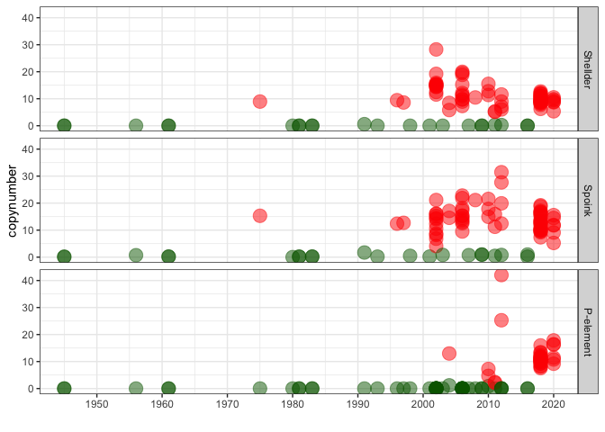
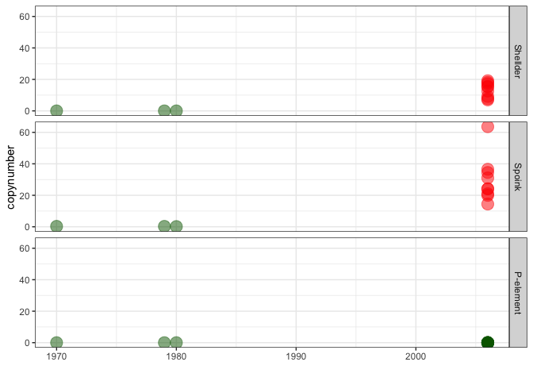
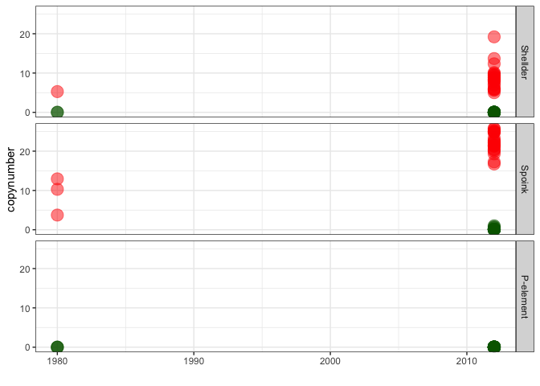
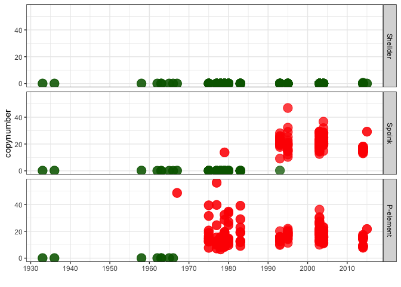
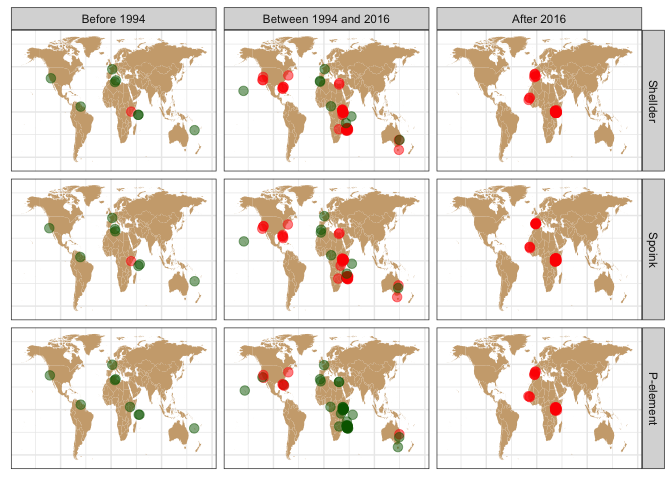
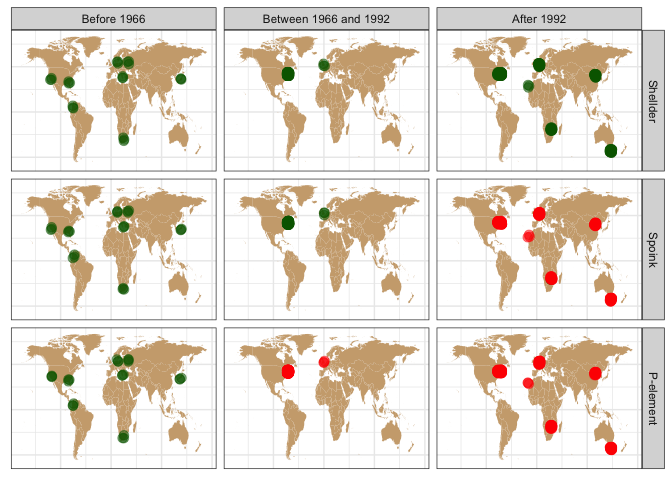

Spoink and Shellder invasion timeline
================

``` r
suppressPackageStartupMessages(library(tidyverse))
suppressPackageStartupMessages(library(knitr))
suppressPackageStartupMessages(library(kableExtra))
suppressPackageStartupMessages(library(ggpubr))
theme_set(theme_bw())
```

``` r
dsim_metadata <- read_tsv("/Volumes/EXT-RICCARDO/DoubleTrouble/Dsim/metadata.txt", show_col_types = FALSE)
dmau_metadata <- read_tsv("/Volumes/EXT-RICCARDO/DoubleTrouble/Dmau/metadata.txt", show_col_types = FALSE)
dsec_metadata <- read_tsv("/Volumes/EXT-RICCARDO/DoubleTrouble/Dsec/metadata.txt", show_col_types = FALSE)
dmel_metadata <- read_tsv("/Volumes/Storage/dmel-full-story/metadata.tsv", show_col_types = FALSE)

dsim_csv <- read_csv("/Volumes/EXT-RICCARDO/DoubleTrouble/Dsim/time-series/dsim.csv", show_col_types = FALSE) %>% filter(Sample!="Sample")
dmau_csv <- read_csv("/Volumes/EXT-RICCARDO/DoubleTrouble/Dmau/time-series/dmau.csv", show_col_types = FALSE) %>% filter(Sample!="Sample") 
dsec_csv <- read_csv("/Volumes/EXT-RICCARDO/DoubleTrouble/Dsec/time-series/dsec.csv", show_col_types = FALSE) %>% filter(Sample!="Sample")
dmel_csv <- read_csv("/Volumes/EXT-RICCARDO/Dmel-spoink/analysis/csv/Dmel/P-ele/D_mel_pool+gdl.csv", show_col_types = FALSE) %>% filter(Sample!="Sample") 
```

    ## Warning: One or more parsing issues, call `problems()` on your data frame for details,
    ## e.g.:
    ##   dat <- vroom(...)
    ##   problems(dat)

``` r
dsim <- inner_join(dsim_metadata, dsim_csv, by="Sample") %>% type_convert() %>% mutate(presence = ifelse(HQ_reads > 2, "present", "absent"), TE = case_when(TE == "spoink" ~ "Spoink", TE == "PPI251" ~ "P-element", TRUE ~ TE), age = case_when(year <= 1994 ~ "Before 1994", year > 1994 & year <= 2016~ "Between 1994 and 2016", year > 2016 ~ "After 2016")) %>% filter(TE %in% c("Spoink", "Shellder", "P-element"))
```

    ## 
    ## ── Column specification ────────────────────────────────────────────────────────
    ## cols(
    ##   Sample = col_character(),
    ##   strain = col_character(),
    ##   publication = col_character(),
    ##   study = col_character(),
    ##   study_id = col_character(),
    ##   location = col_character(),
    ##   TE = col_character(),
    ##   All_reads = col_double(),
    ##   HQ_reads = col_double()
    ## )

``` r
dmau <- inner_join(dmau_metadata, dmau_csv, by="Sample") %>% type_convert() %>% mutate(presence = ifelse(HQ_reads > 2, "present", "absent"), TE = case_when(TE == "spoink" ~ "Spoink", TE == "PPI251" ~ "P-element", TRUE ~ TE), age = case_when(year <= 1994 ~ "Before 1994", year > 1994 & year <= 2016~ "Between 1994 and 2016", year > 2016 ~ "After 2016")) %>% filter(TE %in% c("Spoink", "Shellder", "P-element"))
```

    ## 
    ## ── Column specification ────────────────────────────────────────────────────────
    ## cols(
    ##   strain = col_character(),
    ##   Sample = col_character(),
    ##   project = col_character(),
    ##   TE = col_character(),
    ##   All_reads = col_double(),
    ##   HQ_reads = col_double()
    ## )

``` r
dsec <- inner_join(dsec_metadata, dsec_csv, by="Sample") %>% type_convert() %>% mutate(presence = ifelse(HQ_reads > 2, "present", "absent"), TE = case_when(TE == "spoink" ~ "Spoink", TE == "PPI251" ~ "P-element", TRUE ~ TE), age = case_when(year <= 1994 ~ "Before 1994", year > 1994 & year <= 2016~ "Between 1994 and 2016", year > 2016 ~ "After 2016")) %>% filter(TE %in% c("Spoink", "Shellder", "P-element"))
```

    ## 
    ## ── Column specification ────────────────────────────────────────────────────────
    ## cols(
    ##   Sample = col_character(),
    ##   library_name = col_character(),
    ##   island = col_character(),
    ##   TE = col_character(),
    ##   All_reads = col_double(),
    ##   HQ_reads = col_double()
    ## )

``` r
dmel <- inner_join(dmel_metadata, dmel_csv, by="Sample") %>% type_convert() %>% mutate(presence = ifelse(HQ_reads > 2, "present", "absent"), TE = case_when(TE == "gypsy-29-dsim" ~ "Shellder", TE == "gypsy-7-sim1" ~ "Spoink", TE == "PPI251" ~ "P-element", TRUE ~ TE), age = case_when(year <= 1966 ~ "Before 1966", year > 1966 & year <= 1992 ~ "Between 1966 and 1992", year > 1992 ~ "After 1992")) %>% filter(TE %in% c("Spoink", "Shellder", "P-element"), year>1924)
```

    ## 
    ## ── Column specification ────────────────────────────────────────────────────────
    ## cols(
    ##   Sample = col_character(),
    ##   strain = col_character(),
    ##   publication = col_character(),
    ##   study = col_character(),
    ##   study_id = col_character(),
    ##   location = col_character(),
    ##   lat = col_double(),
    ##   TE = col_character()
    ## )

``` r
timeline <- function(dataset){
dataset$TE <- factor(dataset$TE, levels = c("Shellder", "Spoink", "P-element"))

ggplot(dataset, aes(x=year, y=HQ_reads, color=presence)) + geom_point(alpha=0.5, size=5) +
    labs(y = "copynumber", x = "") +
    scale_x_continuous(breaks = seq(1800, max(dataset$year), by = 10), labels = seq(1800, max(dataset$year), by = 10))+
    scale_color_manual(values=c("darkgreen", "red"))+
    facet_grid(TE ~ .)+
    theme(legend.position = "none")
}


(dsim_timeline <- timeline(dsim))
```

<!-- -->

``` r
(dmau_timeline <- timeline(dmau))
```

<!-- -->

``` r
(dsec_timeline <- timeline(dsec))
```

<!-- -->

``` r
(dmel_timeline <- timeline(dmel))
```

<!-- -->

``` r
plot_map <- function(dataset, ages){
  dataset$age <- factor(dataset$age, levels = ages)
  dataset$TE <- factor(dataset$TE, levels = c("Shellder", "Spoink", "P-element"))
  world_map <- map_data("world")
  world_map <- subset(world_map, region != "Antarctica")

  ggplot() +
    geom_map(data = world_map, map = world_map,
             aes(long, lat, map_id = region),
             color = "white", fill = "burlywood3", size = 0) +
    geom_point(data = dataset, aes(x = lon, y = lat, color = presence), size = 3, position = position_jitter(width = 2, height = 2), alpha = 0.5) +
    scale_colour_manual(values = c("darkgreen", "red")) + 
    theme(plot.title = element_text(hjust = 0.5), axis.text = element_blank(), axis.title = element_blank(), axis.ticks = element_blank(), legend.position = "none") + 
    facet_grid(TE~age)
}

dsim_ages <- c("Before 1994", "Between 1994 and 2016", "After 2016")
dmel_ages <- c("Before 1966", "Between 1966 and 1992", "After 1992")
(dsim_map <- plot_map(dsim, dsim_ages))
```

    ## Warning: Using `size` aesthetic for lines was deprecated in ggplot2 3.4.0.
    ## ℹ Please use `linewidth` instead.
    ## This warning is displayed once every 8 hours.
    ## Call `lifecycle::last_lifecycle_warnings()` to see where this warning was
    ## generated.

    ## Warning in geom_map(data = world_map, map = world_map, aes(long, lat, map_id =
    ## region), : Ignoring unknown aesthetics: x and y

    ## Warning: Removed 12 rows containing missing values (`geom_point()`).

<!-- -->

``` r
(dmel_map <- plot_map(dmel, dmel_ages))
```

    ## Warning in geom_map(data = world_map, map = world_map, aes(long, lat, map_id =
    ## region), : Ignoring unknown aesthetics: x and y

    ## Warning: Removed 9 rows containing missing values (`geom_point()`).

<!-- -->
