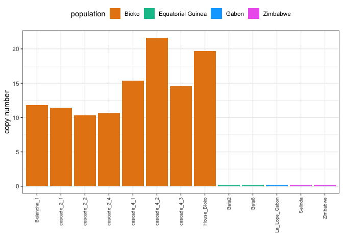

Drosophila teissieri - Copynumber analysis
================

``` r
suppressPackageStartupMessages(library(tidyverse))
suppressPackageStartupMessages(library(knitr))
suppressPackageStartupMessages(library(kableExtra))
theme_set(theme_bw())

knitr::opts_knit$set(root.dir = "/Volumes/Temp1/simulans-old-strains/analysis/plots")
```

## New TEs

``` r
pool <- read_csv("/Volumes/Temp1/simulans-old-strains/analysis/csv/Dtei/Dtei_new_TEs.csv", show_col_types = FALSE) %>% filter(Sample!="Sample") %>% type_convert() #%>% inner_join(meta_pool, by="Sample")
```

    ## 
    ## ── Column specification ────────────────────────────────────────────────────────
    ## cols(
    ##   Sample = col_character(),
    ##   TE = col_character(),
    ##   All_reads = col_double(),
    ##   HQ_reads = col_double()
    ## )

``` r
gypsy29_pool <- pool %>% filter(TE=="gypsy-29-dsim")
(gypsy7_pool <- pool %>% filter(TE=="gypsy-7-sim1")) # %>% arrange(year))
```

    ## # A tibble: 13 × 4
    ##    Sample     TE           All_reads HQ_reads
    ##    <chr>      <chr>            <dbl>    <dbl>
    ##  1 SRR5860571 gypsy-7-sim1      0.46     0.08
    ##  2 SRR5860572 gypsy-7-sim1      0.5      0.07
    ##  3 SRR5860576 gypsy-7-sim1      0.79     0.08
    ##  4 SRR5860577 gypsy-7-sim1      0.85     0.11
    ##  5 SRR5860615 gypsy-7-sim1      0.52     0.08
    ##  6 SRR5860616 gypsy-7-sim1      0.49     0.09
    ##  7 SRR5860617 gypsy-7-sim1      0.53     0.1 
    ##  8 SRR5860618 gypsy-7-sim1      0.46     0.06
    ##  9 SRR5860619 gypsy-7-sim1      0.53     0.11
    ## 10 SRR5860620 gypsy-7-sim1      0.52     0.08
    ## 11 SRR5860621 gypsy-7-sim1      0.54     0.07
    ## 12 SRR5860622 gypsy-7-sim1      0.57     0.08
    ## 13 SRR5860623 gypsy-7-sim1      0.49     0.06

``` r
years_pool <- gypsy7_pool# %>% select(year)# %>% arrange(year)

(plot_29 <- ggplot(gypsy29_pool, aes(x=Sample, y=HQ_reads)) + geom_point()) +
  labs(y = "copynumber", x = "collection year") + ggtitle("gypsy29-dsim") +
    theme(axis.text.x = element_text(angle = 90, vjust = 0.5, size = 6))
```

<!-- -->

``` r
(plot_7 <- ggplot(gypsy7_pool, aes(x=Sample, y=HQ_reads)) + geom_point() +
    labs(y = "copynumber", x = "collection year") + ggtitle("gypsy7-sim1") +
    theme(axis.text.x = element_text(angle = 90, vjust = 0.5, size = 6))+
  ylim(0,15))
```

<!-- -->
