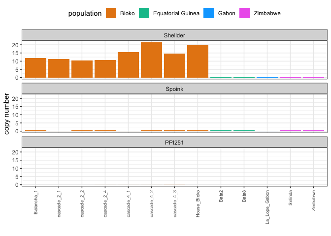
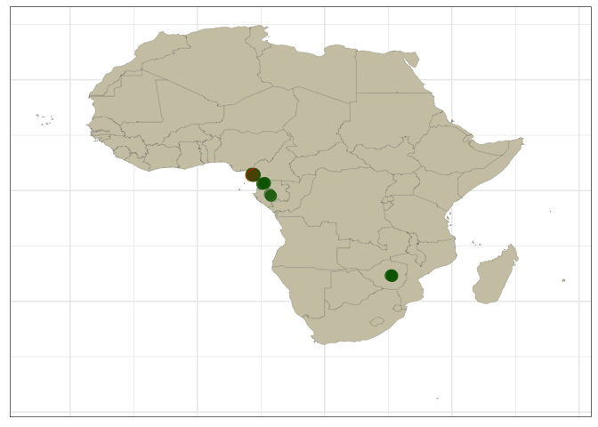

Drosophila teissieri
================

------------------------------------------------------------------------

``` r
suppressPackageStartupMessages(library(tidyverse))
suppressPackageStartupMessages(library(knitr))
suppressPackageStartupMessages(library(kableExtra))
suppressPackageStartupMessages(library(ggpubr))
suppressPackageStartupMessages(library(svglite))
theme_set(theme_bw())
```

``` r
df_matute_supp <- read.csv("/Volumes/EXT-RICCARDO/DoubleTrouble/Dtei/Matute_clean.csv", header = TRUE, sep = ",")

df_TE <- read.csv("/Volumes/EXT-RICCARDO/DoubleTrouble/Dtei/dtei.csv", header = TRUE, sep = ",")
(df_TE <- df_TE %>% filter(Sample != "Sample", TE %in% c("Shellder", "Spoink", "PPI251")))
```

    ##        Sample       TE All_reads HQ_reads
    ## 1  SRR5860571   PPI251      0.00     0.00
    ## 2  SRR5860571 Shellder      0.20     0.02
    ## 3  SRR5860571   Spoink      0.34     0.05
    ## 4  SRR5860572   PPI251      0.01     0.01
    ## 5  SRR5860572 Shellder     21.61    19.04
    ## 6  SRR5860572   Spoink      0.42     0.04
    ## 7  SRR5860576   PPI251      0.00     0.00
    ## 8  SRR5860576 Shellder      0.20     0.00
    ## 9  SRR5860576   Spoink      0.63     0.03
    ## 10 SRR5860577   PPI251      0.00     0.00
    ## 11 SRR5860577 Shellder      0.19     0.00
    ## 12 SRR5860577   Spoink      0.62     0.05
    ## 13 SRR5860615   PPI251      0.00     0.00
    ## 14 SRR5860615 Shellder     11.78    10.39
    ## 15 SRR5860615   Spoink      0.42     0.04
    ## 16 SRR5860616   PPI251      0.00     0.00
    ## 17 SRR5860616 Shellder     10.33     9.07
    ## 18 SRR5860616   Spoink      0.38     0.05
    ## 19 SRR5860617   PPI251      0.03     0.02
    ## 20 SRR5860617 Shellder     14.53    12.87
    ## 21 SRR5860617   Spoink      0.45     0.06
    ## 22 SRR5860618   PPI251      0.01     0.01
    ## 23 SRR5860618 Shellder     15.40    13.63
    ## 24 SRR5860618   Spoink      0.34     0.03
    ## 25 SRR5860619   PPI251      0.00     0.00
    ## 26 SRR5860619 Shellder      0.20     0.03
    ## 27 SRR5860619   Spoink      0.43     0.05
    ## 28 SRR5860620   PPI251      0.00     0.00
    ## 29 SRR5860620 Shellder      0.20     0.02
    ## 30 SRR5860620   Spoink      0.40     0.05
    ## 31 SRR5860621   PPI251      0.00     0.00
    ## 32 SRR5860621 Shellder     19.67    17.43
    ## 33 SRR5860621   Spoink      0.42     0.03
    ## 34 SRR5860622   PPI251      0.01     0.01
    ## 35 SRR5860622 Shellder     10.66     9.35
    ## 36 SRR5860622   Spoink      0.45     0.04
    ## 37 SRR5860623   PPI251      0.00     0.00
    ## 38 SRR5860623 Shellder     11.43    10.13
    ## 39 SRR5860623   Spoink      0.36     0.03

``` r
df_tsv <- read.csv("/Volumes/EXT-RICCARDO/DoubleTrouble/Dtei/filereport_read_run_PRJNA395473_tsv.txt", header = TRUE, sep = "\t")

result <- merge(df_TE, df_tsv, by.x = "Sample", by.y = "run_accession", all = FALSE)
(result2 <- merge(result, df_matute_supp, by.x = "sample_alias", by.y = "Line", all = FALSE))
```

    ##     sample_alias     Sample       TE All_reads HQ_reads experiment_accession
    ## 1     Balancha_1 SRR5860615   PPI251      0.00     0.00           SRX3029331
    ## 2     Balancha_1 SRR5860615 Shellder     11.78    10.39           SRX3029331
    ## 3     Balancha_1 SRR5860615   Spoink      0.42     0.04           SRX3029331
    ## 4          Bata2 SRR5860576   PPI251      0.00     0.00           SRX3029370
    ## 5          Bata2 SRR5860576 Shellder      0.20     0.00           SRX3029370
    ## 6          Bata2 SRR5860576   Spoink      0.63     0.03           SRX3029370
    ## 7          Bata8 SRR5860577   PPI251      0.00     0.00           SRX3029369
    ## 8          Bata8 SRR5860577 Shellder      0.19     0.00           SRX3029369
    ## 9          Bata8 SRR5860577   Spoink      0.62     0.05           SRX3029369
    ## 10   cascade_2_1 SRR5860623   PPI251      0.00     0.00           SRX3029323
    ## 11   cascade_2_1 SRR5860623 Shellder     11.43    10.13           SRX3029323
    ## 12   cascade_2_1 SRR5860623   Spoink      0.36     0.03           SRX3029323
    ## 13   cascade_2_2 SRR5860616   PPI251      0.00     0.00           SRX3029330
    ## 14   cascade_2_2 SRR5860616 Shellder     10.33     9.07           SRX3029330
    ## 15   cascade_2_2 SRR5860616   Spoink      0.38     0.05           SRX3029330
    ## 16   cascade_2_4 SRR5860622   PPI251      0.01     0.01           SRX3029324
    ## 17   cascade_2_4 SRR5860622 Shellder     10.66     9.35           SRX3029324
    ## 18   cascade_2_4 SRR5860622   Spoink      0.45     0.04           SRX3029324
    ## 19   cascade_4_1 SRR5860618   PPI251      0.01     0.01           SRX3029328
    ## 20   cascade_4_1 SRR5860618 Shellder     15.40    13.63           SRX3029328
    ## 21   cascade_4_1 SRR5860618   Spoink      0.34     0.03           SRX3029328
    ## 22   cascade_4_2 SRR5860572   PPI251      0.01     0.01           SRX3029374
    ## 23   cascade_4_2 SRR5860572 Shellder     21.61    19.04           SRX3029374
    ## 24   cascade_4_2 SRR5860572   Spoink      0.42     0.04           SRX3029374
    ## 25   cascade_4_3 SRR5860617   PPI251      0.03     0.02           SRX3029329
    ## 26   cascade_4_3 SRR5860617 Shellder     14.53    12.87           SRX3029329
    ## 27   cascade_4_3 SRR5860617   Spoink      0.45     0.06           SRX3029329
    ## 28   House_Bioko SRR5860621   PPI251      0.00     0.00           SRX3029325
    ## 29   House_Bioko SRR5860621 Shellder     19.67    17.43           SRX3029325
    ## 30   House_Bioko SRR5860621   Spoink      0.42     0.03           SRX3029325
    ## 31 La_Lope_Gabon SRR5860571   PPI251      0.00     0.00           SRX3029375
    ## 32 La_Lope_Gabon SRR5860571 Shellder      0.20     0.02           SRX3029375
    ## 33 La_Lope_Gabon SRR5860571   Spoink      0.34     0.05           SRX3029375
    ## 34       Selinda SRR5860620   PPI251      0.00     0.00           SRX3029326
    ## 35       Selinda SRR5860620 Shellder      0.20     0.02           SRX3029326
    ## 36       Selinda SRR5860620   Spoink      0.40     0.05           SRX3029326
    ## 37      Zimbabwe SRR5860619   PPI251      0.00     0.00           SRX3029327
    ## 38      Zimbabwe SRR5860619 Shellder      0.20     0.03           SRX3029327
    ## 39      Zimbabwe SRR5860619   Spoink      0.43     0.05           SRX3029327
    ##    instrument_platform library_source study_alias
    ## 1             ILLUMINA        GENOMIC PRJNA395473
    ## 2             ILLUMINA        GENOMIC PRJNA395473
    ## 3             ILLUMINA        GENOMIC PRJNA395473
    ## 4             ILLUMINA        GENOMIC PRJNA395473
    ## 5             ILLUMINA        GENOMIC PRJNA395473
    ## 6             ILLUMINA        GENOMIC PRJNA395473
    ## 7             ILLUMINA        GENOMIC PRJNA395473
    ## 8             ILLUMINA        GENOMIC PRJNA395473
    ## 9             ILLUMINA        GENOMIC PRJNA395473
    ## 10            ILLUMINA        GENOMIC PRJNA395473
    ## 11            ILLUMINA        GENOMIC PRJNA395473
    ## 12            ILLUMINA        GENOMIC PRJNA395473
    ## 13            ILLUMINA        GENOMIC PRJNA395473
    ## 14            ILLUMINA        GENOMIC PRJNA395473
    ## 15            ILLUMINA        GENOMIC PRJNA395473
    ## 16            ILLUMINA        GENOMIC PRJNA395473
    ## 17            ILLUMINA        GENOMIC PRJNA395473
    ## 18            ILLUMINA        GENOMIC PRJNA395473
    ## 19            ILLUMINA        GENOMIC PRJNA395473
    ## 20            ILLUMINA        GENOMIC PRJNA395473
    ## 21            ILLUMINA        GENOMIC PRJNA395473
    ## 22            ILLUMINA        GENOMIC PRJNA395473
    ## 23            ILLUMINA        GENOMIC PRJNA395473
    ## 24            ILLUMINA        GENOMIC PRJNA395473
    ## 25            ILLUMINA        GENOMIC PRJNA395473
    ## 26            ILLUMINA        GENOMIC PRJNA395473
    ## 27            ILLUMINA        GENOMIC PRJNA395473
    ## 28            ILLUMINA        GENOMIC PRJNA395473
    ## 29            ILLUMINA        GENOMIC PRJNA395473
    ## 30            ILLUMINA        GENOMIC PRJNA395473
    ## 31            ILLUMINA        GENOMIC PRJNA395473
    ## 32            ILLUMINA        GENOMIC PRJNA395473
    ## 33            ILLUMINA        GENOMIC PRJNA395473
    ## 34            ILLUMINA        GENOMIC PRJNA395473
    ## 35            ILLUMINA        GENOMIC PRJNA395473
    ## 36            ILLUMINA        GENOMIC PRJNA395473
    ## 37            ILLUMINA        GENOMIC PRJNA395473
    ## 38            ILLUMINA        GENOMIC PRJNA395473
    ## 39            ILLUMINA        GENOMIC PRJNA395473
    ##                                                            fastq_md5
    ## 1  40507e0102ff76f8c9701a51363dc30c;8d718faf4b6ab2f25e2e0aaaee56049c
    ## 2  40507e0102ff76f8c9701a51363dc30c;8d718faf4b6ab2f25e2e0aaaee56049c
    ## 3  40507e0102ff76f8c9701a51363dc30c;8d718faf4b6ab2f25e2e0aaaee56049c
    ## 4                                   67a88c58f69de100259d649cecf9ec44
    ## 5                                   67a88c58f69de100259d649cecf9ec44
    ## 6                                   67a88c58f69de100259d649cecf9ec44
    ## 7                                   aa6b7426e7427132d3759ba9fff2c870
    ## 8                                   aa6b7426e7427132d3759ba9fff2c870
    ## 9                                   aa6b7426e7427132d3759ba9fff2c870
    ## 10 113eaa26fa684d48baa1272949539bdd;bb1e04052f79bbb8246c149e5f688f56
    ## 11 113eaa26fa684d48baa1272949539bdd;bb1e04052f79bbb8246c149e5f688f56
    ## 12 113eaa26fa684d48baa1272949539bdd;bb1e04052f79bbb8246c149e5f688f56
    ## 13 03b5a692fe20e106035ba84b090e9706;d0af2c573b57ba77ab63b8354bb7fd52
    ## 14 03b5a692fe20e106035ba84b090e9706;d0af2c573b57ba77ab63b8354bb7fd52
    ## 15 03b5a692fe20e106035ba84b090e9706;d0af2c573b57ba77ab63b8354bb7fd52
    ## 16 8fadbda51a37646346ec93067ba58fd0;f89b055debfcbb00232d9e71c227725b
    ## 17 8fadbda51a37646346ec93067ba58fd0;f89b055debfcbb00232d9e71c227725b
    ## 18 8fadbda51a37646346ec93067ba58fd0;f89b055debfcbb00232d9e71c227725b
    ## 19 8f68cf60b3f4b9c5442ac48ebf69edb8;472b0be609ffb3b589923e6d7e234b25
    ## 20 8f68cf60b3f4b9c5442ac48ebf69edb8;472b0be609ffb3b589923e6d7e234b25
    ## 21 8f68cf60b3f4b9c5442ac48ebf69edb8;472b0be609ffb3b589923e6d7e234b25
    ## 22 81c891e02a851c9729f36c0b2dabc79b;f70b9e6e1a68d339af7397254e420494
    ## 23 81c891e02a851c9729f36c0b2dabc79b;f70b9e6e1a68d339af7397254e420494
    ## 24 81c891e02a851c9729f36c0b2dabc79b;f70b9e6e1a68d339af7397254e420494
    ## 25 a13ccab8d8ea610210690e817e6a9d39;398bed7ff529fbe35f671776d031e435
    ## 26 a13ccab8d8ea610210690e817e6a9d39;398bed7ff529fbe35f671776d031e435
    ## 27 a13ccab8d8ea610210690e817e6a9d39;398bed7ff529fbe35f671776d031e435
    ## 28 73f89a9f37166c1d4a8c6aac08621670;48a7b80f2a81e5cc246a5070c5a66990
    ## 29 73f89a9f37166c1d4a8c6aac08621670;48a7b80f2a81e5cc246a5070c5a66990
    ## 30 73f89a9f37166c1d4a8c6aac08621670;48a7b80f2a81e5cc246a5070c5a66990
    ## 31 5f073958c67c74ce8464ae2a39e2129f;161d9ad70ab3a65506aae15e36660abb
    ## 32 5f073958c67c74ce8464ae2a39e2129f;161d9ad70ab3a65506aae15e36660abb
    ## 33 5f073958c67c74ce8464ae2a39e2129f;161d9ad70ab3a65506aae15e36660abb
    ## 34 f12b0fe6153c059d880a7c2d2b5eba1e;41d2d628d51c12247dcbe4d6c9719bed
    ## 35 f12b0fe6153c059d880a7c2d2b5eba1e;41d2d628d51c12247dcbe4d6c9719bed
    ## 36 f12b0fe6153c059d880a7c2d2b5eba1e;41d2d628d51c12247dcbe4d6c9719bed
    ## 37 fca416207e9c7f02bab935f6578cc23a;dba7fbdbb9f72226dc3b287df17c1046
    ## 38 fca416207e9c7f02bab935f6578cc23a;dba7fbdbb9f72226dc3b287df17c1046
    ## 39 fca416207e9c7f02bab935f6578cc23a;dba7fbdbb9f72226dc3b287df17c1046
    ##                                                                                                                                            fastq_ftp
    ## 1  ftp.sra.ebi.ac.uk/vol1/fastq/SRR586/005/SRR5860615/SRR5860615_1.fastq.gz;ftp.sra.ebi.ac.uk/vol1/fastq/SRR586/005/SRR5860615/SRR5860615_2.fastq.gz
    ## 2  ftp.sra.ebi.ac.uk/vol1/fastq/SRR586/005/SRR5860615/SRR5860615_1.fastq.gz;ftp.sra.ebi.ac.uk/vol1/fastq/SRR586/005/SRR5860615/SRR5860615_2.fastq.gz
    ## 3  ftp.sra.ebi.ac.uk/vol1/fastq/SRR586/005/SRR5860615/SRR5860615_1.fastq.gz;ftp.sra.ebi.ac.uk/vol1/fastq/SRR586/005/SRR5860615/SRR5860615_2.fastq.gz
    ## 4                                                                             ftp.sra.ebi.ac.uk/vol1/fastq/SRR586/006/SRR5860576/SRR5860576.fastq.gz
    ## 5                                                                             ftp.sra.ebi.ac.uk/vol1/fastq/SRR586/006/SRR5860576/SRR5860576.fastq.gz
    ## 6                                                                             ftp.sra.ebi.ac.uk/vol1/fastq/SRR586/006/SRR5860576/SRR5860576.fastq.gz
    ## 7                                                                             ftp.sra.ebi.ac.uk/vol1/fastq/SRR586/007/SRR5860577/SRR5860577.fastq.gz
    ## 8                                                                             ftp.sra.ebi.ac.uk/vol1/fastq/SRR586/007/SRR5860577/SRR5860577.fastq.gz
    ## 9                                                                             ftp.sra.ebi.ac.uk/vol1/fastq/SRR586/007/SRR5860577/SRR5860577.fastq.gz
    ## 10 ftp.sra.ebi.ac.uk/vol1/fastq/SRR586/003/SRR5860623/SRR5860623_1.fastq.gz;ftp.sra.ebi.ac.uk/vol1/fastq/SRR586/003/SRR5860623/SRR5860623_2.fastq.gz
    ## 11 ftp.sra.ebi.ac.uk/vol1/fastq/SRR586/003/SRR5860623/SRR5860623_1.fastq.gz;ftp.sra.ebi.ac.uk/vol1/fastq/SRR586/003/SRR5860623/SRR5860623_2.fastq.gz
    ## 12 ftp.sra.ebi.ac.uk/vol1/fastq/SRR586/003/SRR5860623/SRR5860623_1.fastq.gz;ftp.sra.ebi.ac.uk/vol1/fastq/SRR586/003/SRR5860623/SRR5860623_2.fastq.gz
    ## 13 ftp.sra.ebi.ac.uk/vol1/fastq/SRR586/006/SRR5860616/SRR5860616_1.fastq.gz;ftp.sra.ebi.ac.uk/vol1/fastq/SRR586/006/SRR5860616/SRR5860616_2.fastq.gz
    ## 14 ftp.sra.ebi.ac.uk/vol1/fastq/SRR586/006/SRR5860616/SRR5860616_1.fastq.gz;ftp.sra.ebi.ac.uk/vol1/fastq/SRR586/006/SRR5860616/SRR5860616_2.fastq.gz
    ## 15 ftp.sra.ebi.ac.uk/vol1/fastq/SRR586/006/SRR5860616/SRR5860616_1.fastq.gz;ftp.sra.ebi.ac.uk/vol1/fastq/SRR586/006/SRR5860616/SRR5860616_2.fastq.gz
    ## 16 ftp.sra.ebi.ac.uk/vol1/fastq/SRR586/002/SRR5860622/SRR5860622_1.fastq.gz;ftp.sra.ebi.ac.uk/vol1/fastq/SRR586/002/SRR5860622/SRR5860622_2.fastq.gz
    ## 17 ftp.sra.ebi.ac.uk/vol1/fastq/SRR586/002/SRR5860622/SRR5860622_1.fastq.gz;ftp.sra.ebi.ac.uk/vol1/fastq/SRR586/002/SRR5860622/SRR5860622_2.fastq.gz
    ## 18 ftp.sra.ebi.ac.uk/vol1/fastq/SRR586/002/SRR5860622/SRR5860622_1.fastq.gz;ftp.sra.ebi.ac.uk/vol1/fastq/SRR586/002/SRR5860622/SRR5860622_2.fastq.gz
    ## 19 ftp.sra.ebi.ac.uk/vol1/fastq/SRR586/008/SRR5860618/SRR5860618_1.fastq.gz;ftp.sra.ebi.ac.uk/vol1/fastq/SRR586/008/SRR5860618/SRR5860618_2.fastq.gz
    ## 20 ftp.sra.ebi.ac.uk/vol1/fastq/SRR586/008/SRR5860618/SRR5860618_1.fastq.gz;ftp.sra.ebi.ac.uk/vol1/fastq/SRR586/008/SRR5860618/SRR5860618_2.fastq.gz
    ## 21 ftp.sra.ebi.ac.uk/vol1/fastq/SRR586/008/SRR5860618/SRR5860618_1.fastq.gz;ftp.sra.ebi.ac.uk/vol1/fastq/SRR586/008/SRR5860618/SRR5860618_2.fastq.gz
    ## 22 ftp.sra.ebi.ac.uk/vol1/fastq/SRR586/002/SRR5860572/SRR5860572_1.fastq.gz;ftp.sra.ebi.ac.uk/vol1/fastq/SRR586/002/SRR5860572/SRR5860572_2.fastq.gz
    ## 23 ftp.sra.ebi.ac.uk/vol1/fastq/SRR586/002/SRR5860572/SRR5860572_1.fastq.gz;ftp.sra.ebi.ac.uk/vol1/fastq/SRR586/002/SRR5860572/SRR5860572_2.fastq.gz
    ## 24 ftp.sra.ebi.ac.uk/vol1/fastq/SRR586/002/SRR5860572/SRR5860572_1.fastq.gz;ftp.sra.ebi.ac.uk/vol1/fastq/SRR586/002/SRR5860572/SRR5860572_2.fastq.gz
    ## 25 ftp.sra.ebi.ac.uk/vol1/fastq/SRR586/007/SRR5860617/SRR5860617_1.fastq.gz;ftp.sra.ebi.ac.uk/vol1/fastq/SRR586/007/SRR5860617/SRR5860617_2.fastq.gz
    ## 26 ftp.sra.ebi.ac.uk/vol1/fastq/SRR586/007/SRR5860617/SRR5860617_1.fastq.gz;ftp.sra.ebi.ac.uk/vol1/fastq/SRR586/007/SRR5860617/SRR5860617_2.fastq.gz
    ## 27 ftp.sra.ebi.ac.uk/vol1/fastq/SRR586/007/SRR5860617/SRR5860617_1.fastq.gz;ftp.sra.ebi.ac.uk/vol1/fastq/SRR586/007/SRR5860617/SRR5860617_2.fastq.gz
    ## 28 ftp.sra.ebi.ac.uk/vol1/fastq/SRR586/001/SRR5860621/SRR5860621_1.fastq.gz;ftp.sra.ebi.ac.uk/vol1/fastq/SRR586/001/SRR5860621/SRR5860621_2.fastq.gz
    ## 29 ftp.sra.ebi.ac.uk/vol1/fastq/SRR586/001/SRR5860621/SRR5860621_1.fastq.gz;ftp.sra.ebi.ac.uk/vol1/fastq/SRR586/001/SRR5860621/SRR5860621_2.fastq.gz
    ## 30 ftp.sra.ebi.ac.uk/vol1/fastq/SRR586/001/SRR5860621/SRR5860621_1.fastq.gz;ftp.sra.ebi.ac.uk/vol1/fastq/SRR586/001/SRR5860621/SRR5860621_2.fastq.gz
    ## 31 ftp.sra.ebi.ac.uk/vol1/fastq/SRR586/001/SRR5860571/SRR5860571_1.fastq.gz;ftp.sra.ebi.ac.uk/vol1/fastq/SRR586/001/SRR5860571/SRR5860571_2.fastq.gz
    ## 32 ftp.sra.ebi.ac.uk/vol1/fastq/SRR586/001/SRR5860571/SRR5860571_1.fastq.gz;ftp.sra.ebi.ac.uk/vol1/fastq/SRR586/001/SRR5860571/SRR5860571_2.fastq.gz
    ## 33 ftp.sra.ebi.ac.uk/vol1/fastq/SRR586/001/SRR5860571/SRR5860571_1.fastq.gz;ftp.sra.ebi.ac.uk/vol1/fastq/SRR586/001/SRR5860571/SRR5860571_2.fastq.gz
    ## 34 ftp.sra.ebi.ac.uk/vol1/fastq/SRR586/000/SRR5860620/SRR5860620_1.fastq.gz;ftp.sra.ebi.ac.uk/vol1/fastq/SRR586/000/SRR5860620/SRR5860620_2.fastq.gz
    ## 35 ftp.sra.ebi.ac.uk/vol1/fastq/SRR586/000/SRR5860620/SRR5860620_1.fastq.gz;ftp.sra.ebi.ac.uk/vol1/fastq/SRR586/000/SRR5860620/SRR5860620_2.fastq.gz
    ## 36 ftp.sra.ebi.ac.uk/vol1/fastq/SRR586/000/SRR5860620/SRR5860620_1.fastq.gz;ftp.sra.ebi.ac.uk/vol1/fastq/SRR586/000/SRR5860620/SRR5860620_2.fastq.gz
    ## 37 ftp.sra.ebi.ac.uk/vol1/fastq/SRR586/009/SRR5860619/SRR5860619_1.fastq.gz;ftp.sra.ebi.ac.uk/vol1/fastq/SRR586/009/SRR5860619/SRR5860619_2.fastq.gz
    ## 38 ftp.sra.ebi.ac.uk/vol1/fastq/SRR586/009/SRR5860619/SRR5860619_1.fastq.gz;ftp.sra.ebi.ac.uk/vol1/fastq/SRR586/009/SRR5860619/SRR5860619_2.fastq.gz
    ## 39 ftp.sra.ebi.ac.uk/vol1/fastq/SRR586/009/SRR5860619/SRR5860619_1.fastq.gz;ftp.sra.ebi.ac.uk/vol1/fastq/SRR586/009/SRR5860619/SRR5860619_2.fastq.gz
    ##                             sra_md5
    ## 1  6a3e8baa3965ec4a717eeab326b55369
    ## 2  6a3e8baa3965ec4a717eeab326b55369
    ## 3  6a3e8baa3965ec4a717eeab326b55369
    ## 4  69a3c1a0d542effabf998a88c0f02b52
    ## 5  69a3c1a0d542effabf998a88c0f02b52
    ## 6  69a3c1a0d542effabf998a88c0f02b52
    ## 7  246891b64c12131d0c9f6cc09e0a4bb6
    ## 8  246891b64c12131d0c9f6cc09e0a4bb6
    ## 9  246891b64c12131d0c9f6cc09e0a4bb6
    ## 10 cccbd75773f491ea5c89294f861f92b3
    ## 11 cccbd75773f491ea5c89294f861f92b3
    ## 12 cccbd75773f491ea5c89294f861f92b3
    ## 13 5a409cca1bab0550f25694b0bba57dba
    ## 14 5a409cca1bab0550f25694b0bba57dba
    ## 15 5a409cca1bab0550f25694b0bba57dba
    ## 16 958915158bfb52d9da99fedeab4ac662
    ## 17 958915158bfb52d9da99fedeab4ac662
    ## 18 958915158bfb52d9da99fedeab4ac662
    ## 19 15b5a3b925b2dc812cde6ed3dc555072
    ## 20 15b5a3b925b2dc812cde6ed3dc555072
    ## 21 15b5a3b925b2dc812cde6ed3dc555072
    ## 22 c16011f306238c6dd6c397354e8540e4
    ## 23 c16011f306238c6dd6c397354e8540e4
    ## 24 c16011f306238c6dd6c397354e8540e4
    ## 25 1d72075211e520797098c4aa54029a90
    ## 26 1d72075211e520797098c4aa54029a90
    ## 27 1d72075211e520797098c4aa54029a90
    ## 28 798b09678691d8759c2cd2aadf40095f
    ## 29 798b09678691d8759c2cd2aadf40095f
    ## 30 798b09678691d8759c2cd2aadf40095f
    ## 31 07730350c649f37cc8670a2e8f5f56fd
    ## 32 07730350c649f37cc8670a2e8f5f56fd
    ## 33 07730350c649f37cc8670a2e8f5f56fd
    ## 34 c8a639be367d3cad7bf9f4f4f17f2df9
    ## 35 c8a639be367d3cad7bf9f4f4f17f2df9
    ## 36 c8a639be367d3cad7bf9f4f4f17f2df9
    ## 37 f2265404e18e922eb74452994d3f5ad5
    ## 38 f2265404e18e922eb74452994d3f5ad5
    ## 39 f2265404e18e922eb74452994d3f5ad5
    ##                                     sample_title      Species        Population
    ## 1  Invertebrate sample from Drosophila teissieri D. teissieri             Bioko
    ## 2  Invertebrate sample from Drosophila teissieri D. teissieri             Bioko
    ## 3  Invertebrate sample from Drosophila teissieri D. teissieri             Bioko
    ## 4  Invertebrate sample from Drosophila teissieri D. teissieri Equatorial Guinea
    ## 5  Invertebrate sample from Drosophila teissieri D. teissieri Equatorial Guinea
    ## 6  Invertebrate sample from Drosophila teissieri D. teissieri Equatorial Guinea
    ## 7  Invertebrate sample from Drosophila teissieri D. teissieri Equatorial Guinea
    ## 8  Invertebrate sample from Drosophila teissieri D. teissieri Equatorial Guinea
    ## 9  Invertebrate sample from Drosophila teissieri D. teissieri Equatorial Guinea
    ## 10 Invertebrate sample from Drosophila teissieri D. teissieri             Bioko
    ## 11 Invertebrate sample from Drosophila teissieri D. teissieri             Bioko
    ## 12 Invertebrate sample from Drosophila teissieri D. teissieri             Bioko
    ## 13 Invertebrate sample from Drosophila teissieri D. teissieri             Bioko
    ## 14 Invertebrate sample from Drosophila teissieri D. teissieri             Bioko
    ## 15 Invertebrate sample from Drosophila teissieri D. teissieri             Bioko
    ## 16 Invertebrate sample from Drosophila teissieri D. teissieri             Bioko
    ## 17 Invertebrate sample from Drosophila teissieri D. teissieri             Bioko
    ## 18 Invertebrate sample from Drosophila teissieri D. teissieri             Bioko
    ## 19 Invertebrate sample from Drosophila teissieri D. teissieri             Bioko
    ## 20 Invertebrate sample from Drosophila teissieri D. teissieri             Bioko
    ## 21 Invertebrate sample from Drosophila teissieri D. teissieri             Bioko
    ## 22 Invertebrate sample from Drosophila teissieri D. teissieri             Bioko
    ## 23 Invertebrate sample from Drosophila teissieri D. teissieri             Bioko
    ## 24 Invertebrate sample from Drosophila teissieri D. teissieri             Bioko
    ## 25 Invertebrate sample from Drosophila teissieri D. teissieri             Bioko
    ## 26 Invertebrate sample from Drosophila teissieri D. teissieri             Bioko
    ## 27 Invertebrate sample from Drosophila teissieri D. teissieri             Bioko
    ## 28 Invertebrate sample from Drosophila teissieri D. teissieri             Bioko
    ## 29 Invertebrate sample from Drosophila teissieri D. teissieri             Bioko
    ## 30 Invertebrate sample from Drosophila teissieri D. teissieri             Bioko
    ## 31 Invertebrate sample from Drosophila teissieri D. teissieri             Gabon
    ## 32 Invertebrate sample from Drosophila teissieri D. teissieri             Gabon
    ## 33 Invertebrate sample from Drosophila teissieri D. teissieri             Gabon
    ## 34 Invertebrate sample from Drosophila teissieri D. teissieri          Zimbabwe
    ## 35 Invertebrate sample from Drosophila teissieri D. teissieri          Zimbabwe
    ## 36 Invertebrate sample from Drosophila teissieri D. teissieri          Zimbabwe
    ## 37 Invertebrate sample from Drosophila teissieri D. teissieri          Zimbabwe
    ## 38 Invertebrate sample from Drosophila teissieri D. teissieri          Zimbabwe
    ## 39 Invertebrate sample from Drosophila teissieri D. teissieri          Zimbabwe
    ##    Pair.type Read.length Average.coverage yak.into.san.markers
    ## 1         pe         150            30.37                 <NA>
    ## 2         pe         150            30.37                 <NA>
    ## 3         pe         150            30.37                 <NA>
    ## 4         se         100            20.70                 <NA>
    ## 5         se         100            20.70                 <NA>
    ## 6         se         100            20.70                 <NA>
    ## 7         se         100            18.56                 <NA>
    ## 8         se         100            18.56                 <NA>
    ## 9         se         100            18.56                 <NA>
    ## 10        pe         150            29.20                 <NA>
    ## 11        pe         150            29.20                 <NA>
    ## 12        pe         150            29.20                 <NA>
    ## 13        pe         150            33.88                 <NA>
    ## 14        pe         150            33.88                 <NA>
    ## 15        pe         150            33.88                 <NA>
    ## 16        pe         150            26.91                 <NA>
    ## 17        pe         150            26.91                 <NA>
    ## 18        pe         150            26.91                 <NA>
    ## 19        pe         150            27.07                 <NA>
    ## 20        pe         150            27.07                 <NA>
    ## 21        pe         150            27.07                 <NA>
    ## 22        pe         150            39.54                 <NA>
    ## 23        pe         150            39.54                 <NA>
    ## 24        pe         150            39.54                 <NA>
    ## 25        pe         150            23.26                 <NA>
    ## 26        pe         150            23.26                 <NA>
    ## 27        pe         150            23.26                 <NA>
    ## 28        pe         150            35.70                 <NA>
    ## 29        pe         150            35.70                 <NA>
    ## 30        pe         150            35.70                 <NA>
    ## 31        pe         150            36.60                 <NA>
    ## 32        pe         150            36.60                 <NA>
    ## 33        pe         150            36.60                 <NA>
    ## 34        pe         150            27.74                 <NA>
    ## 35        pe         150            27.74                 <NA>
    ## 36        pe         150            27.74                 <NA>
    ## 37        pe         150            32.17                 <NA>
    ## 38        pe         150            32.17                 <NA>
    ## 39        pe         150            32.17                 <NA>
    ##    san.into.yak.markers yak.into.tei.markers tei.into.yak.markers
    ## 1                  <NA>            2,440,335                 <NA>
    ## 2                  <NA>            2,440,335                 <NA>
    ## 3                  <NA>            2,440,335                 <NA>
    ## 4                  <NA>            2,275,453                 <NA>
    ## 5                  <NA>            2,275,453                 <NA>
    ## 6                  <NA>            2,275,453                 <NA>
    ## 7                  <NA>            2,280,660                 <NA>
    ## 8                  <NA>            2,280,660                 <NA>
    ## 9                  <NA>            2,280,660                 <NA>
    ## 10                 <NA>            2,435,953                 <NA>
    ## 11                 <NA>            2,435,953                 <NA>
    ## 12                 <NA>            2,435,953                 <NA>
    ## 13                 <NA>            2,439,716                 <NA>
    ## 14                 <NA>            2,439,716                 <NA>
    ## 15                 <NA>            2,439,716                 <NA>
    ## 16                 <NA>            2,438,424                 <NA>
    ## 17                 <NA>            2,438,424                 <NA>
    ## 18                 <NA>            2,438,424                 <NA>
    ## 19                 <NA>            2,435,999                 <NA>
    ## 20                 <NA>            2,435,999                 <NA>
    ## 21                 <NA>            2,435,999                 <NA>
    ## 22                 <NA>            2,468,955                 <NA>
    ## 23                 <NA>            2,468,955                 <NA>
    ## 24                 <NA>            2,468,955                 <NA>
    ## 25                 <NA>            2,430,334                 <NA>
    ## 26                 <NA>            2,430,334                 <NA>
    ## 27                 <NA>            2,430,334                 <NA>
    ## 28                 <NA>            2,445,383                 <NA>
    ## 29                 <NA>            2,445,383                 <NA>
    ## 30                 <NA>            2,445,383                 <NA>
    ## 31                 <NA>            2,426,237                 <NA>
    ## 32                 <NA>            2,426,237                 <NA>
    ## 33                 <NA>            2,426,237                 <NA>
    ## 34                 <NA>            2,425,028                 <NA>
    ## 35                 <NA>            2,425,028                 <NA>
    ## 36                 <NA>            2,425,028                 <NA>
    ## 37                 <NA>            2,429,980                 <NA>
    ## 38                 <NA>            2,429,980                 <NA>
    ## 39                 <NA>            2,429,980                 <NA>

``` r
result2$Sample <- factor(result2$Sample, levels = c("SRR5860572", "SRR5860615", "SRR5860616", "SRR5860617", "SRR5860618", "SRR5860621", "SRR5860622", "SRR5860623", "SRR5860576", "SRR5860577", "SRR5860571", "SRR5860619", "SRR5860620"))

result2$sample_alias <- factor(result2$sample_alias, levels = c("Balancha_1", "cascade_2_1", "cascade_2_2", "cascade_2_4", "cascade_4_1", "cascade_4_2", "cascade_4_3", "House_Bioko", "Bata2", "Bata8", "La_Lope_Gabon", "Selinda", "Zimbabwe"))

result2$TE <- factor(result2$TE, levels = c("Shellder", "Spoink", "PPI251"))

Shellder <- result2 %>% filter(TE=="Shellder")

(dtei_barplot <- ggplot(Shellder, aes(x = reorder(sample_alias, Population), y = as.numeric(All_reads), fill = Population)) +
  geom_bar(stat = "identity")+
  labs(y= "copy number", x="", fill="population")+
  scale_fill_manual(values = c("#E68613", "#00C19A", "#00A9FF", "#ED68ED"))+
  theme(axis.text.x = element_text(angle = 90, vjust = 0.5, hjust=1, size=7), legend.position = "top"))
```

<!-- -->

``` r
(dtei_barplot_others <- ggplot(result2, aes(x = reorder(sample_alias, Population), y = as.numeric(All_reads), fill = Population)) +
  geom_bar(stat = "identity")+
  labs(y= "copy number", x="", fill="population")+
  scale_fill_manual(values = c("#E68613", "#00C19A", "#00A9FF", "#ED68ED"))+
  theme(axis.text.x = element_text(angle = 90, vjust = 0.5, hjust=1, size=7), legend.position = "top")+
    facet_wrap(~TE, ncol=1))
```

<!-- -->

``` r
countries <- c("Bioko", "Equatorial Guinea", "Gabon", "Zimbabwe")
lat <- c(3.558445,1.547533, -0.989408, -19.150480)
long <- c(8.731123, 10.416840,11.561101,30.339835)
coordinates <- tibble(Population=countries, lat=lat, long=long)


result3 <-inner_join(result2, coordinates, by = "Population")


plot_map <- function(dataset) {
  dataset$TE <- factor(dataset$TE, levels = c("gypsy-29-dsim"))
  world_map <- map_data("world")
  africa_map <- subset(world_map, region %in% c(
    "Algeria", "Angola", "Benin", "Botswana", "Burundi", "Cameroon", "Cape Verde", 
    "Central African Republic", "Chad", "Comoros", "Congo", "Democratic Republic of the Congo",
    "Djibouti", "Egypt", "Equatorial Guinea", "Eritrea", "Swaziland", "Ethiopia", "Gabon",
    "Gambia", "Ghana", "Guinea", "Guinea-Bissau", "Ivory Coast", "Kenya", "Lesotho", 
    "Liberia", "Libya", "Madagascar", "Malawi", "Mali", "Mauritania", "Mauritius", "Morocco", 
    "Mozambique", "Namibia", "Niger", "Nigeria", "Rwanda", "Sao Tome and Principe", "Senegal", 
    "Seychelles", "Sierra Leone", "Somalia", "South Africa", "South Sudan", "Sudan", 
    "Tanzania", "Togo", "Tunisia", "Uganda", "Zambia", "Zimbabwe", "Western Sahara", 
    "Mauritania", "Mali", "Niger", "Chad", "Sudan", "Libya", "Egypt", 
    "Burkina Faso", "Lesotho", "Republic of Congo"
  ))
  
  ggplot() +
    geom_map(data = africa_map, map = africa_map,
             aes(long, lat, map_id = region),
             color = "black", fill = "cornsilk3", size = 0.05) +
    geom_point(data = dataset, aes(x = long, y = lat, color = as.numeric(HQ_reads)), size = 4, position = position_jitter(width = 0.3, height = 0.3), alpha = 0.5) +
    scale_colour_gradient(low = "darkgreen", high = "red") + 
    theme(plot.title = element_text(hjust = 0.5), axis.text = element_blank(), axis.title = element_blank(), axis.ticks = element_blank(), legend.position = "none")
}

(map <- plot_map(result3))
```

<!-- -->

``` r
#ggsave(map, filename="/Volumes/EXT-RICCARDO/DoubleTrouble/Dtei/dtei-map.png", dpi=600, width = 7, height = 7.5)
```

``` r
pca_dtei_eigenval <- read.csv("/Volumes/EXT-RICCARDO/DoubleTrouble/Dtei/dtei.pca.eigenval", header = FALSE)
names(pca_dtei_eigenval) <- c("col_val")

pca_dtei_eigenvec <- read.csv("/Volumes/EXT-RICCARDO/DoubleTrouble/Dtei/dtei.pca.eigenvec", sep = "", header = FALSE)
PCs <-c("PC1", "PC2", "PC3", "PC4", "PC5", "PC6", "PC7", "PC8", "PC9", "PC10", "PC11", "PC12", "PC13")
names(pca_dtei_eigenvec) <- c("ID","ID2","PC1", "PC2", "PC3", "PC4", "PC5", "PC6", "PC7", "PC8", "PC9", "PC10", "PC11", "PC12", "PC13")

pca_dtei_eigenvec <- pca_dtei_eigenvec %>%
  mutate(ID = str_extract(ID, "(?<=/)[^/]+(?=.fastq)"))

miniinfo <- subset(result3, select = c("Sample", "Population", "HQ_reads"))
pca_dtei_eigenvec <- merge(pca_dtei_eigenvec, miniinfo, by.x = "ID", by.y = "Sample", all = FALSE)

pca_dtei_eigenvec <- pca_dtei_eigenvec %>%
  mutate(Presence = ifelse(HQ_reads > 1, "present", "absent"))


eigen2pca <- function(vec, val, title) {
  
  eigenval <-  val %>% mutate(PC = PCs, variability_explained = paste0(round((col_val/sum(col_val)*100),2), "%"))
  
  var_explained <- eigenval %>% select(variability_explained) %>% pull()
  
  pca_plot_islands <- ggplot(vec, aes(x=PC1, y=PC3, color=Population)) + geom_point(alpha=0.5, size=4) +
    xlab(paste0("PC1: ", var_explained[1])) + ylab(paste0("PC3: ", var_explained[3])) +
    ggtitle(title) + theme(plot.title = element_text(hjust = 0.5), legend.position = "bottom")
  
  pca_plot_presence <- ggplot(vec, aes(x=PC1, y=PC3, color=Presence)) + geom_point(alpha=0.5, size=4) +
    xlab(paste0("PC1: ", var_explained[1])) + ylab(paste0("PC3: ", var_explained[3])) +
    scale_color_manual(values = c("darkgreen", "red")) + labs(color = "Shellder") +
    ggtitle(title) + theme(plot.title = element_text(hjust = 0.5), legend.position = "bottom")
  
  pca_plot_merged <- ggplot(vec, aes(x=PC1, y=PC3, color=Presence, fill=Population)) + geom_point(shape=21, alpha=0.5, size=5, stroke=2) +
    xlab(paste0("PC1: ", var_explained[1])) + ylab(paste0("PC3: ", var_explained[3])) +
    scale_color_manual(values = c("darkgreen", "red")) + labs(color = "Shellder") +
    scale_fill_manual(values = c("#E68613", "#00C19A", "#00A9FF", "#ED68ED")) +
    ggtitle(title) + theme(plot.title = element_text(hjust = 0.5), legend.position = "bottom")+
    labs(fill="population")+
    theme(legend.key.size = unit(0.2, "cm"))
  
  list(islands = pca_plot_islands, presence = pca_plot_presence, merged = pca_plot_merged)
  
}

(pca_dtei <- eigen2pca(pca_dtei_eigenvec, pca_dtei_eigenval, "PCA on 7.412.533 SNPs"))
```

    ## $islands

<!-- -->

    ## 
    ## $presence

<!-- -->

    ## 
    ## $merged

<!-- -->

``` r
ggsave(map, filename="/Volumes/EXT-RICCARDO/DoubleTrouble/figures/dtei/dtei-map.svg", dpi=300, width = 7, height = 7.5)
ggsave(dtei_barplot, filename="/Volumes/EXT-RICCARDO/DoubleTrouble/figures/dtei/dtei-barplot.svg", dpi=300, width = 9, height = 7)
ggsave(dtei_barplot_others, filename="/Volumes/EXT-RICCARDO/DoubleTrouble/figures/dtei/dtei-barplot-others.svg", dpi=300, width = 3, height = 7)

ggsave(pca_dtei$merged, filename="/Volumes/EXT-RICCARDO/DoubleTrouble/figures/sup-figures/dtei-pca/dtei-pca.png", dpi=300, width = 7, height = 7)
```
