PCA of Spoink and Shellder - removing ancient sites
================

``` r
suppressPackageStartupMessages(library(tidyverse))
suppressPackageStartupMessages(library(knitr))
suppressPackageStartupMessages(library(kableExtra))
suppressPackageStartupMessages(library(ggpubr))
suppressPackageStartupMessages(library(umap))
suppressPackageStartupMessages(library(sf))
suppressPackageStartupMessages(library(svglite))
theme_set(theme_bw())
```

PCA function.

``` r
PCA <- function(pcaable, titlee, scale){
  
  pcaable <- pcaable %>% select_if(~ !all(. == .[1]))
  pca_result <- prcomp(pcaable[, -c(1:9)], center = TRUE, scale = TRUE)
  var_explained <- pca_result$sdev^2/sum(pca_result$sdev^2)
  
  plot1 <- ggplot(data.frame(pca_result$x, ID=pcaable$Sample, location=pcaable$location), aes(x=PC1,y=PC2, color=location)) + geom_point(size=4, alpha=0.8) + labs(x=paste0("PC1: ",round(var_explained[1]*100,1),"%"), y=paste0("PC2: ",round(var_explained[2]*100,1),"%"), color="location") + ggtitle(titlee) + theme(plot.title = element_text(hjust = 0.5))+
 # geom_text(aes(label=strain), vjust=1.5, hjust=1.5, size=3) +
scale_colour_manual(values=scale)
  
  plot2 <- ggplot(data.frame(pca_result$x, ID=pcaable$Sample, location=pcaable$location), aes(x=PC1,y=PC3, color=location)) + geom_point(size=4) + labs(x=paste0("PC1: ",round(var_explained[1]*100,1),"%"), y=paste0("PC3: ",round(var_explained[3]*100,1),"%"), color="location") + ggtitle(titlee) + theme(plot.title = element_text(hjust = 0.5))+
scale_colour_manual(values=scale)
  
  plot3 <- ggplot(data.frame(pca_result$x, ID=pcaable$Sample, location=pcaable$location), aes(x=PC3,y=PC2, color=location)) + geom_point(size=4) + labs(x=paste0("PC3: ",round(var_explained[3]*100,1),"%"), y=paste0("PC2: ",round(var_explained[2]*100,1),"%"), color="location") + ggtitle(titlee) + theme(plot.title = element_text(hjust = 0.5))+
scale_colour_manual(values=scale)
  
  plot4 <- ggplot(data.frame(pca_result$x, ID=pcaable$Sample, location=pcaable$location), aes(x=PC1,y=PC4, color=location)) + geom_point(size=4) + labs(x=paste0("PC1: ",round(var_explained[1]*100,1),"%"), y=paste0("PC4: ",round(var_explained[4]*100,1),"%"), color="location") + ggtitle(titlee) + theme(plot.title = element_text(hjust = 0.5))+
scale_colour_manual(values=scale)
  
  plot5 <- ggplot(data.frame(pca_result$x, ID=pcaable$Sample, location=pcaable$location), aes(x=PC4,y=PC2, color=location)) + geom_point(size=4) + labs(x=paste0("PC4: ",round(var_explained[4]*100,1),"%"), y=paste0("PC2: ",round(var_explained[2]*100,1),"%"), color="location") + ggtitle(titlee) + theme(plot.title = element_text(hjust = 0.5))+
scale_colour_manual(values=scale)
  
  plot6 <- ggplot(data.frame(pca_result$x, ID=pcaable$Sample, location=pcaable$location), aes(x=PC3,y=PC4, color=location)) + geom_point(size=4) + labs(x=paste0("PC3: ",round(var_explained[3]*100,1),"%"), y=paste0("PC4: ",round(var_explained[4]*100,1),"%"), color="location") + ggtitle(titlee) + theme(plot.title = element_text(hjust = 0.5))+
   # geom_text(aes(label=strain), vjust=1.5, hjust=1.5, size=3) +
scale_colour_manual(values=scale)
  
    plot_bonus <- ggplot(data.frame(pca_result$x, ID=pcaable$Sample, location=pcaable$location), aes(x=PC5,y=PC6, color=location)) + geom_point(size=4) + labs(x=paste0("PC5: ",round(var_explained[5]*100,1),"%"), y=paste0("PC6: ",round(var_explained[6]*100,1),"%"), color="location") + ggtitle(titlee) + theme(plot.title = element_text(hjust = 0.5))+
   # geom_text(aes(label=strain), vjust=1.5, hjust=1.5, size=3) +
scale_colour_manual(values=scale)

  list(pc1_2 = plot1, pc1_3 = plot2, pc2_3 = plot3, pc1_4 = plot4, pc2_4 = plot5, pc3_4 = plot6, pc_bonus = plot_bonus)
}
```

I remove all the positions in the TEs which have a coverage \> 0.5 in
the old samples without the TE.

``` r
(Spoink_old_coverage <- read_table("/Volumes/EXT-RICCARDO/DoubleTrouble/Dsim/time-series/deviaTE/SRR22548187.fastq.sort.bam.spoink", skip = 3, col_names = c("TE","file","base","ref","A","C","G","T","cov","phys_cov","hq_cov","snp","refsnp","int_del", "int_del_freq","trunc_left","trunc_right","ins","delet","annotation")) %>% select(TE, base, cov) %>% filter(cov>0.5))
```

    ## 
    ## ── Column specification ────────────────────────────────────────────────────────
    ## cols(
    ##   .default = col_logical(),
    ##   TE = col_character(),
    ##   file = col_character(),
    ##   base = col_double(),
    ##   ref = col_character(),
    ##   A = col_double(),
    ##   C = col_double(),
    ##   G = col_double(),
    ##   T = col_double(),
    ##   cov = col_double(),
    ##   phys_cov = col_double(),
    ##   hq_cov = col_double()
    ## )
    ## ℹ Use `spec()` for the full column specifications.

    ## Warning: 92 parsing failures.
    ##  row         col           expected actual                                                                                             file
    ## 1295 trunc_left  1/0/T/F/TRUE/FALSE  0.316 '/Volumes/EXT-RICCARDO/DoubleTrouble/Dsim/time-series/deviaTE/SRR22548187.fastq.sort.bam.spoink'
    ## 2061 trunc_right 1/0/T/F/TRUE/FALSE  0.406 '/Volumes/EXT-RICCARDO/DoubleTrouble/Dsim/time-series/deviaTE/SRR22548187.fastq.sort.bam.spoink'
    ## 2097 trunc_right 1/0/T/F/TRUE/FALSE  0.293 '/Volumes/EXT-RICCARDO/DoubleTrouble/Dsim/time-series/deviaTE/SRR22548187.fastq.sort.bam.spoink'
    ## 2114 trunc_left  1/0/T/F/TRUE/FALSE  1.827 '/Volumes/EXT-RICCARDO/DoubleTrouble/Dsim/time-series/deviaTE/SRR22548187.fastq.sort.bam.spoink'
    ## 2190 trunc_right 1/0/T/F/TRUE/FALSE  0.18  '/Volumes/EXT-RICCARDO/DoubleTrouble/Dsim/time-series/deviaTE/SRR22548187.fastq.sort.bam.spoink'
    ## .... ........... .................. ...... ................................................................................................
    ## See problems(...) for more details.

    ## # A tibble: 2,258 × 3
    ##    TE      base   cov
    ##    <chr>  <dbl> <dbl>
    ##  1 spoink   297 0.519
    ##  2 spoink   298 0.519
    ##  3 spoink   299 0.519
    ##  4 spoink   300 0.519
    ##  5 spoink   301 0.519
    ##  6 spoink   302 0.519
    ##  7 spoink   303 0.519
    ##  8 spoink   304 0.519
    ##  9 spoink   305 0.564
    ## 10 spoink   306 0.541
    ## # ℹ 2,248 more rows

``` r
(Shellder_old_coverage <- read_table("/Volumes/EXT-RICCARDO/DoubleTrouble/Dsim/time-series/deviaTE/SRR22548187.fastq.sort.bam.Shellder", skip = 3, col_names = c("TE","file","base","ref","A","C","G","T","cov","phys_cov","hq_cov","snp","refsnp","int_del", "int_del_freq","trunc_left","trunc_right","ins","delet","annotation")) %>% select(TE, base, cov) %>% filter(cov>0.5))
```

    ## 
    ## ── Column specification ────────────────────────────────────────────────────────
    ## cols(
    ##   .default = col_double(),
    ##   TE = col_character(),
    ##   file = col_character(),
    ##   ref = col_character(),
    ##   snp = col_logical(),
    ##   refsnp = col_logical(),
    ##   int_del = col_logical(),
    ##   int_del_freq = col_logical(),
    ##   ins = col_logical(),
    ##   delet = col_character(),
    ##   annotation = col_logical()
    ## )
    ## ℹ Use `spec()` for the full column specifications.

    ## # A tibble: 83 × 3
    ##    TE        base   cov
    ##    <chr>    <dbl> <dbl>
    ##  1 Shellder   608 0.541
    ##  2 Shellder   609 0.722
    ##  3 Shellder   610 0.722
    ##  4 Shellder   611 0.902
    ##  5 Shellder   612 1.08 
    ##  6 Shellder   613 1.44 
    ##  7 Shellder   614 1.44 
    ##  8 Shellder   615 1.53 
    ##  9 Shellder   616 1.53 
    ## 10 Shellder   617 1.53 
    ## # ℹ 73 more rows

``` r
write_tsv(Spoink_old_coverage, "/Volumes/EXT-RICCARDO/DoubleTrouble/Dsim/spoink-ancient-coverage.txt")
write_tsv(Shellder_old_coverage, "/Volumes/EXT-RICCARDO/DoubleTrouble/Dsim/shellder-ancient-coverage.txt")
```

Here is the version with coverage \> 0 (Shellder) or coverage \> 0.3
(Spoink), more stringent.

``` r
(Spoink_old_coverage0 <- read_table("/Volumes/EXT-RICCARDO/DoubleTrouble/Dsim/time-series/deviaTE/SRR22548187.fastq.sort.bam.spoink", skip = 3, col_names = c("TE","file","base","ref","A","C","G","T","cov","phys_cov","hq_cov","snp","refsnp","int_del", "int_del_freq","trunc_left","trunc_right","ins","delet","annotation")) %>% select(TE, base, cov) %>% filter(cov>0.3))
```

    ## 
    ## ── Column specification ────────────────────────────────────────────────────────
    ## cols(
    ##   .default = col_logical(),
    ##   TE = col_character(),
    ##   file = col_character(),
    ##   base = col_double(),
    ##   ref = col_character(),
    ##   A = col_double(),
    ##   C = col_double(),
    ##   G = col_double(),
    ##   T = col_double(),
    ##   cov = col_double(),
    ##   phys_cov = col_double(),
    ##   hq_cov = col_double()
    ## )
    ## ℹ Use `spec()` for the full column specifications.

    ## Warning: 92 parsing failures.
    ##  row         col           expected actual                                                                                             file
    ## 1295 trunc_left  1/0/T/F/TRUE/FALSE  0.316 '/Volumes/EXT-RICCARDO/DoubleTrouble/Dsim/time-series/deviaTE/SRR22548187.fastq.sort.bam.spoink'
    ## 2061 trunc_right 1/0/T/F/TRUE/FALSE  0.406 '/Volumes/EXT-RICCARDO/DoubleTrouble/Dsim/time-series/deviaTE/SRR22548187.fastq.sort.bam.spoink'
    ## 2097 trunc_right 1/0/T/F/TRUE/FALSE  0.293 '/Volumes/EXT-RICCARDO/DoubleTrouble/Dsim/time-series/deviaTE/SRR22548187.fastq.sort.bam.spoink'
    ## 2114 trunc_left  1/0/T/F/TRUE/FALSE  1.827 '/Volumes/EXT-RICCARDO/DoubleTrouble/Dsim/time-series/deviaTE/SRR22548187.fastq.sort.bam.spoink'
    ## 2190 trunc_right 1/0/T/F/TRUE/FALSE  0.18  '/Volumes/EXT-RICCARDO/DoubleTrouble/Dsim/time-series/deviaTE/SRR22548187.fastq.sort.bam.spoink'
    ## .... ........... .................. ...... ................................................................................................
    ## See problems(...) for more details.

    ## # A tibble: 3,930 × 3
    ##    TE      base   cov
    ##    <chr>  <dbl> <dbl>
    ##  1 spoink    41 0.316
    ##  2 spoink    42 0.316
    ##  3 spoink    43 0.316
    ##  4 spoink    44 0.316
    ##  5 spoink    45 0.316
    ##  6 spoink    46 0.316
    ##  7 spoink    47 0.316
    ##  8 spoink    48 0.338
    ##  9 spoink    49 0.338
    ## 10 spoink    50 0.338
    ## # ℹ 3,920 more rows

``` r
(Shellder_old_coverage0 <- read_table("/Volumes/EXT-RICCARDO/DoubleTrouble/Dsim/time-series/deviaTE/SRR22548187.fastq.sort.bam.Shellder", skip = 3, col_names = c("TE","file","base","ref","A","C","G","T","cov","phys_cov","hq_cov","snp","refsnp","int_del", "int_del_freq","trunc_left","trunc_right","ins","delet","annotation")) %>% select(TE, base, cov) %>% filter(cov>0))
```

    ## 
    ## ── Column specification ────────────────────────────────────────────────────────
    ## cols(
    ##   .default = col_double(),
    ##   TE = col_character(),
    ##   file = col_character(),
    ##   ref = col_character(),
    ##   snp = col_logical(),
    ##   refsnp = col_logical(),
    ##   int_del = col_logical(),
    ##   int_del_freq = col_logical(),
    ##   ins = col_logical(),
    ##   delet = col_character(),
    ##   annotation = col_logical()
    ## )
    ## ℹ Use `spec()` for the full column specifications.

    ## # A tibble: 683 × 3
    ##    TE        base   cov
    ##    <chr>    <dbl> <dbl>
    ##  1 Shellder    33 0.045
    ##  2 Shellder    34 0.045
    ##  3 Shellder    35 0.045
    ##  4 Shellder    36 0.045
    ##  5 Shellder    37 0.045
    ##  6 Shellder    38 0.045
    ##  7 Shellder    39 0.045
    ##  8 Shellder    40 0.045
    ##  9 Shellder    41 0.045
    ## 10 Shellder    42 0.045
    ## # ℹ 673 more rows

``` r
write_tsv(Spoink_old_coverage, "/Volumes/EXT-RICCARDO/DoubleTrouble/Dsim/spoink-ancient-coverage-0.txt")
write_tsv(Shellder_old_coverage, "/Volumes/EXT-RICCARDO/DoubleTrouble/Dsim/shellder-ancient-coverage-0.txt")
```

## Drosophila sechellia

``` r
dsec_csv <- read_csv("/Volumes/EXT-RICCARDO/DoubleTrouble/Dsec/time-series/dsec.csv", show_col_types = FALSE) %>% filter(Sample!="Sample")

dsec_metadata <- read_tsv("/Volumes/EXT-RICCARDO/DoubleTrouble/Dsec/metadata.txt", show_col_types = FALSE)

dsec <- inner_join(dsec_metadata, dsec_csv, by="Sample") %>% type_convert() %>% mutate(presence = ifelse(HQ_reads > 2, "present", "absent"), TE = case_when(TE == "spoink" ~ "Spoink", TE == "PPI251" ~ "P-element", TRUE ~ TE)) %>% filter(TE %in% c("Spoink", "Shellder", "P-element")) %>% filter(island!="Cousin") %>% rename(location=island)
```

    ## 
    ## ── Column specification ────────────────────────────────────────────────────────
    ## cols(
    ##   Sample = col_character(),
    ##   library_name = col_character(),
    ##   island = col_character(),
    ##   TE = col_character(),
    ##   All_reads = col_double(),
    ##   HQ_reads = col_double()
    ## )

``` r
dsec_scale <- c("#ABA300", "#ED68ED")

shellder <- read_tsv("/Volumes/EXT-RICCARDO/DoubleTrouble/Dsec/PCA/Dsec-shellder.PCAable") %>% rename(Sample = ID) %>% mutate(Sample = str_remove(Sample, "\\.cleaned$"))
```

    ## Rows: 46 Columns: 18
    ## ── Column specification ────────────────────────────────────────────────────────
    ## Delimiter: "\t"
    ## chr  (1): ID
    ## dbl (17): gypsy-29-dsim_442, gypsy-29-dsim_452, gypsy-29-dsim_625, gypsy-29-...
    ## 
    ## ℹ Use `spec()` to retrieve the full column specification for this data.
    ## ℹ Specify the column types or set `show_col_types = FALSE` to quiet this message.

``` r
shellder_pcaable <- inner_join(dsec, shellder, by="Sample") %>% filter(TE=="Shellder", presence == "present", location %in% c("Praslin", "Denis")) %>% select(-All_reads)
colnames(shellder_pcaable) <- str_remove(colnames(shellder_pcaable), "^.+?_")

shellder_pcaable_cleaned <- shellder_pcaable %>% select(-matches(as.character(Shellder_old_coverage$base)))

pca_shellder <- PCA(shellder_pcaable, "D. sechellia - Shellder - 17 SNPs", dsec_scale)
pca_shellder$pc1_2
```

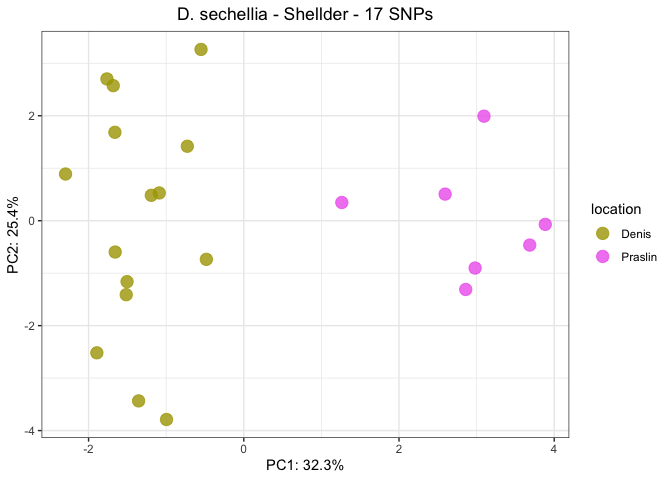<!-- -->

``` r
pca_shellder_clean <- PCA(shellder_pcaable_cleaned, "D. sechellia - Shellder - 7 SNPs", dsec_scale)
pca_shellder_clean$pc1_2
```

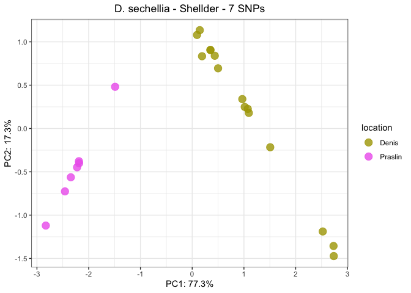<!-- -->

``` r
spoink <- read_tsv("/Volumes/EXT-RICCARDO/DoubleTrouble/Dsec/PCA/Dsec-spoink.PCAable") %>% rename(Sample = ID) %>% mutate(Sample = str_remove(Sample, "\\.cleaned$"))
```

    ## Rows: 46 Columns: 283
    ## ── Column specification ────────────────────────────────────────────────────────
    ## Delimiter: "\t"
    ## chr   (1): ID
    ## dbl (282): gypsy-7-sim1_141, gypsy-7-sim1_333, gypsy-7-sim1_415, gypsy-7-sim...
    ## 
    ## ℹ Use `spec()` to retrieve the full column specification for this data.
    ## ℹ Specify the column types or set `show_col_types = FALSE` to quiet this message.

``` r
spoink_pcaable <- inner_join(dsec, spoink, by="Sample") %>% filter(TE=="Spoink", presence == "present", location %in% c("Praslin", "Denis")) %>% select(-All_reads)
colnames(spoink_pcaable) <- str_remove(colnames(spoink_pcaable), "^.+?_")

spoink_pcaable_cleaned <- spoink_pcaable %>% select(-matches(as.character(Spoink_old_coverage$base)))

pca_spoink <- PCA(spoink_pcaable, "D. sechellia - Spoink - 282 SNPs", dsec_scale)
pca_spoink$pc1_2
```

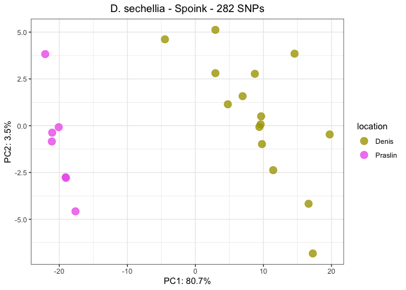<!-- -->

``` r
pca_spoink_clean <- PCA(spoink_pcaable_cleaned, "D. sechellia - Spoink - 20 SNPs", dsec_scale)
pca_spoink_clean$pc1_2
```

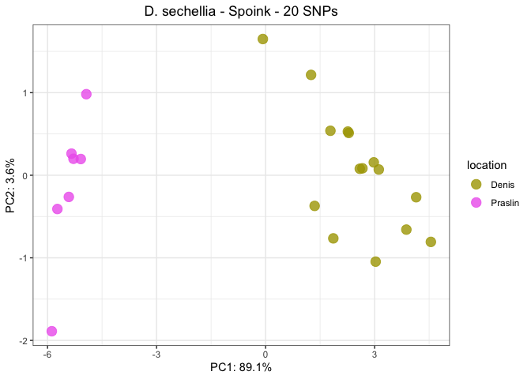<!-- -->

``` r
#ggsave("/Volumes/EXT-RICCARDO/DoubleTrouble/figures/sup-figures/dsec-TE-pca/dsec-shellder-pca.png", pca_shellder$pc1_2, dpi=300)
#ggsave("/Volumes/EXT-RICCARDO/DoubleTrouble/figures/sup-figures/dsec-TE-pca/dsec-spoink-pca.png", pca_spoink$pc1_2, dpi=300)
```

## Drosophila melanogaster

min-freq 0.2 min-count 10

``` r
dmel_scale <- c("#F8766D","#A3A500","#00BF7D","#00B0F6","#E76BF3")
dmel_metadata <- read_tsv("/Volumes/Storage/dmel-full-story/metadata.tsv", show_col_types = FALSE)

spoink_dmel <- read_tsv("/Volumes/Storage/Dmel-spoink/PCA-UMAP/GDL/gdl-gypsy7.PCAable") %>% rename(Sample = ID) %>% mutate(Sample = str_remove(Sample, "\\.cleaned$"))
```

    ## Rows: 86 Columns: 15
    ## ── Column specification ────────────────────────────────────────────────────────
    ## Delimiter: "\t"
    ## chr  (1): ID
    ## dbl (14): gypsy-7-sim1_21, gypsy-7-sim1_87, gypsy-7-sim1_1167, gypsy-7-sim1_...
    ## 
    ## ℹ Use `spec()` to retrieve the full column specification for this data.
    ## ℹ Specify the column types or set `show_col_types = FALSE` to quiet this message.

``` r
spoink_pcaable_dmel <- inner_join(dmel_metadata, spoink_dmel, by="Sample") %>% filter(strain != "ZS10")
colnames(spoink_pcaable_dmel) <- str_remove(colnames(spoink_pcaable_dmel), "^.+?_")

spoink_pcaable_dmel_cleaned <- spoink_pcaable_dmel %>% select(-matches(as.character(Spoink_old_coverage$base)))

pca_spoink_dmel <- PCA(spoink_pcaable_dmel, "D. melanogaster - Spoink - 23 SNPs", dmel_scale)
pca_spoink_dmel$pc1_2
```

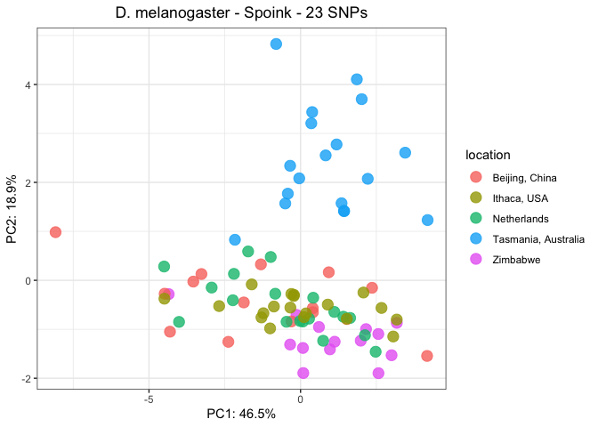<!-- -->

``` r
pca_spoink_dmel_cleaned <- PCA(spoink_pcaable_dmel_cleaned, "D. melanogaster - Spoink - 6 SNPs", dmel_scale)
pca_spoink_dmel_cleaned$pc1_2
```

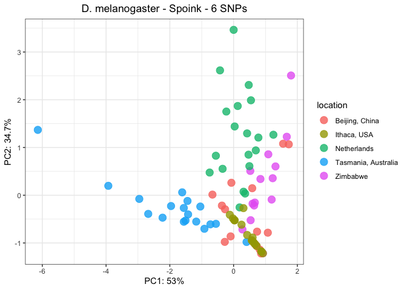<!-- -->

``` r
#ggsave("/Volumes/EXT-RICCARDO/DoubleTrouble/figures/sup-figures/dsec-TE-pca/dsec-shellder-pca.png", pca_shellder$pc1_2, dpi=300)
#ggsave("/Volumes/EXT-RICCARDO/DoubleTrouble/figures/sup-figures/dsec-TE-pca/dsec-spoink-pca.png", pca_spoink$pc1_2, dpi=300)
```

## Drosophila simulans

``` r
dsim_scale <- c("#00B0F6","dodgerblue2","#E31A1C","green4","palegreen2","#A3A500","#FF7F00","#6A3D9A","darkorchid","#E76BF3","#CAB2D6","#FDBF6F")
dsim_metadata <- read_tsv("/Volumes/EXT-RICCARDO/DoubleTrouble/Dsim/metadata.txt", show_col_types = FALSE)

dsim_csv <- read_csv("/Volumes/EXT-RICCARDO/DoubleTrouble/Dsim/time-series/dsim.csv", show_col_types = FALSE) %>% filter(Sample!="Sample")

dsim <- inner_join(dsim_metadata, dsim_csv, by="Sample") %>% type_convert() %>% mutate(presence = ifelse(HQ_reads > 2, "present", "absent"), TE = case_when(TE == "spoink" ~ "Spoink", TRUE ~ TE)) %>% filter(TE %in% c("Spoink", "Shellder"), presence=="present") %>% select(-presence, -HQ_reads, -All_reads, -TE) %>% distinct() %>% filter(!(strain %in% c("18KARI03", "FL(US)", "Ken75")))
```

    ## 
    ## ── Column specification ────────────────────────────────────────────────────────
    ## cols(
    ##   Sample = col_character(),
    ##   strain = col_character(),
    ##   publication = col_character(),
    ##   study = col_character(),
    ##   study_id = col_character(),
    ##   location = col_character(),
    ##   TE = col_character(),
    ##   All_reads = col_double(),
    ##   HQ_reads = col_double()
    ## )

``` r
dsim$location <- factor(dsim$location, levels = c("Australia", "Tasmania, Australia", "Spain", "California, USA", "Florida, USA", "Rhode Island, USA", "Egypt", "Kenya", "Senegal", "Tanzania", "Zimbabwe", "Madagascar"))

spoink_dsim <- read_tsv("/Volumes/EXT-RICCARDO/DoubleTrouble/Dsim/time-series/raw/Spoink-out/merged.PCAable") %>% rename(Sample = ID) %>% mutate(Sample = str_remove(Sample, "\\.cleaned$"))
```

    ## Rows: 94 Columns: 302

    ## ── Column specification ────────────────────────────────────────────────────────
    ## Delimiter: "\t"
    ## chr   (1): ID
    ## dbl (301): spoink_272, spoink_790, spoink_795, spoink_813, spoink_814, spoin...
    ## 
    ## ℹ Use `spec()` to retrieve the full column specification for this data.
    ## ℹ Specify the column types or set `show_col_types = FALSE` to quiet this message.

``` r
colnames(spoink_dsim) <- str_remove(colnames(spoink_dsim), "^.+?_")

spoink_pcaable_dsim <- inner_join(dsim, spoink_dsim, by="Sample")

spoink_pcaable_dsim_cleaned <- spoink_pcaable_dsim %>% select(-matches(as.character(Spoink_old_coverage$base)))

pca_spoink_dsim <- PCA(spoink_pcaable_dsim, "D. simulans - Spoink - 301 SNPs", dsim_scale)
pca_spoink_dsim$pc1_2
```

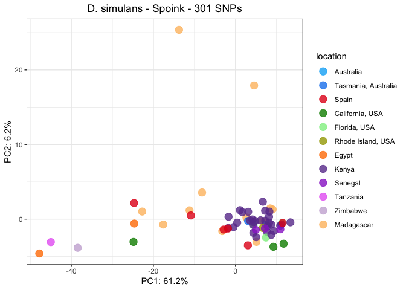<!-- -->

``` r
pca_spoink_dsim_cleaned <- PCA(spoink_pcaable_dsim_cleaned, "D. simulans - Spoink - 38 SNPs", dsim_scale)
pca_spoink_dsim_cleaned$pc1_3
```

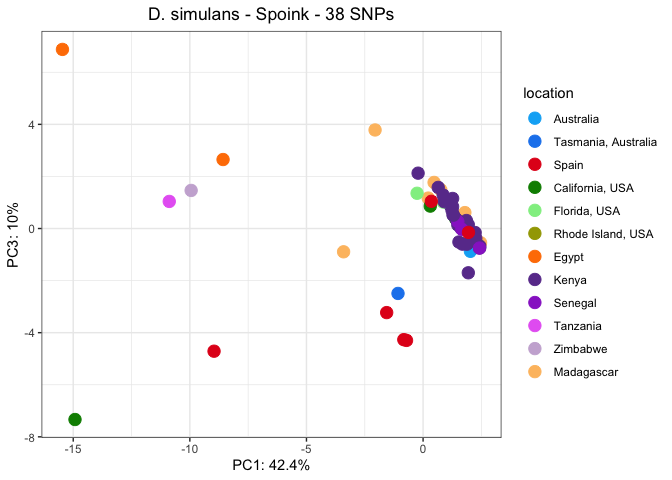<!-- -->

``` r
shellder_dsim <- read_tsv("/Volumes/EXT-RICCARDO/DoubleTrouble/Dsim/time-series/raw/Shellder-out/merged.PCAable") %>% rename(Sample = ID) %>% mutate(Sample = str_remove(Sample, "\\.cleaned$"))
```

    ## Rows: 94 Columns: 26
    ## ── Column specification ────────────────────────────────────────────────────────
    ## Delimiter: "\t"
    ## chr  (1): ID
    ## dbl (25): Shellder_147, Shellder_288, Shellder_369, Shellder_452, Shellder_5...
    ## 
    ## ℹ Use `spec()` to retrieve the full column specification for this data.
    ## ℹ Specify the column types or set `show_col_types = FALSE` to quiet this message.

``` r
colnames(shellder_dsim) <- str_remove(colnames(shellder_dsim), "^.+?_")

shellder_pcaable_dsim <- inner_join(dsim, shellder_dsim, by="Sample")

shellder_pcaable_dsim_cleaned <- shellder_pcaable_dsim %>% select(-matches(as.character(Shellder_old_coverage$base)))

pca_shellder_dsim <- PCA(shellder_pcaable_dsim, "D. simulans - Shellder - 25 SNPs", dsim_scale)
pca_shellder_dsim$pc1_2
```

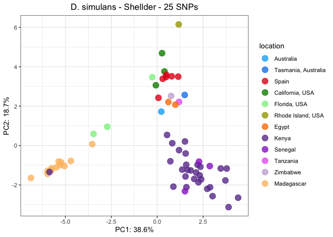<!-- -->

``` r
pca_shellder_dsim_cleaned <- PCA(shellder_pcaable_dsim_cleaned, "D. simulans - Shellder - 16 SNPs", dsim_scale)
pca_shellder_dsim_cleaned$pc1_2
```

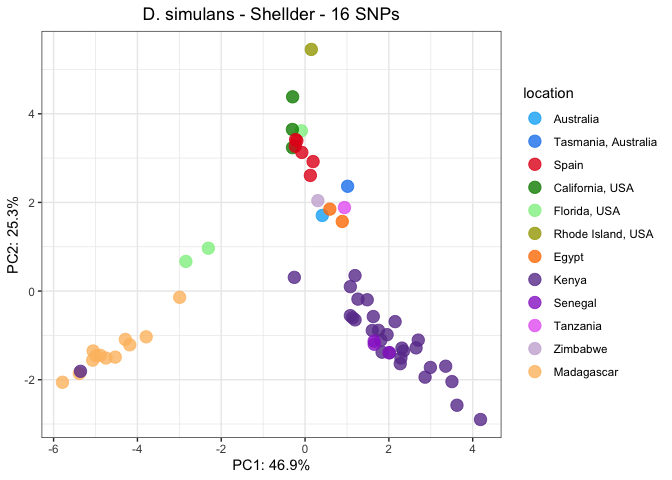<!-- -->

``` r
ggsave("/Volumes/EXT-RICCARDO/DoubleTrouble/figures/sup-figures/PCA-TE-noancient/dsec-spoink-pca.png", pca_spoink_clean$pc1_2)
```

    ## Saving 7 x 5 in image

``` r
ggsave("/Volumes/EXT-RICCARDO/DoubleTrouble/figures/sup-figures/PCA-TE-noancient/dsec-shellder-pca.png", pca_shellder_clean$pc1_2)
```

    ## Saving 7 x 5 in image

``` r
ggsave("/Volumes/EXT-RICCARDO/DoubleTrouble/figures/sup-figures/PCA-TE-noancient/dmel-spoink-pca.png", pca_spoink_dmel_cleaned$pc1_2)
```

    ## Saving 7 x 5 in image

``` r
ggsave("/Volumes/EXT-RICCARDO/DoubleTrouble/figures/sup-figures/PCA-TE-noancient/dsim-spoink-pca.png", pca_spoink_dsim_cleaned$pc1_2)
```

    ## Saving 7 x 5 in image

``` r
ggsave("/Volumes/EXT-RICCARDO/DoubleTrouble/figures/sup-figures/PCA-TE-noancient/dsim-shellder-pca.png", pca_shellder_dsim_cleaned$pc1_2)
```

    ## Saving 7 x 5 in image

## SNPs ratio

``` r
dmel_sp <- read_tsv("/Volumes/EXT-RICCARDO/DoubleTrouble/Dmel/spoink-out-mf1-mc1/merged.PCAable") %>% select(-ID)
```

    ## Rows: 206 Columns: 502
    ## ── Column specification ────────────────────────────────────────────────────────
    ## Delimiter: "\t"
    ## chr   (1): ID
    ## dbl (501): spoink_19, spoink_48, spoink_85, spoink_94, spoink_120, spoink_14...
    ## 
    ## ℹ Use `spec()` to retrieve the full column specification for this data.
    ## ℹ Specify the column types or set `show_col_types = FALSE` to quiet this message.

``` r
dsim_sh <- read_tsv("/Volumes/EXT-RICCARDO/DoubleTrouble/Dsim/time-series/raw/Shellder-out-mc1-mf1/merged.PCAable") %>% select(-ID)
```

    ## Rows: 94 Columns: 203
    ## ── Column specification ────────────────────────────────────────────────────────
    ## Delimiter: "\t"
    ## chr   (1): ID
    ## dbl (202): Shellder_34, Shellder_86, Shellder_147, Shellder_187, Shellder_22...
    ## 
    ## ℹ Use `spec()` to retrieve the full column specification for this data.
    ## ℹ Specify the column types or set `show_col_types = FALSE` to quiet this message.

``` r
dsim_sp <- read_tsv("/Volumes/EXT-RICCARDO/DoubleTrouble/Dsim/time-series/raw/Spoink-out-mc1-mf1/merged.PCAable") %>% select(-ID)
```

    ## Rows: 94 Columns: 468
    ## ── Column specification ────────────────────────────────────────────────────────
    ## Delimiter: "\t"
    ## chr   (1): ID
    ## dbl (467): spoink_33, spoink_79, spoink_123, spoink_126, spoink_139, spoink_...
    ## 
    ## ℹ Use `spec()` to retrieve the full column specification for this data.
    ## ℹ Specify the column types or set `show_col_types = FALSE` to quiet this message.

``` r
dsec_sh <- read_tsv("/Volumes/EXT-RICCARDO/DoubleTrouble/Dsec/PCA/Shellder-out-mf1-mc1/merged.PCAable") %>% select(-ID)
```

    ## Rows: 46 Columns: 73
    ## ── Column specification ────────────────────────────────────────────────────────
    ## Delimiter: "\t"
    ## chr  (1): ID
    ## dbl (72): Shellder_254, Shellder_272, Shellder_294, Shellder_342, Shellder_4...
    ## 
    ## ℹ Use `spec()` to retrieve the full column specification for this data.
    ## ℹ Specify the column types or set `show_col_types = FALSE` to quiet this message.

``` r
dsec_sp <- read_tsv("/Volumes/EXT-RICCARDO/DoubleTrouble/Dsec/PCA/Spoink-out-mf1-mc1/merged.PCAable") %>% select(-ID)
```

    ## Rows: 46 Columns: 383
    ## ── Column specification ────────────────────────────────────────────────────────
    ## Delimiter: "\t"
    ## chr   (1): ID
    ## dbl (382): spoink_139, spoink_200, spoink_272, spoink_332, spoink_414, spoin...
    ## 
    ## ℹ Use `spec()` to retrieve the full column specification for this data.
    ## ℹ Specify the column types or set `show_col_types = FALSE` to quiet this message.

``` r
dmau_sh <- read_tsv("/Volumes/EXT-RICCARDO/DoubleTrouble/Dmau/time-series/Shellder-out-mf1-mc1/merged.PCAable") %>% select(-ID)
```

    ## Rows: 12 Columns: 40
    ## ── Column specification ────────────────────────────────────────────────────────
    ## Delimiter: "\t"
    ## chr  (1): ID
    ## dbl (39): Shellder_279, Shellder_442, Shellder_452, Shellder_610, Shellder_6...
    ## 
    ## ℹ Use `spec()` to retrieve the full column specification for this data.
    ## ℹ Specify the column types or set `show_col_types = FALSE` to quiet this message.

``` r
dmau_sp <- read_tsv("/Volumes/EXT-RICCARDO/DoubleTrouble/Dmau/time-series/Spoink-out-mf1-mc1/merged.PCAable") %>% select(-ID)
```

    ## Rows: 12 Columns: 280
    ## ── Column specification ────────────────────────────────────────────────────────
    ## Delimiter: "\t"
    ## chr   (1): ID
    ## dbl (279): spoink_217, spoink_370, spoink_794, spoink_1266, spoink_1278, spo...
    ## 
    ## ℹ Use `spec()` to retrieve the full column specification for this data.
    ## ℹ Specify the column types or set `show_col_types = FALSE` to quiet this message.

``` r
dtei_sh <- read_tsv("/Volumes/EXT-RICCARDO/DoubleTrouble/Dtei/raw/Shellder-out-mc1-mf1/merged.PCAable") %>% select(-ID)
```

    ## Rows: 13 Columns: 40
    ## ── Column specification ────────────────────────────────────────────────────────
    ## Delimiter: "\t"
    ## chr  (1): ID
    ## dbl (39): Shellder_452, Shellder_604, Shellder_606, Shellder_609, Shellder_6...
    ## 
    ## ℹ Use `spec()` to retrieve the full column specification for this data.
    ## ℹ Specify the column types or set `show_col_types = FALSE` to quiet this message.

``` r
colnames(dmel_sp) <- str_remove(colnames(dmel_sp), "^.+?_")
colnames(dsim_sh) <- str_remove(colnames(dsim_sh), "^.+?_")
colnames(dsim_sp) <- str_remove(colnames(dsim_sp), "^.+?_")
colnames(dsec_sh) <- str_remove(colnames(dsec_sh), "^.+?_")
colnames(dsec_sp) <- str_remove(colnames(dsec_sp), "^.+?_")
colnames(dmau_sh) <- str_remove(colnames(dmau_sh), "^.+?_")
colnames(dmau_sp) <- str_remove(colnames(dmau_sp), "^.+?_")
colnames(dtei_sh) <- str_remove(colnames(dtei_sh), "^.+?_")

dmel_sp_clean <- dmel_sp %>% select(-matches(as.character(Spoink_old_coverage$base)))
dsim_sh_clean <- dsim_sh %>% select(-matches(as.character(Shellder_old_coverage$base)))
dsim_sp_clean <- dsim_sp %>% select(-matches(as.character(Spoink_old_coverage$base)))
dsec_sh_clean <- dsec_sh %>% select(-matches(as.character(Shellder_old_coverage$base)))
dsec_sp_clean <- dsec_sp %>% select(-matches(as.character(Spoink_old_coverage$base)))
dmau_sh_clean <- dmau_sh %>% select(-matches(as.character(Shellder_old_coverage$base)))
dmau_sp_clean <- dmau_sp %>% select(-matches(as.character(Spoink_old_coverage$base)))
dtei_sh_clean <- dtei_sh %>% select(-matches(as.character(Shellder_old_coverage$base)))

snps_info <- tibble(
  species = c("D.mel", "D.sim", "D.sim", "D.sec", "D.sec", "D.mau", "D.mau", "D.tei"),
  transposon = c("Spoink", "Shellder", "Spoink", "Shellder", "Spoink", "Shellder", "Spoink", "Shellder"),
  bp = c(5216,6635,5216,6635,5216,6635,5216,6635),
  ancient_sites = c(2258,83,2258,83,2258,83,2258,83),
  copies = c(16, 12, 25, 9, 20, 14, 30, 13),
  SNPs = c(ncol(dmel_sp_clean), ncol(dsim_sh_clean), ncol(dsim_sp_clean), ncol(dsec_sh_clean), ncol(dsec_sp_clean), ncol(dmau_sh_clean), ncol(dmau_sp_clean),ncol(dtei_sh_clean)),
  samples = c(nrow(dmel_sp), nrow(dsim_sh), nrow(dsim_sp), nrow(dsec_sh), nrow(dsec_sp), nrow(dmau_sh), nrow(dmau_sp),nrow(dtei_sh))
)

(snps <- snps_info %>% mutate(total_bp = bp-ancient_sites, heterozigosity = SNPs/total_bp, het_normalized = heterozigosity/copies))
```

    ## # A tibble: 8 × 10
    ##   species transposon    bp ancient_sites copies  SNPs samples total_bp
    ##   <chr>   <chr>      <dbl>         <dbl>  <dbl> <int>   <int>    <dbl>
    ## 1 D.mel   Spoink      5216          2258     16    95     206     2958
    ## 2 D.sim   Shellder    6635            83     12   136      94     6552
    ## 3 D.sim   Spoink      5216          2258     25   102      94     2958
    ## 4 D.sec   Shellder    6635            83      9    30      46     6552
    ## 5 D.sec   Spoink      5216          2258     20    62      46     2958
    ## 6 D.mau   Shellder    6635            83     14    23      12     6552
    ## 7 D.mau   Spoink      5216          2258     30    14      12     2958
    ## 8 D.tei   Shellder    6635            83     13    20      13     6552
    ## # ℹ 2 more variables: heterozigosity <dbl>, het_normalized <dbl>

``` r
snps$species <- factor(snps$species, levels = c("D.sim", "D.sec", "D.mau", "D.tei", "D.mel"))
```

``` r
(snps_plot <- ggplot(snps, aes(x=species, y=heterozigosity, fill=transposon))+
  geom_col(position = position_dodge2(width = 0.9, preserve = "single"))+
   labs(x="", fill="", y="proportion of polymorphic loci")+
   scale_fill_manual(values=c("#6A3D9A","lightpink1")))
```

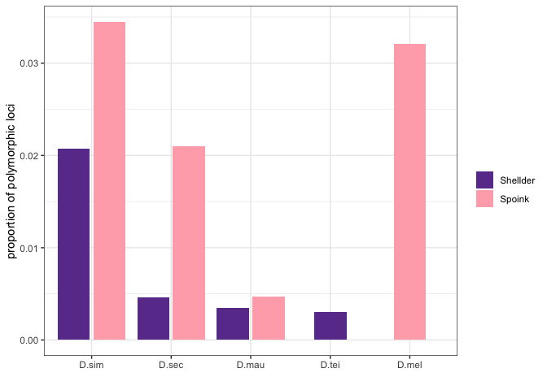<!-- -->

``` r
(snps_plot_norm <- ggplot(snps, aes(x=species, y=het_normalized, fill=transposon))+
  geom_col(position = position_dodge2(width = 0.9, preserve = "single"))+
   labs(x="", fill="", y="proportion of polymorphic loci per copy")+
   scale_fill_manual(values=c("#6A3D9A","lightpink1")))
```

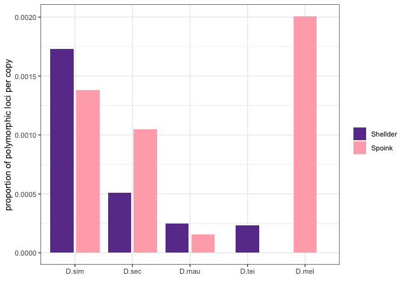<!-- -->

``` r
#ggsave("/Volumes/EXT-RICCARDO/DoubleTrouble/figures/sup-figures/heterozigosity-TE/het-TEs.png", snps_plot)
```
