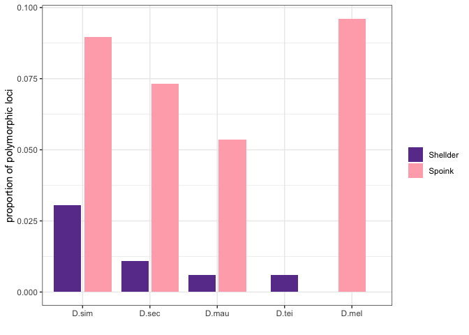
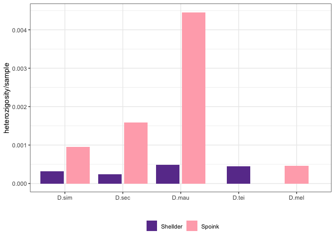

PCA of Spoink and Shellder
================

``` r
suppressPackageStartupMessages(library(tidyverse))
suppressPackageStartupMessages(library(knitr))
suppressPackageStartupMessages(library(kableExtra))
suppressPackageStartupMessages(library(ggpubr))
suppressPackageStartupMessages(library(umap))
suppressPackageStartupMessages(library(sf))
suppressPackageStartupMessages(library(svglite))
theme_set(theme_bw())
```

PCA function.

``` r
PCA <- function(pcaable, titlee, scale){
  
  pcaable <- pcaable %>% select_if(~ !all(. == .[1]))
  pca_result <- prcomp(pcaable[, -c(1:9)], center = TRUE, scale = TRUE)
  var_explained <- pca_result$sdev^2/sum(pca_result$sdev^2)
  
  plot1 <- ggplot(data.frame(pca_result$x, ID=pcaable$Sample, location=pcaable$location), aes(x=PC1,y=PC2, color=location)) + geom_point(size=4, alpha=0.8) + labs(x=paste0("PC1: ",round(var_explained[1]*100,1),"%"), y=paste0("PC2: ",round(var_explained[2]*100,1),"%"), color="location") + ggtitle(titlee) + theme(plot.title = element_text(hjust = 0.5))+
 # geom_text(aes(label=strain), vjust=1.5, hjust=1.5, size=3) +
scale_colour_manual(values=scale)
  
  plot2 <- ggplot(data.frame(pca_result$x, ID=pcaable$Sample, location=pcaable$location), aes(x=PC1,y=PC3, color=location)) + geom_point(size=4) + labs(x=paste0("PC1: ",round(var_explained[1]*100,1),"%"), y=paste0("PC3: ",round(var_explained[3]*100,1),"%"), color="location") + ggtitle(titlee) + theme(plot.title = element_text(hjust = 0.5))+
scale_colour_manual(values=scale)
  
  plot3 <- ggplot(data.frame(pca_result$x, ID=pcaable$Sample, location=pcaable$location), aes(x=PC3,y=PC2, color=location)) + geom_point(size=4) + labs(x=paste0("PC3: ",round(var_explained[3]*100,1),"%"), y=paste0("PC2: ",round(var_explained[2]*100,1),"%"), color="location") + ggtitle(titlee) + theme(plot.title = element_text(hjust = 0.5))+
scale_colour_manual(values=scale)
  
  plot4 <- ggplot(data.frame(pca_result$x, ID=pcaable$Sample, location=pcaable$location), aes(x=PC1,y=PC4, color=location)) + geom_point(size=4) + labs(x=paste0("PC1: ",round(var_explained[1]*100,1),"%"), y=paste0("PC4: ",round(var_explained[4]*100,1),"%"), color="location") + ggtitle(titlee) + theme(plot.title = element_text(hjust = 0.5))+
scale_colour_manual(values=scale)
  
  plot5 <- ggplot(data.frame(pca_result$x, ID=pcaable$Sample, location=pcaable$location), aes(x=PC4,y=PC2, color=location)) + geom_point(size=4) + labs(x=paste0("PC4: ",round(var_explained[4]*100,1),"%"), y=paste0("PC2: ",round(var_explained[2]*100,1),"%"), color="location") + ggtitle(titlee) + theme(plot.title = element_text(hjust = 0.5))+
scale_colour_manual(values=scale)
  
  plot6 <- ggplot(data.frame(pca_result$x, ID=pcaable$Sample, location=pcaable$location), aes(x=PC3,y=PC4, color=location)) + geom_point(size=4) + labs(x=paste0("PC3: ",round(var_explained[3]*100,1),"%"), y=paste0("PC4: ",round(var_explained[4]*100,1),"%"), color="location") + ggtitle(titlee) + theme(plot.title = element_text(hjust = 0.5))+
   # geom_text(aes(label=strain), vjust=1.5, hjust=1.5, size=3) +
scale_colour_manual(values=scale)
  
    plot_bonus <- ggplot(data.frame(pca_result$x, ID=pcaable$Sample, location=pcaable$location), aes(x=PC5,y=PC6, color=location)) + geom_point(size=4) + labs(x=paste0("PC5: ",round(var_explained[5]*100,1),"%"), y=paste0("PC6: ",round(var_explained[6]*100,1),"%"), color="location") + ggtitle(titlee) + theme(plot.title = element_text(hjust = 0.5))+
   # geom_text(aes(label=strain), vjust=1.5, hjust=1.5, size=3) +
scale_colour_manual(values=scale)

  list(pc1_2 = plot1, pc1_3 = plot2, pc2_3 = plot3, pc1_4 = plot4, pc2_4 = plot5, pc3_4 = plot6, pc_bonus = plot_bonus)
}
```

## Drosophila sechellia

``` r
dsec_csv <- read_csv("/Volumes/EXT-RICCARDO/DoubleTrouble/Dsec/time-series/dsec.csv", show_col_types = FALSE) %>% filter(Sample!="Sample")

(dsec_metadata <- read_tsv("/Volumes/EXT-RICCARDO/DoubleTrouble/Dsec/metadata.txt", show_col_types = FALSE))
```

    ## # A tibble: 47 × 6
    ##    Sample     library_name island     lat  long  year
    ##    <chr>      <chr>        <chr>    <dbl> <dbl> <dbl>
    ##  1 SRR5860583 PNF4         Praslin  -4.32  55.7  2012
    ##  2 SRR5860625 DenisNF155   Denis    -3.81  55.7  2012
    ##  3 SRR5860626 DenisNoni10  Denis    -3.81  55.7  2012
    ##  4 SRR5860628 DenisNoni60  Denis    -3.81  55.7  2012
    ##  5 SRR5860631 Denis124     Denis    -3.81  55.7  2012
    ##  6 SRR5860632 Denis7_2     Denis    -3.81  55.7  2012
    ##  7 SRR5860645 Anro_B7      Mahé     -4.73  55.5  2012
    ##  8 SRR5860656 LD16         La Digue -4.36  55.8  2012
    ##  9 SRR5860659 mariane_1    Mariane  -4.34  55.9  2012
    ## 10 SRR5860661 Anro_B2      Mahé     -4.73  55.5  2012
    ## # ℹ 37 more rows

``` r
dsec <- inner_join(dsec_metadata, dsec_csv, by="Sample") %>% type_convert() %>% mutate(presence = ifelse(HQ_reads > 2, "present", "absent"), TE = case_when(TE == "spoink" ~ "Spoink", TE == "PPI251" ~ "P-element", TRUE ~ TE)) %>% filter(TE %in% c("Spoink", "Shellder", "P-element")) %>% filter(island!="Cousin") %>% rename(location=island)
```

    ## 
    ## ── Column specification ────────────────────────────────────────────────────────
    ## cols(
    ##   Sample = col_character(),
    ##   library_name = col_character(),
    ##   island = col_character(),
    ##   TE = col_character(),
    ##   All_reads = col_double(),
    ##   HQ_reads = col_double()
    ## )

``` r
dsec_scale <- c("#ABA300", "#ED68ED")

shellder <- read_tsv("/Volumes/EXT-RICCARDO/DoubleTrouble/Dsec/PCA/Dsec-shellder.PCAable") %>% rename(Sample = ID) %>% mutate(Sample = str_remove(Sample, "\\.cleaned$"))
```

    ## Rows: 46 Columns: 18
    ## ── Column specification ────────────────────────────────────────────────────────
    ## Delimiter: "\t"
    ## chr  (1): ID
    ## dbl (17): gypsy-29-dsim_442, gypsy-29-dsim_452, gypsy-29-dsim_625, gypsy-29-...
    ## 
    ## ℹ Use `spec()` to retrieve the full column specification for this data.
    ## ℹ Specify the column types or set `show_col_types = FALSE` to quiet this message.

``` r
shellder_pcaable <- inner_join(dsec, shellder, by="Sample") %>% filter(TE=="Shellder", presence == "present", location %in% c("Praslin", "Denis"))

pca_shellder <- PCA(shellder_pcaable, "D. sechellia - Shellder - 18 SNPs", dsec_scale)
pca_shellder$pc1_2
```

<!-- -->

``` r
spoink <- read_tsv("/Volumes/EXT-RICCARDO/DoubleTrouble/Dsec/PCA/Dsec-spoink.PCAable") %>% rename(Sample = ID) %>% mutate(Sample = str_remove(Sample, "\\.cleaned$"))
```

    ## Rows: 46 Columns: 283
    ## ── Column specification ────────────────────────────────────────────────────────
    ## Delimiter: "\t"
    ## chr   (1): ID
    ## dbl (282): gypsy-7-sim1_141, gypsy-7-sim1_333, gypsy-7-sim1_415, gypsy-7-sim...
    ## 
    ## ℹ Use `spec()` to retrieve the full column specification for this data.
    ## ℹ Specify the column types or set `show_col_types = FALSE` to quiet this message.

``` r
spoink_pcaable <- inner_join(dsec, spoink, by="Sample") %>% filter(TE=="Spoink", presence == "present", location %in% c("Praslin", "Denis"))

pca_spoink <- PCA(spoink_pcaable, "D. sechellia - Spoink - 282 SNPs", dsec_scale)
pca_spoink$pc1_2
```

<!-- -->

``` r
#ggsave("/Volumes/EXT-RICCARDO/DoubleTrouble/figures/sup-figures/dsec-TE-pca/dsec-shellder-pca.png", pca_shellder$pc1_2, dpi=300)
#ggsave("/Volumes/EXT-RICCARDO/DoubleTrouble/figures/sup-figures/dsec-TE-pca/dsec-spoink-pca.png", pca_spoink$pc1_2, dpi=300)
```

## Drosophila melanogaster

min-freq 0.2 min-count 10

``` r
dmel_scale <- c("#F8766D","#A3A500","#00BF7D","#00B0F6","#E76BF3")
(dmel_metadata <- read_tsv("/Volumes/Storage/dmel-full-story/metadata.tsv", show_col_types = FALSE))
```

    ## # A tibble: 585 × 9
    ##    Sample      strain   publication    study study_id  year location lat     lon
    ##    <chr>       <chr>    <chr>          <chr> <chr>    <dbl> <chr>    <chr> <dbl>
    ##  1 SRR23876563 H10      https://doi.o… PRJN… Shpak20…  1815 Lund, S… 55       13
    ##  2 SRR23876564 H4       https://doi.o… PRJN… Shpak20…  1815 Lund, S… 55       13
    ##  3 SRR23876566 H6       https://doi.o… PRJN… Shpak20…  1815 Smaland… 60       15
    ##  4 SRR23876582 H13      https://doi.o… PRJN… Shpak20…  1815 Lund, S… 55       13
    ##  5 SRR23876583 H12      https://doi.o… PRJN… Shpak20…  1815 Lund, S… 55       13
    ##  6 SRR23876584 H11      https://doi.o… PRJN… Shpak20…  1815 Lund, S… 55       13
    ##  7 SRR23876562 H9       https://doi.o… PRJN… Shpak20…  1850 Passau,… 49       13
    ##  8 SRR23876569 H25      https://doi.o… PRJN… Shpak20…  1850 Passau,… 49       13
    ##  9 SRR23876565 H5       https://doi.o… PRJN… Shpak20…  1875 Zealand… 55       12
    ## 10 ERR6474638  Oregon-R https://doi.o… PRJN… Burny20…  1925 <NA>     <NA>     NA
    ## # ℹ 575 more rows

``` r
spoink_dmel <- read_tsv("/Volumes/Storage/Dmel-spoink/PCA-UMAP/GDL/gdl-gypsy7.PCAable") %>% rename(Sample = ID) %>% mutate(Sample = str_remove(Sample, "\\.cleaned$"))
```

    ## Rows: 86 Columns: 15
    ## ── Column specification ────────────────────────────────────────────────────────
    ## Delimiter: "\t"
    ## chr  (1): ID
    ## dbl (14): gypsy-7-sim1_21, gypsy-7-sim1_87, gypsy-7-sim1_1167, gypsy-7-sim1_...
    ## 
    ## ℹ Use `spec()` to retrieve the full column specification for this data.
    ## ℹ Specify the column types or set `show_col_types = FALSE` to quiet this message.

``` r
(spoink_pcaable_dmel <- inner_join(dmel_metadata, spoink_dmel, by="Sample") %>% filter(strain != "ZS10"))
```

    ## # A tibble: 85 × 23
    ##    Sample     strain publication       study study_id  year location lat     lon
    ##    <chr>      <chr>  <chr>             <chr> <chr>    <dbl> <chr>    <chr> <dbl>
    ##  1 SRR1663598 ZH23   https://doi.org/… PRJN… Grenier…  1993 Zimbabwe -19      29
    ##  2 SRR1663599 ZH26   https://doi.org/… PRJN… Grenier…  1993 Zimbabwe -19      29
    ##  3 SRR1663600 ZH33   https://doi.org/… PRJN… Grenier…  1993 Zimbabwe -19      29
    ##  4 SRR1663601 ZH42   https://doi.org/… PRJN… Grenier…  1993 Zimbabwe -19      29
    ##  5 SRR1663603 ZW09   https://doi.org/… PRJN… Grenier…  1993 Zimbabwe -19      29
    ##  6 SRR1663604 ZW139  https://doi.org/… PRJN… Grenier…  1993 Zimbabwe -19      29
    ##  7 SRR1663605 ZW140  https://doi.org/… PRJN… Grenier…  1993 Zimbabwe -19      29
    ##  8 SRR1663606 ZW142  https://doi.org/… PRJN… Grenier…  1993 Zimbabwe -19      29
    ##  9 SRR1663607 ZW144  https://doi.org/… PRJN… Grenier…  1993 Zimbabwe -19      29
    ## 10 SRR1663608 ZW155  https://doi.org/… PRJN… Grenier…  1993 Zimbabwe -19      29
    ## # ℹ 75 more rows
    ## # ℹ 14 more variables: `gypsy-7-sim1_21` <dbl>, `gypsy-7-sim1_87` <dbl>,
    ## #   `gypsy-7-sim1_1167` <dbl>, `gypsy-7-sim1_1644` <dbl>,
    ## #   `gypsy-7-sim1_2429` <dbl>, `gypsy-7-sim1_2432` <dbl>,
    ## #   `gypsy-7-sim1_2439` <dbl>, `gypsy-7-sim1_2453` <dbl>,
    ## #   `gypsy-7-sim1_3124` <dbl>, `gypsy-7-sim1_3569` <dbl>,
    ## #   `gypsy-7-sim1_3593` <dbl>, `gypsy-7-sim1_4333` <dbl>, …

``` r
pca_spoink_dmel <- PCA(spoink_pcaable_dmel, "D. melanogaster - Spoink - 23 SNPs", dmel_scale)
pca_spoink_dmel$pc1_2
```

<!-- -->

``` r
#ggsave("/Volumes/EXT-RICCARDO/DoubleTrouble/figures/sup-figures/dsec-TE-pca/dsec-shellder-pca.png", pca_shellder$pc1_2, dpi=300)
#ggsave("/Volumes/EXT-RICCARDO/DoubleTrouble/figures/sup-figures/dsec-TE-pca/dsec-spoink-pca.png", pca_spoink$pc1_2, dpi=300)
```

``` r
eigen2pca_dmel <- function(vec, val, metadata, title) {
  
  PCs <- c("PC1", "PC2", "PC3", "PC4", "PC5", "PC6", "PC7", "PC8", "PC9", "PC10", "PC11", "PC12", "PC13", "PC14", "PC15", "PC16", "PC17", "PC18", "PC19", "PC20")
  
  eigenvec <- read_table(vec, col_names = c("Sample", "Sample2", "PC1", "PC2", "PC3", "PC4", "PC5", "PC6", "PC7", "PC8", "PC9", "PC10", "PC11", "PC12", "PC13", "PC14", "PC15", "PC16", "PC17", "PC18", "PC19", "PC20")) %>% select(-Sample2) %>% mutate(Sample = str_extract(Sample, "SRR\\d+"))

eigenval <- read_table(val, col_names = c("val")) %>% mutate(PC = PCs, variability_explained = paste0(round((val/sum(val)*100),2), "%"))

var_explained <- eigenval %>% select(variability_explained) %>% pull()
pcaable <- inner_join(metadata, eigenvec, by="Sample")

(pca_plot <- ggplot(pcaable, aes(x=PC1, y=PC2, color=location)) + geom_point(alpha=0.5, size=4) +
    xlab(paste0("PC1: ", var_explained[1])) + ylab(paste0("PC2: ", var_explained[2])) +
    ggtitle(title) + theme(plot.title = element_text(hjust = 0.5), legend.position = "right")+
  scale_fill_manual(values = c("#F8766D","#A3A500","#00BF7D","#00B0F6","#E76BF3")))
}

(dmel_wg <- eigen2pca_dmel("/Volumes/EXT-RICCARDO/DoubleTrouble/Dmel/tree/mapped/dmel.pca.eigenvec", "/Volumes/EXT-RICCARDO/DoubleTrouble/Dmel/tree/mapped/dmel.pca.eigenval", dmel_metadata, "D. melanogaster - 10.137.297 SNPs"))
```

    ## 
    ## ── Column specification ────────────────────────────────────────────────────────
    ## cols(
    ##   .default = col_double(),
    ##   Sample = col_character(),
    ##   Sample2 = col_character()
    ## )
    ## ℹ Use `spec()` for the full column specifications.

    ## 
    ## ── Column specification ────────────────────────────────────────────────────────
    ## cols(
    ##   val = col_double()
    ## )

<!-- -->

``` r
#ggsave("/Volumes/EXT-RICCARDO/DoubleTrouble/figures/sup-figures/dsec-pca/dsec-pca.png", all_samples$pca, dpi=300)
```

## Drosophila simulans

``` r
dsim_scale <- c("#00B0F6","dodgerblue2","#E31A1C","green4","palegreen2","#A3A500","#FF7F00","#6A3D9A","darkorchid","#E76BF3","#CAB2D6","#FDBF6F")
dsim_metadata <- read_tsv("/Volumes/EXT-RICCARDO/DoubleTrouble/Dsim/metadata.txt", show_col_types = FALSE)

dsim_csv <- read_csv("/Volumes/EXT-RICCARDO/DoubleTrouble/Dsim/time-series/dsim.csv", show_col_types = FALSE) %>% filter(Sample!="Sample")

dsim <- inner_join(dsim_metadata, dsim_csv, by="Sample") %>% type_convert() %>% mutate(presence = ifelse(HQ_reads > 2, "present", "absent"), TE = case_when(TE == "spoink" ~ "Spoink", TRUE ~ TE)) %>% filter(TE %in% c("Spoink", "Shellder"), presence=="present") %>% select(-presence, -HQ_reads, -All_reads, -TE) %>% distinct() %>% filter(!(strain %in% c("18KARI03", "FL(US)", "Ken75")))
```

    ## 
    ## ── Column specification ────────────────────────────────────────────────────────
    ## cols(
    ##   Sample = col_character(),
    ##   strain = col_character(),
    ##   publication = col_character(),
    ##   study = col_character(),
    ##   study_id = col_character(),
    ##   location = col_character(),
    ##   TE = col_character(),
    ##   All_reads = col_double(),
    ##   HQ_reads = col_double()
    ## )

``` r
dsim$location <- factor(dsim$location, levels = c("Australia", "Tasmania, Australia", "Spain", "California, USA", "Florida, USA", "Rhode Island, USA", "Egypt", "Kenya", "Senegal", "Tanzania", "Zimbabwe", "Madagascar"))

spoink_dsim <- read_tsv("/Volumes/EXT-RICCARDO/DoubleTrouble/Dsim/time-series/raw/Spoink-out/merged.PCAable") %>% rename(Sample = ID) %>% mutate(Sample = str_remove(Sample, "\\.cleaned$"))
```

    ## Rows: 94 Columns: 302

    ## ── Column specification ────────────────────────────────────────────────────────
    ## Delimiter: "\t"
    ## chr   (1): ID
    ## dbl (301): spoink_272, spoink_790, spoink_795, spoink_813, spoink_814, spoin...
    ## 
    ## ℹ Use `spec()` to retrieve the full column specification for this data.
    ## ℹ Specify the column types or set `show_col_types = FALSE` to quiet this message.

``` r
(spoink_pcaable_dsim <- inner_join(dsim, spoink_dsim, by="Sample"))
```

    ## # A tibble: 63 × 310
    ##    Sample      strain publication      study study_id  year location   lat   lon
    ##    <chr>       <chr>  <chr>            <chr> <chr>    <dbl> <fct>    <dbl> <dbl>
    ##  1 SRR22548196 Tan96  https://doi.org… PRJN… Courret…  1996 Tanzania    -5    35
    ##  2 SRR22548177 Zim97  https://doi.org… PRJN… Courret…  1997 Zimbabwe   -18    30
    ##  3 ERR668322   MD225a https://doi.org… PRJE… Signor2…  2002 Madagas…   -19    46
    ##  4 ERR668323   MD225b https://doi.org… PRJE… Signor2…  2002 Madagas…   -19    46
    ##  5 ERR668324   MD235  https://doi.org… PRJE… Signor2…  2002 Madagas…   -19    46
    ##  6 ERR668317   MD72   https://doi.org… PRJE… Signor2…  2002 Madagas…   -19    46
    ##  7 ERR668318   MD146  https://doi.org… PRJE… Signor2…  2002 Madagas…   -19    46
    ##  8 ERR668320   MD201  https://doi.org… PRJE… Signor2…  2002 Madagas…   -19    46
    ##  9 ERR668321   MD224  https://doi.org… PRJE… Signor2…  2002 Madagas…   -19    46
    ## 10 ERR668325   MD238  https://doi.org… PRJE… Signor2…  2002 Madagas…   -19    46
    ## # ℹ 53 more rows
    ## # ℹ 301 more variables: spoink_272 <dbl>, spoink_790 <dbl>, spoink_795 <dbl>,
    ## #   spoink_813 <dbl>, spoink_814 <dbl>, spoink_815 <dbl>, spoink_819 <dbl>,
    ## #   spoink_828 <dbl>, spoink_837 <dbl>, spoink_1278 <dbl>, spoink_1287 <dbl>,
    ## #   spoink_1290 <dbl>, spoink_1293 <dbl>, spoink_1303 <dbl>, spoink_1314 <dbl>,
    ## #   spoink_1315 <dbl>, spoink_1316 <dbl>, spoink_1324 <dbl>, spoink_1326 <dbl>,
    ## #   spoink_1344 <dbl>, spoink_1350 <dbl>, spoink_1356 <dbl>, …

``` r
pca_spoink_dsim <- PCA(spoink_pcaable_dsim, "D. simulans - Spoink - 301 SNPs", dsim_scale)
pca_spoink_dsim$pc1_2
```

<!-- -->

``` r
pca_spoink_dsim$pc3_4
```

<!-- -->

``` r
pca_spoink_dsim$pc_bonus
```

<!-- -->

``` r
shellder_dsim <- read_tsv("/Volumes/EXT-RICCARDO/DoubleTrouble/Dsim/time-series/raw/Shellder-out/merged.PCAable") %>% rename(Sample = ID) %>% mutate(Sample = str_remove(Sample, "\\.cleaned$"))
```

    ## Rows: 94 Columns: 26
    ## ── Column specification ────────────────────────────────────────────────────────
    ## Delimiter: "\t"
    ## chr  (1): ID
    ## dbl (25): Shellder_147, Shellder_288, Shellder_369, Shellder_452, Shellder_5...
    ## 
    ## ℹ Use `spec()` to retrieve the full column specification for this data.
    ## ℹ Specify the column types or set `show_col_types = FALSE` to quiet this message.

``` r
(shellder_pcaable_dsim <- inner_join(dsim, shellder_dsim, by="Sample"))
```

    ## # A tibble: 63 × 34
    ##    Sample      strain publication      study study_id  year location   lat   lon
    ##    <chr>       <chr>  <chr>            <chr> <chr>    <dbl> <fct>    <dbl> <dbl>
    ##  1 SRR22548196 Tan96  https://doi.org… PRJN… Courret…  1996 Tanzania    -5    35
    ##  2 SRR22548177 Zim97  https://doi.org… PRJN… Courret…  1997 Zimbabwe   -18    30
    ##  3 ERR668322   MD225a https://doi.org… PRJE… Signor2…  2002 Madagas…   -19    46
    ##  4 ERR668323   MD225b https://doi.org… PRJE… Signor2…  2002 Madagas…   -19    46
    ##  5 ERR668324   MD235  https://doi.org… PRJE… Signor2…  2002 Madagas…   -19    46
    ##  6 ERR668317   MD72   https://doi.org… PRJE… Signor2…  2002 Madagas…   -19    46
    ##  7 ERR668318   MD146  https://doi.org… PRJE… Signor2…  2002 Madagas…   -19    46
    ##  8 ERR668320   MD201  https://doi.org… PRJE… Signor2…  2002 Madagas…   -19    46
    ##  9 ERR668321   MD224  https://doi.org… PRJE… Signor2…  2002 Madagas…   -19    46
    ## 10 ERR668325   MD238  https://doi.org… PRJE… Signor2…  2002 Madagas…   -19    46
    ## # ℹ 53 more rows
    ## # ℹ 25 more variables: Shellder_147 <dbl>, Shellder_288 <dbl>,
    ## #   Shellder_369 <dbl>, Shellder_452 <dbl>, Shellder_563 <dbl>,
    ## #   Shellder_625 <dbl>, Shellder_627 <dbl>, Shellder_632 <dbl>,
    ## #   Shellder_635 <dbl>, Shellder_658 <dbl>, Shellder_662 <dbl>,
    ## #   Shellder_707 <dbl>, Shellder_1811 <dbl>, Shellder_1870 <dbl>,
    ## #   Shellder_1972 <dbl>, Shellder_2017 <dbl>, Shellder_2749 <dbl>, …

``` r
pca_shellder_dsim <- PCA(shellder_pcaable_dsim, "D. simulans - Shellder - 25 SNPs", dsim_scale)
pca_shellder_dsim$pc1_2
```

<!-- -->

``` r
#ggsave("/Volumes/EXT-RICCARDO/DoubleTrouble/figures/sup-figures/dsec-TE-pca/dsec-shellder-pca.png", pca_shellder$pc1_2, dpi=300)
#ggsave("/Volumes/EXT-RICCARDO/DoubleTrouble/figures/sup-figures/dsec-TE-pca/dsec-spoink-pca.png", pca_spoink$pc1_2, dpi=300)
```

``` r
ggsave("/Volumes/EXT-RICCARDO/DoubleTrouble/figures/sup-figures/PCA-TE/dsec-spoink-pca.png", pca_spoink$pc1_2)
```

    ## Saving 7 x 5 in image

``` r
ggsave("/Volumes/EXT-RICCARDO/DoubleTrouble/figures/sup-figures/PCA-TE/dsec-shellder-pca.png", pca_shellder$pc1_2)
```

    ## Saving 7 x 5 in image

``` r
ggsave("/Volumes/EXT-RICCARDO/DoubleTrouble/figures/sup-figures/PCA-TE/dmel-spoink-pca.png", pca_spoink_dmel$pc1_2)
```

    ## Saving 7 x 5 in image

``` r
ggsave("/Volumes/EXT-RICCARDO/DoubleTrouble/figures/sup-figures/PCA-TE/dsim-spoink-pca.png", pca_spoink_dsim$pc1_2)
```

    ## Saving 7 x 5 in image

``` r
ggsave("/Volumes/EXT-RICCARDO/DoubleTrouble/figures/sup-figures/PCA-TE/dsim-shellder-pca.png", pca_shellder_dsim$pc1_2)
```

    ## Saving 7 x 5 in image

## SNPs ratio

``` r
dmel_sp <- read_tsv("/Volumes/EXT-RICCARDO/DoubleTrouble/Dmel/spoink-out-mf1-mc1/merged.PCAable") %>% select(-ID)
```

    ## Rows: 206 Columns: 502
    ## ── Column specification ────────────────────────────────────────────────────────
    ## Delimiter: "\t"
    ## chr   (1): ID
    ## dbl (501): spoink_19, spoink_48, spoink_85, spoink_94, spoink_120, spoink_14...
    ## 
    ## ℹ Use `spec()` to retrieve the full column specification for this data.
    ## ℹ Specify the column types or set `show_col_types = FALSE` to quiet this message.

``` r
dsim_sh <- read_tsv("/Volumes/EXT-RICCARDO/DoubleTrouble/Dsim/time-series/raw/Shellder-out-mc1-mf1/merged.PCAable") %>% select(-ID)
```

    ## Rows: 94 Columns: 203
    ## ── Column specification ────────────────────────────────────────────────────────
    ## Delimiter: "\t"
    ## chr   (1): ID
    ## dbl (202): Shellder_34, Shellder_86, Shellder_147, Shellder_187, Shellder_22...
    ## 
    ## ℹ Use `spec()` to retrieve the full column specification for this data.
    ## ℹ Specify the column types or set `show_col_types = FALSE` to quiet this message.

``` r
dsim_sp <- read_tsv("/Volumes/EXT-RICCARDO/DoubleTrouble/Dsim/time-series/raw/Spoink-out-mc1-mf1/merged.PCAable") %>% select(-ID)
```

    ## Rows: 94 Columns: 468
    ## ── Column specification ────────────────────────────────────────────────────────
    ## Delimiter: "\t"
    ## chr   (1): ID
    ## dbl (467): spoink_33, spoink_79, spoink_123, spoink_126, spoink_139, spoink_...
    ## 
    ## ℹ Use `spec()` to retrieve the full column specification for this data.
    ## ℹ Specify the column types or set `show_col_types = FALSE` to quiet this message.

``` r
dsec_sh <- read_tsv("/Volumes/EXT-RICCARDO/DoubleTrouble/Dsec/PCA/Shellder-out-mf1-mc1/merged.PCAable") %>% select(-ID)
```

    ## Rows: 46 Columns: 73
    ## ── Column specification ────────────────────────────────────────────────────────
    ## Delimiter: "\t"
    ## chr  (1): ID
    ## dbl (72): Shellder_254, Shellder_272, Shellder_294, Shellder_342, Shellder_4...
    ## 
    ## ℹ Use `spec()` to retrieve the full column specification for this data.
    ## ℹ Specify the column types or set `show_col_types = FALSE` to quiet this message.

``` r
dsec_sp <- read_tsv("/Volumes/EXT-RICCARDO/DoubleTrouble/Dsec/PCA/Spoink-out-mf1-mc1/merged.PCAable") %>% select(-ID)
```

    ## Rows: 46 Columns: 383
    ## ── Column specification ────────────────────────────────────────────────────────
    ## Delimiter: "\t"
    ## chr   (1): ID
    ## dbl (382): spoink_139, spoink_200, spoink_272, spoink_332, spoink_414, spoin...
    ## 
    ## ℹ Use `spec()` to retrieve the full column specification for this data.
    ## ℹ Specify the column types or set `show_col_types = FALSE` to quiet this message.

``` r
dmau_sh <- read_tsv("/Volumes/EXT-RICCARDO/DoubleTrouble/Dmau/time-series/Shellder-out-mf1-mc1/merged.PCAable") %>% select(-ID)
```

    ## Rows: 12 Columns: 40
    ## ── Column specification ────────────────────────────────────────────────────────
    ## Delimiter: "\t"
    ## chr  (1): ID
    ## dbl (39): Shellder_279, Shellder_442, Shellder_452, Shellder_610, Shellder_6...
    ## 
    ## ℹ Use `spec()` to retrieve the full column specification for this data.
    ## ℹ Specify the column types or set `show_col_types = FALSE` to quiet this message.

``` r
dmau_sp <- read_tsv("/Volumes/EXT-RICCARDO/DoubleTrouble/Dmau/time-series/Spoink-out-mf1-mc1/merged.PCAable") %>% select(-ID)
```

    ## Rows: 12 Columns: 280
    ## ── Column specification ────────────────────────────────────────────────────────
    ## Delimiter: "\t"
    ## chr   (1): ID
    ## dbl (279): spoink_217, spoink_370, spoink_794, spoink_1266, spoink_1278, spo...
    ## 
    ## ℹ Use `spec()` to retrieve the full column specification for this data.
    ## ℹ Specify the column types or set `show_col_types = FALSE` to quiet this message.

``` r
dtei_sh <- read_tsv("/Volumes/EXT-RICCARDO/DoubleTrouble/Dtei/raw/Shellder-out-mc1-mf1/merged.PCAable") %>% select(-ID)
```

    ## Rows: 13 Columns: 40
    ## ── Column specification ────────────────────────────────────────────────────────
    ## Delimiter: "\t"
    ## chr  (1): ID
    ## dbl (39): Shellder_452, Shellder_604, Shellder_606, Shellder_609, Shellder_6...
    ## 
    ## ℹ Use `spec()` to retrieve the full column specification for this data.
    ## ℹ Specify the column types or set `show_col_types = FALSE` to quiet this message.

``` r
snps_info <- tibble(
  species = c("D.mel", "D.sim", "D.sim", "D.sec", "D.sec", "D.mau", "D.mau", "D.tei"),
  transposon = c("Spoink", "Shellder", "Spoink", "Shellder", "Spoink", "Shellder", "Spoink", "Shellder"),
  bp = c(5216,6635,5216,6635,5216,6635,5216,6635),
  SNPs = c(ncol(dmel_sp), ncol(dsim_sh), ncol(dsim_sp), ncol(dsec_sh), ncol(dsec_sp), ncol(dmau_sh), ncol(dmau_sp),ncol(dtei_sh)),
  samples = c(nrow(dmel_sp), nrow(dsim_sh), nrow(dsim_sp), nrow(dsec_sh), nrow(dsec_sp), nrow(dmau_sh), nrow(dmau_sp),nrow(dtei_sh))
)

(snps <- snps_info %>% mutate(heterozigosity = SNPs/bp, het_per_sample = heterozigosity/samples))
```

    ## # A tibble: 8 × 7
    ##   species transposon    bp  SNPs samples heterozigosity het_per_sample
    ##   <chr>   <chr>      <dbl> <int>   <int>          <dbl>          <dbl>
    ## 1 D.mel   Spoink      5216   501     206        0.0961        0.000466
    ## 2 D.sim   Shellder    6635   202      94        0.0304        0.000324
    ## 3 D.sim   Spoink      5216   467      94        0.0895        0.000952
    ## 4 D.sec   Shellder    6635    72      46        0.0109        0.000236
    ## 5 D.sec   Spoink      5216   382      46        0.0732        0.00159 
    ## 6 D.mau   Shellder    6635    39      12        0.00588       0.000490
    ## 7 D.mau   Spoink      5216   279      12        0.0535        0.00446 
    ## 8 D.tei   Shellder    6635    39      13        0.00588       0.000452

``` r
snps$species <- factor(snps$species, levels = c("D.sim", "D.sec", "D.mau", "D.tei", "D.mel"))
```

``` r
(snps_plot <- ggplot(snps, aes(x=species, y=heterozigosity, fill=transposon))+
  geom_col(position = position_dodge2(width = 0.9, preserve = "single"))+
   labs(x="", fill="", y="proportion of polymorphic loci")+
   scale_fill_manual(values=c("#6A3D9A","lightpink1")))
```

<!-- -->

``` r
(snps_plot_normalized <- ggplot(snps, aes(x=species, y=het_per_sample, fill=transposon))+
  geom_col(position = position_dodge2(width = 0.9, preserve = "single"))+
   labs(x="", fill="", y="heterozigosity/sample")+
    theme(legend.position = "bottom")+
    scale_fill_manual(values=c("#6A3D9A","lightpink1")))
```

<!-- -->

``` r
#ggsave("/Volumes/EXT-RICCARDO/DoubleTrouble/figures/sup-figures/heterozigosity-TE/het-TEs.png", snps_plot)
```
