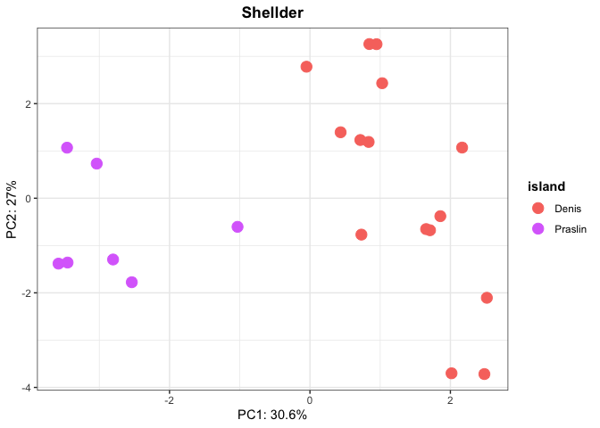
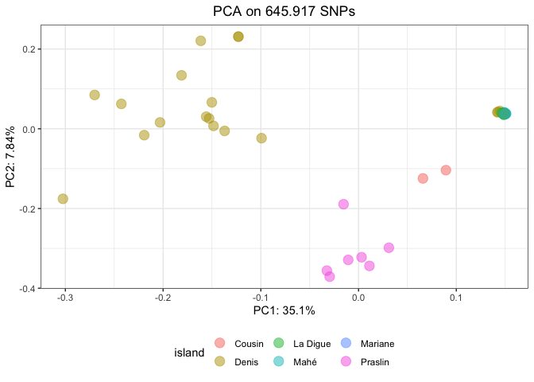

Drosophila sechellia - Population structure
================

``` r
suppressPackageStartupMessages(library(tidyverse))
suppressPackageStartupMessages(library(knitr))
suppressPackageStartupMessages(library(kableExtra))
suppressPackageStartupMessages(library(ggpubr))
suppressPackageStartupMessages(library(umap))
suppressPackageStartupMessages(library(sf))
theme_set(theme_bw())
```

``` r
dsec_csv <- read_csv("/Volumes/EXT-RICCARDO/DoubleTrouble/Dsec/time-series/dsec.csv", show_col_types = FALSE) %>% filter(Sample!="Sample")

(dsec_metadata <- read_tsv("/Volumes/EXT-RICCARDO/DoubleTrouble/Dsec/metadata.txt", show_col_types = FALSE))
```

    ## # A tibble: 47 × 6
    ##    Sample     library_name island     lat  long  year
    ##    <chr>      <chr>        <chr>    <dbl> <dbl> <dbl>
    ##  1 SRR5860583 PNF4         Praslin  -4.32  55.7  2012
    ##  2 SRR5860625 DenisNF155   Denis    -3.81  55.7  2012
    ##  3 SRR5860626 DenisNoni10  Denis    -3.81  55.7  2012
    ##  4 SRR5860628 DenisNoni60  Denis    -3.81  55.7  2012
    ##  5 SRR5860631 Denis124     Denis    -3.81  55.7  2012
    ##  6 SRR5860632 Denis7_2     Denis    -3.81  55.7  2012
    ##  7 SRR5860645 Anro_B7      Mahé     -4.73  55.5  2012
    ##  8 SRR5860656 LD16         La Digue -4.36  55.8  2012
    ##  9 SRR5860659 mariane_1    Mariane  -4.34  55.9  2012
    ## 10 SRR5860661 Anro_B2      Mahé     -4.73  55.5  2012
    ## # ℹ 37 more rows

``` r
dsec <- inner_join(dsec_metadata, dsec_csv, by="Sample") %>% type_convert() %>% mutate(presence = ifelse(HQ_reads > 2, "present", "absent"), TE = case_when(TE == "spoink" ~ "Spoink", TE == "PPI251" ~ "P-element", TRUE ~ TE)) %>% filter(TE %in% c("Spoink", "Shellder", "P-element"))
```

    ## 
    ## ── Column specification ────────────────────────────────────────────────────────
    ## cols(
    ##   Sample = col_character(),
    ##   library_name = col_character(),
    ##   island = col_character(),
    ##   TE = col_character(),
    ##   All_reads = col_double(),
    ##   HQ_reads = col_double()
    ## )

``` r
map <- st_read("/Volumes/EXT-RICCARDO/DoubleTrouble/Dsec/seychelles-latest-free.shp/gis_osm_landuse_a_free_1.shp")
```

    ## Reading layer `gis_osm_landuse_a_free_1' from data source 
    ##   `/Volumes/EXT-RICCARDO/DoubleTrouble/Dsec/seychelles-latest-free.shp/gis_osm_landuse_a_free_1.shp' 
    ##   using driver `ESRI Shapefile'
    ## Simple feature collection with 403 features and 4 fields
    ## Geometry type: MULTIPOLYGON
    ## Dimension:     XY
    ## Bounding box:  xmin: 45.76767 ymin: -12.80537 xmax: 56.29089 ymax: -3.713628
    ## Geodetic CRS:  WGS 84

``` r
plot_map_seychelles <- function(dataset) {
  limits <- c(xmin = 55.35, xmax = 55.95, ymin = -4.8, ymax = -3.78)
  dataset$TE <- factor(dataset$TE, levels = c("Shellder", "Spoink", "P-element"))
  
  island_labels <- dataset %>% distinct(island, lat, long)
  
  ggplot() +
    geom_sf(data = map) +
    geom_point(data = dataset, aes(long, lat, color = presence), position = position_jitter(width = 0.01, height = 0.02), alpha = 0.5, size=5) +
    scale_colour_manual(values=c("darkgreen", "red")) +
    theme(legend.position = "none", axis.text = element_blank(), axis.title = element_blank(), axis.ticks = element_blank()) +
    coord_sf(xlim = c(limits["xmin"], limits["xmax"]), ylim = c(limits["ymin"], limits["ymax"])) +
    facet_wrap(~TE)+
    geom_text(data = island_labels, aes(label = island, x = long, y = lat), vjust = 3, size = 3, color = "black")
}

plot_map_seychelles(dsec)
```

    ## Warning: Removed 6 rows containing missing values (`geom_point()`).

    ## Warning: Removed 3 rows containing missing values (`geom_text()`).

<!-- -->

``` r
PCA <- function(pcaable, titlee){
  
  pcaable <- pcaable %>% select_if(~ !all(. == .[1]))
  pca_result <- prcomp(pcaable[, -c(1:9)], center = TRUE, scale = TRUE)
  var_explained <- pca_result$sdev^2/sum(pca_result$sdev^2)
  
  plot1 <- ggplot(data.frame(pca_result$x, ID=pcaable$Sample, location=pcaable$island), aes(x=PC1,y=PC2, color=location)) + geom_point(size=2) + labs(x=paste0("PC1: ",round(var_explained[1]*100,1),"%"), y=paste0("PC2: ",round(var_explained[2]*100,1),"%"), color="island") + ggtitle(titlee) + theme(plot.title = element_text(hjust = 0.5, face = "bold"), legend.title = element_text(face = "bold"))
  
  plot2 <- ggplot(data.frame(pca_result$x, ID=pcaable$Sample, location=pcaable$island), aes(x=PC1,y=PC3, color=location)) + geom_point(size=2) + labs(x=paste0("PC1: ",round(var_explained[1]*100,1),"%"), y=paste0("PC3: ",round(var_explained[3]*100,1),"%"), color="island") + ggtitle(titlee) + theme(plot.title = element_text(hjust = 0.5, face = "bold"), legend.title = element_text(face = "bold"))
  
  plot3 <- ggplot(data.frame(pca_result$x, ID=pcaable$Sample, location=pcaable$island), aes(x=PC3,y=PC2, color=location)) + geom_point(size=2) + labs(x=paste0("PC3: ",round(var_explained[3]*100,1),"%"), y=paste0("PC2: ",round(var_explained[2]*100,1),"%"), color="island") + ggtitle(titlee) + theme(plot.title = element_text(hjust = 0.5, face = "bold"), legend.title = element_text(face = "bold"))
  
  plot4 <- ggplot(data.frame(pca_result$x, ID=pcaable$Sample, location=pcaable$island), aes(x=PC1,y=PC4, color=location)) + geom_point(size=2) + labs(x=paste0("PC1: ",round(var_explained[1]*100,1),"%"), y=paste0("PC4: ",round(var_explained[4]*100,1),"%"), color="island") + ggtitle(titlee) + theme(plot.title = element_text(hjust = 0.5, face = "bold"), legend.title = element_text(face = "bold"))
  
  plot5 <- ggplot(data.frame(pca_result$x, ID=pcaable$Sample, location=pcaable$island), aes(x=PC4,y=PC2, color=location)) + geom_point(size=2) + labs(x=paste0("PC4: ",round(var_explained[4]*100,1),"%"), y=paste0("PC2: ",round(var_explained[2]*100,1),"%"), color="island") + ggtitle(titlee) + theme(plot.title = element_text(hjust = 0.5, face = "bold"), legend.title = element_text(face = "bold"))
  
  plot6 <- ggplot(data.frame(pca_result$x, ID=pcaable$Sample, location=pcaable$island), aes(x=PC3,y=PC4, color=location)) + geom_point(size=2) + labs(x=paste0("PC3: ",round(var_explained[3]*100,1),"%"), y=paste0("PC4: ",round(var_explained[4]*100,1),"%"), color="island") + ggtitle(titlee) + theme(plot.title = element_text(hjust = 0.5, face = "bold"), legend.title = element_text(face = "bold"))

  list(pc1_2 = plot1, pc1_3 = plot2, pc2_3 = plot3, pc1_4 = plot4, pc2_4 = plot5, pc3_4 = plot6)
}
```

``` r
shellder <- read_tsv("/Volumes/EXT-RICCARDO/DoubleTrouble/Dsec/PCA/Dsec-shellder.PCAable") %>% rename(Sample = ID) %>% mutate(Sample = str_remove(Sample, "\\.cleaned$"))
```

    ## Rows: 46 Columns: 18
    ## ── Column specification ────────────────────────────────────────────────────────
    ## Delimiter: "\t"
    ## chr  (1): ID
    ## dbl (17): gypsy-29-dsim_442, gypsy-29-dsim_452, gypsy-29-dsim_625, gypsy-29-...
    ## 
    ## ℹ Use `spec()` to retrieve the full column specification for this data.
    ## ℹ Specify the column types or set `show_col_types = FALSE` to quiet this message.

``` r
shellder_pcaable <- inner_join(dsec, shellder, by="Sample") %>% filter(TE=="Shellder", presence == "present", island %in% c("Praslin", "Denis"))

pca_shellder <- PCA(shellder_pcaable, "Shellder")
pca_shellder$pc1_2
```

<!-- -->

``` r
#pca_shellder$pc1_3
#pca_shellder$pc2_3
#pca_shellder$pc1_4
#pca_shellder$pc2_4
#pca_shellder$pc3_4
```

``` r
spoink <- read_tsv("/Volumes/EXT-RICCARDO/DoubleTrouble/Dsec/PCA/Dsec-spoink.PCAable") %>% rename(Sample = ID) %>% mutate(Sample = str_remove(Sample, "\\.cleaned$"))
```

    ## Rows: 46 Columns: 283
    ## ── Column specification ────────────────────────────────────────────────────────
    ## Delimiter: "\t"
    ## chr   (1): ID
    ## dbl (282): gypsy-7-sim1_141, gypsy-7-sim1_333, gypsy-7-sim1_415, gypsy-7-sim...
    ## 
    ## ℹ Use `spec()` to retrieve the full column specification for this data.
    ## ℹ Specify the column types or set `show_col_types = FALSE` to quiet this message.

``` r
spoink_pcaable <- inner_join(dsec, spoink, by="Sample") %>% filter(TE=="Spoink", presence == "present", island %in% c("Praslin", "Denis"))

pca_spoink <- PCA(spoink_pcaable, "Spoink")
pca_spoink$pc1_2
```

<!-- -->

``` r
#pca_spoink$pc1_3
#pca_spoink$pc2_3
#pca_spoink$pc1_4
#pca_spoink$pc2_4
#pca_spoink$pc3_4
```

## PCA - Whole genome SNPs

To prepare the data for the PCA, I first downloaded, trimmed (75 bp) and
merged (\_1 and \_2) all the *D. sechellia* strains present in our
dataset. I also downloaded the reference genome of *D. sechellia* from
the NCBI database (GCF_004382195.2_ASM438219v2_genomic.fna).

I mapped the short reads of each sample to the **reference genome** and
then sorted the **bam** files.

    find . -name "*.fastq.gz" | parallel -j 4 'n={/.}; bwa bwasw -t 4 /Volumes/Temp/Riccardo/simulans-clade-TE-invasions/sechellia-population-structure/GCF_004382195.2_ASM438219v2_genomic.fna {} | samtools sort -@ 4 -m 3G - > /Volumes/Temp/Riccardo/simulans-clade-TE-invasions/sechellia-population-structure/${n}.sort.bam'

I generated the mpileup (**bcf**) file for all the bam files.

    find . -name "*.bam" | parallel -j 20 'n={/.}; samtools mpileup -uf /Volumes/Temp/Riccardo/simulans-clade-TE-invasions/sechellia-population-structure/reference/GCF_004382195.2_ASM438219v2_genomic.fna {} -o ${n}.bcf'

I converted the **bcf** into **vcf**, performing the variants call using
**bcftools**. Then I zipped all the files using **bgzip** and
**indexed** the bcf files with bcftools.

    find . -name "*.bcf" | parallel -j 20 'n={/.}; bcftools call -mv -Ov {} -o ${n}.vcf'
    find . -name "*.vcf" | parallel -j 20 'n={/.}; bgzip {}'
    find . -name "*.vcf.gz" | parallel -j 20 'n={/.}; bcftools index {}'

After, I merged the vcf files.

    bcftools merge *vcf.gz -o dsec.vcf

Using **plink2**, I pruned the linked variants (see this tutorial for
explanation <https://speciationgenomics.github.io/pca/>)

    plink2 --vcf dsec.vcf --double-id --allow-extra-chr --indep-pairwise 50 10 0.1 --out dsec.pruned

And finally, performed the PCA.

    plink2 --vcf dsec.vcf --double-id --allow-extra-chr --extract dsec.pruned.prune.in --make-bed --pca --out dsec.pca

The PCA gives as output files the **.eigenvec** file (containing the
values of each PC for each sample) and the **.eigenval** file
(variability explained by each PC, easily convertible in % value).

``` r
(pca_metadata <- left_join(dsec_metadata, dsec_csv, by="Sample") %>% type_convert() %>% mutate(presence = ifelse(HQ_reads > 2, "present", "absent"), TE = case_when(TE == "spoink" ~ "Spoink", TE == "PPI251" ~ "P-element", TRUE ~ TE)) %>% filter(TE %in% c("Spoink", "Shellder", "P-element", NA)) %>% select(-All_reads, -HQ_reads) %>% pivot_wider(names_from = TE, values_from = presence) %>% mutate(Shellder = ifelse(library_name=="14021-0248.01", "absent", Shellder), Spoink = ifelse(library_name=="14021-0248.01", "present", Spoink)) %>% mutate(presence = case_when(
    Spoink == "present" & Shellder == "present" ~ "both",
    Spoink == "present" & Shellder != "present" ~ "Spoink only",
    Spoink != "present" & Shellder == "present" ~ "Shellder only",
    TRUE ~ "none"
  )) %>% select(-"NA"))
```

    ## 
    ## ── Column specification ────────────────────────────────────────────────────────
    ## cols(
    ##   Sample = col_character(),
    ##   library_name = col_character(),
    ##   island = col_character(),
    ##   TE = col_character(),
    ##   All_reads = col_double(),
    ##   HQ_reads = col_double()
    ## )

    ## # A tibble: 47 × 10
    ##    Sample     library_name island    lat  long  year `P-element` Shellder Spoink
    ##    <chr>      <chr>        <chr>   <dbl> <dbl> <dbl> <chr>       <chr>    <chr> 
    ##  1 SRR5860583 PNF4         Praslin -4.32  55.7  2012 absent      present  prese…
    ##  2 SRR5860625 DenisNF155   Denis   -3.81  55.7  2012 absent      present  prese…
    ##  3 SRR5860626 DenisNoni10  Denis   -3.81  55.7  2012 absent      absent   absent
    ##  4 SRR5860628 DenisNoni60  Denis   -3.81  55.7  2012 absent      present  prese…
    ##  5 SRR5860631 Denis124     Denis   -3.81  55.7  2012 absent      present  prese…
    ##  6 SRR5860632 Denis7_2     Denis   -3.81  55.7  2012 absent      present  prese…
    ##  7 SRR5860645 Anro_B7      Mahé    -4.73  55.5  2012 absent      absent   absent
    ##  8 SRR5860656 LD16         La Dig… -4.36  55.8  2012 absent      absent   absent
    ##  9 SRR5860659 mariane_1    Mariane -4.34  55.9  2012 absent      absent   absent
    ## 10 SRR5860661 Anro_B2      Mahé    -4.73  55.5  2012 absent      absent   absent
    ## # ℹ 37 more rows
    ## # ℹ 1 more variable: presence <chr>

``` r
PCs <- c("PC1", "PC2", "PC3", "PC4", "PC5", "PC6", "PC7", "PC8", "PC9", "PC10", "PC11", "PC12", "PC13", "PC14", "PC15", "PC16", "PC17", "PC18", "PC19", "PC20")
```

This function takes as input the two output files (vec, val) and the
metadata. Note that depending on your metadata column names you might
need to change the code below when plotting or merging. Also, the names
of the samples in the eigenvec files must be adjusted (es. removing part
of the file path) to match with the metadata and make the merging
possible. This is done here in the function by removing everything
before “SRR” and everything after the last number after “SRR”. Might
need adjustments.

``` r
eigen2pca <- function(vec, val, metadata, title) {
  eigenvec <- read_table(vec, col_names = c("Sample", "Sample2", "PC1", "PC2", "PC3", "PC4", "PC5", "PC6", "PC7", "PC8", "PC9", "PC10", "PC11", "PC12", "PC13", "PC14", "PC15", "PC16", "PC17", "PC18", "PC19", "PC20")) %>% select(-Sample2) %>% mutate(Sample = str_extract(Sample, "SRR\\d+"))

eigenval <- read_table(val, col_names = c("val")) %>% mutate(PC = PCs, variability_explained = paste0(round((val/sum(val)*100),2), "%"))

var_explained <- eigenval %>% select(variability_explained) %>% pull()
pcaable <- inner_join(pca_metadata, eigenvec, by="Sample")

pca_plot_islands <- ggplot(pcaable, aes(x=PC1, y=PC2, color=island)) + geom_point(alpha=0.5, size=4) +
    xlab(paste0("PC1: ", var_explained[1])) + ylab(paste0("PC2: ", var_explained[2])) +
    ggtitle(title) + theme(plot.title = element_text(hjust = 0.5), legend.position = "bottom")

pca_plot_presence <- ggplot(pcaable, aes(x=PC1, y=PC2, color=presence)) + geom_point(alpha=0.5, size=4) +
    xlab(paste0("PC1: ", var_explained[1])) + ylab(paste0("PC2: ", var_explained[2])) +
    scale_color_manual(values = c("red", "darkgreen", "orange")) + labs(color = "TE carried") +
    ggtitle(title) + theme(plot.title = element_text(hjust = 0.5), legend.position = "bottom")

pca_plot_merged <- ggplot(pcaable, aes(x=PC1, y=PC2, color=presence, fill=island)) + geom_point(shape=21, alpha=0.5, size=4, stroke=2) +
    xlab(paste0("PC1: ", var_explained[1])) + ylab(paste0("PC2: ", var_explained[2])) +
    scale_color_manual(values = c("red", "darkgreen", "orange")) + labs(color = "TE carried") +
    ggtitle(title) + theme(plot.title = element_text(hjust = 0.5), legend.position = "bottom")

list(islands = pca_plot_islands, presence = pca_plot_presence, data = pcaable, pca = pca_plot_merged)
}
```

The first PCA is performed using all the strains of Sechellia. The
second one is performed removing the 2 suspicious strains of unknown
origin.

``` r
all_samples <- eigen2pca("/Volumes/EXT-RICCARDO/DoubleTrouble/Dsec/population-structure/matute+chopped/dsec.pca.eigenvec", "/Volumes/EXT-RICCARDO/DoubleTrouble/Dsec/population-structure/matute+chopped/dsec.pca.eigenval", pca_metadata, "PCA on 645.917 SNPs")
```

    ## 
    ## ── Column specification ────────────────────────────────────────────────────────
    ## cols(
    ##   .default = col_double(),
    ##   Sample = col_character(),
    ##   Sample2 = col_character()
    ## )
    ## ℹ Use `spec()` for the full column specifications.

    ## 
    ## ── Column specification ────────────────────────────────────────────────────────
    ## cols(
    ##   val = col_double()
    ## )

``` r
print(all_samples$islands)
```

<!-- -->

``` r
print(all_samples$presence)
```

<!-- -->

``` r
print(all_samples$pca)
```

<!-- -->

``` r
#eigen2pca("/Volumes/EXT-RICCARDO/DoubleTrouble/Dsec/population-structure/v2/dsec.pca.eigenvec", "/Volumes/EXT-RICCARDO/DoubleTrouble/Dsec/population-structure/v2/dsec.pca.eigenval", pca_metadata)

#good_samples <- eigen2pca("/Volumes/EXT-RICCARDO/DoubleTrouble/Dsec/population-structure/v3/dsec.pca.eigenvec", "/Volumes/EXT-RICCARDO/DoubleTrouble/Dsec/population-structure/v3/dsec.pca.eigenval", pca_metadata, "PCA on 645.917 SNPs")
#print(good_samples$islands)
#print(good_samples$presence)
```

``` r
(LD <- read_tsv("/Volumes/EXT-RICCARDO/DoubleTrouble/Dsec/popgen-parameters/popgen.txt") %>% mutate(avg_LD = round(avg_LD, digits = 2), pi = round(pi, digits = 2)))
```

    ## Rows: 8 Columns: 3
    ## ── Column specification ────────────────────────────────────────────────────────
    ## Delimiter: "\t"
    ## chr (1): samples
    ## dbl (2): avg_LD, pi
    ## 
    ## ℹ Use `spec()` to retrieve the full column specification for this data.
    ## ℹ Specify the column types or set `show_col_types = FALSE` to quiet this message.

    ## # A tibble: 8 × 3
    ##   samples       avg_LD    pi
    ##   <chr>          <dbl> <dbl>
    ## 1 all             0.69  0.44
    ## 2 absent          0.84  0.12
    ## 3 present         0.67  0.48
    ## 4 Denis_present   0.66  0.51
    ## 5 Praslin         0.81  0.33
    ## 6 Denis           0.69  0.47
    ## 7 Mahé            0.88  0.05
    ## 8 La Digue        0.92  0.03

``` r
LD$samples <- factor(LD$samples, levels = c("all", "present", "absent", "Denis", "Praslin", "Mahé", "La Digue"))

plottable_pi <- LD %>% filter(samples %in% c("Denis", "Praslin", "Mahé", "La Digue"))
(pi__plot <- ggplot(plottable_pi, aes(x = samples, y = pi, fill = samples)) +
  geom_histogram(stat="identity") +
  scale_fill_manual(values=c("#CD9600","#FF61CC","#00BFC4","#00BE67")) +
    xlab("island") + labs(fill="island"))
```

    ## Warning in geom_histogram(stat = "identity"): Ignoring unknown parameters:
    ## `binwidth`, `bins`, and `pad`

<!-- -->

To construct the phylogeny tree starting from the merged VCF file, I
used a python script which can be found at
<https://github.com/edgardomortiz/vcf2phylip> with a call like this to
obtain the NEXUS file:

    python vcf2phylip.py --input myfile.vcf --phylip-disable --nexus

From the nexus file I used BEAUti to get the XML file and used it as
input for BEAST. Then I extracted the maximum credibility tree with
TreeAnnotator and visualized it with FigTree.

## Outliers investigation

SRR9913024 and SRR7697345 (SynA) come from two different studies where
they crossed Dsim and Dsec in the lab, but they are the Dsec parental
strain.

SRR5514394 (sech25) are chopped long reads.

``` r
(outliers <- dsec %>% filter(library_name %in% c("SynA","sech25"), TE!="P-element"))
```

    ## # A tibble: 6 × 10
    ##   Sample library_name island   lat  long  year TE    All_reads HQ_reads presence
    ##   <chr>  <chr>        <chr>  <dbl> <dbl> <dbl> <chr>     <dbl>    <dbl> <chr>   
    ## 1 SRR99… SynA         <NA>   NA     NA    1980 Shel…      6.04     5.28 present 
    ## 2 SRR99… SynA         <NA>   NA     NA    1980 Spoi…     16.3     13.0  present 
    ## 3 SRR76… SynA         <NA>   NA     NA    1980 Shel…      0.1      0.03 absent  
    ## 4 SRR76… SynA         <NA>   NA     NA    1980 Spoi…     13.7     10.3  present 
    ## 5 SRR55… sech25       Cousin -4.33  55.7  2003 Shel…      0.01     0    absent  
    ## 6 SRR55… sech25       Cousin -4.33  55.7  2003 Spoi…      9.04     3.74 present
