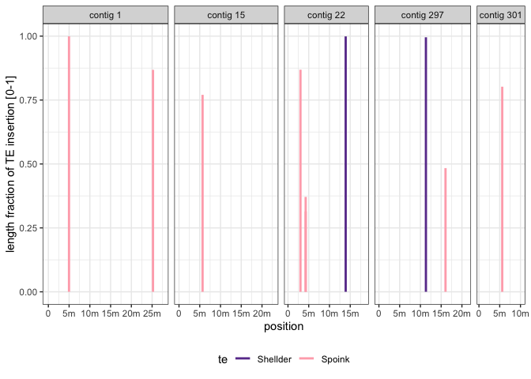
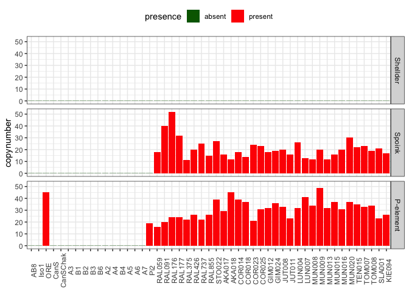
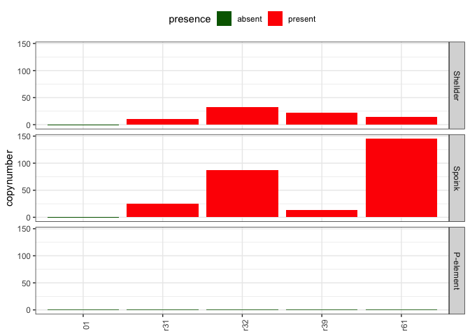

Spoink and Shellder invasion in long reads assemblies
================

``` r
suppressPackageStartupMessages(library(tidyverse))
suppressPackageStartupMessages(library(knitr))
suppressPackageStartupMessages(library(kableExtra))
suppressPackageStartupMessages(library(ggpubr))
theme_set(theme_bw())
```

    less path/rm.ori.out | sed 's/  */ /g' | cut -c2- | > output

## D.sim.sz129

``` r
(sz129 <- read_tsv("/Volumes/EXT-RICCARDO/DoubleTrouble/Dsim/insertions/D.sim.SZ129.fa.fai", col_names = c("contig", "length", "x", "y", "z")) %>% arrange(desc(length)) %>% select(contig, length) %>% filter(length > 10000000))
```

    ## Rows: 345 Columns: 5
    ## ── Column specification ────────────────────────────────────────────────────────
    ## Delimiter: "\t"
    ## chr (1): contig
    ## dbl (4): length, x, y, z
    ## 
    ## ℹ Use `spec()` to retrieve the full column specification for this data.
    ## ℹ Specify the column types or set `show_col_types = FALSE` to quiet this message.

    ## # A tibble: 5 × 2
    ##   contig                    length
    ##   <chr>                      <dbl>
    ## 1 tig00000001_pilon_pilon 27570015
    ## 2 tig00000015_pilon_pilon 22801566
    ## 3 tig00000297_pilon_pilon 21130583
    ## 4 tig00000022_pilon_pilon 18538940
    ## 5 tig00000301_pilon_pilon 10615794

``` r
sim_RM <- read_table("/Volumes/EXT-RICCARDO/DoubleTrouble/Dsim/insertions/D.sim.sz129.fa.ori.out.txt", col_names = c("SWscore", "div", "del", "ins", "contig", "position_in_query_begin", "position_in_query_end", "position_in_query_left",  "strand", "te", "repeat_class/family", "position_in_repeat_begin", "position_in_repeat_end", "position_in_repeat_left")) %>% mutate(position_in_repeat_begin = str_replace(position_in_repeat_begin, "\\(", ""), position_in_repeat_begin = str_replace(position_in_repeat_begin, "\\)", ""), position_in_repeat_left = str_replace(position_in_repeat_left, "\\(", ""), position_in_repeat_left = str_replace(position_in_repeat_left, "\\)", ""), position_in_query_left = str_replace(position_in_query_left, "\\(", ""), position_in_query_left = str_replace(position_in_query_left, "\\)", ""), position_in_repeat_end = str_replace(position_in_repeat_end, "\\(", ""), position_in_repeat_end = str_replace(position_in_repeat_end, "\\)", ""), position_in_query_begin = str_replace(position_in_query_begin, "\\(", ""), position_in_query_begin = str_replace(position_in_query_begin, "\\)", ""), position_in_query_end = str_replace(position_in_query_end, "\\(", ""), position_in_query_end = str_replace(position_in_query_end, "\\)", "")) %>%
rename(start = position_in_query_begin, end = position_in_query_end, qstart = 
position_in_repeat_begin, qend = position_in_repeat_end) %>% type_convert()
```

    ## 
    ## ── Column specification ────────────────────────────────────────────────────────
    ## cols(
    ##   SWscore = col_double(),
    ##   div = col_double(),
    ##   del = col_double(),
    ##   ins = col_double(),
    ##   contig = col_character(),
    ##   position_in_query_begin = col_double(),
    ##   position_in_query_end = col_double(),
    ##   position_in_query_left = col_character(),
    ##   strand = col_character(),
    ##   te = col_character(),
    ##   `repeat_class/family` = col_character(),
    ##   position_in_repeat_begin = col_character(),
    ##   position_in_repeat_end = col_double(),
    ##   position_in_repeat_left = col_character()
    ## )

    ## Warning: 1491 parsing failures.
    ## row col   expected     actual                                                                             file
    ##   1  -- 14 columns 15 columns '/Volumes/EXT-RICCARDO/DoubleTrouble/Dsim/insertions/D.sim.sz129.fa.ori.out.txt'
    ##   2  -- 14 columns 15 columns '/Volumes/EXT-RICCARDO/DoubleTrouble/Dsim/insertions/D.sim.sz129.fa.ori.out.txt'
    ##   3  -- 14 columns 15 columns '/Volumes/EXT-RICCARDO/DoubleTrouble/Dsim/insertions/D.sim.sz129.fa.ori.out.txt'
    ##   4  -- 14 columns 15 columns '/Volumes/EXT-RICCARDO/DoubleTrouble/Dsim/insertions/D.sim.sz129.fa.ori.out.txt'
    ##   5  -- 14 columns 15 columns '/Volumes/EXT-RICCARDO/DoubleTrouble/Dsim/insertions/D.sim.sz129.fa.ori.out.txt'
    ## ... ... .......... .......... ................................................................................
    ## See problems(...) for more details.

    ## 
    ## ── Column specification ────────────────────────────────────────────────────────
    ## cols(
    ##   contig = col_character(),
    ##   start = col_double(),
    ##   end = col_double(),
    ##   position_in_query_left = col_double(),
    ##   strand = col_character(),
    ##   te = col_character(),
    ##   `repeat_class/family` = col_character(),
    ##   qstart = col_double(),
    ##   qend = col_double(),
    ##   position_in_repeat_left = col_double()
    ## )

``` r
(sim <- sim_RM %>% select(te, contig, strand, start, end, qstart, qend, div) %>% mutate(telen = ifelse(te=="Spoink", 5216, 6635), fraglen = end-start, lenfraction = fraglen/telen))
```

    ## # A tibble: 1,491 × 11
    ##    te       contig         strand  start    end qstart  qend   div telen fraglen
    ##    <chr>    <chr>          <chr>   <dbl>  <dbl>  <dbl> <dbl> <dbl> <dbl>   <dbl>
    ##  1 Shellder tig00000001_p… C      2.92e5 2.92e5   5949   686  16.7  6635      53
    ##  2 Shellder tig00000001_p… C      4.72e5 4.72e5   5950   685  12.5  6635      55
    ##  3 Shellder tig00000001_p… C      8.45e5 8.45e5   5948   687  22.1  6635      67
    ##  4 Shellder tig00000001_p… C      8.46e5 8.46e5   5950   685  19.7  6635      95
    ##  5 Shellder tig00000001_p… C      1.18e6 1.18e6   5934   701  27.1  6635      84
    ##  6 Shellder tig00000001_p… +      1.20e6 1.20e6    599   690  19.6  6635      92
    ##  7 Shellder tig00000001_p… +      1.20e6 1.20e6    595   702  19.7  6635     111
    ##  8 Shellder tig00000001_p… +      1.20e6 1.20e6    598   695  21.0  6635     114
    ##  9 Shellder tig00000001_p… C      1.27e6 1.27e6   5945   690  12.3  6635      56
    ## 10 Shellder tig00000001_p… C      1.53e6 1.53e6   5934   701  27.1  6635      84
    ## # ℹ 1,481 more rows
    ## # ℹ 1 more variable: lenfraction <dbl>

``` r
(sim_good <- sim %>% filter(fraglen > 1000 & div < 10) %>% arrange(te) %>% select(te, contig, start, lenfraction) %>% inner_join(sz129, by="contig"))
```

    ## # A tibble: 10 × 5
    ##    te       contig                     start lenfraction   length
    ##    <chr>    <chr>                      <dbl>       <dbl>    <dbl>
    ##  1 Shellder tig00000022_pilon_pilon 13905210       0.999 18538940
    ##  2 Shellder tig00000297_pilon_pilon 11325262       0.995 21130583
    ##  3 Spoink   tig00000001_pilon_pilon  4976343       0.999 27570015
    ##  4 Spoink   tig00000001_pilon_pilon 25213495       0.868 27570015
    ##  5 Spoink   tig00000015_pilon_pilon  5679564       0.770 22801566
    ##  6 Spoink   tig00000022_pilon_pilon  3009534       0.869 18538940
    ##  7 Spoink   tig00000022_pilon_pilon  4262479       0.314 18538940
    ##  8 Spoink   tig00000022_pilon_pilon  4264112       0.371 18538940
    ##  9 Spoink   tig00000297_pilon_pilon 16048403       0.484 21130583
    ## 10 Spoink   tig00000301_pilon_pilon  5606898       0.802 10615794

``` r
positive_cont <- sim_good %>% select(contig) %>% distinct() %>% inner_join(sz129, by="contig")

dummy_end <- tibble(te = "Spoink", length = sz129$length, lenfraction = 0)
dummy_end <- dummy_end %>% inner_join(sz129, by="length") %>% rename(start=length)
dummy_start <- tibble(te = "Spoink", start = 0, lenfraction = 0, contig = positive_cont$contig)
dummy <- bind_rows(dummy_end, dummy_start)

(sim_plot <- bind_rows(sim_good, dummy))
```

    ## # A tibble: 20 × 5
    ##    te       contig                     start lenfraction   length
    ##    <chr>    <chr>                      <dbl>       <dbl>    <dbl>
    ##  1 Shellder tig00000022_pilon_pilon 13905210       0.999 18538940
    ##  2 Shellder tig00000297_pilon_pilon 11325262       0.995 21130583
    ##  3 Spoink   tig00000001_pilon_pilon  4976343       0.999 27570015
    ##  4 Spoink   tig00000001_pilon_pilon 25213495       0.868 27570015
    ##  5 Spoink   tig00000015_pilon_pilon  5679564       0.770 22801566
    ##  6 Spoink   tig00000022_pilon_pilon  3009534       0.869 18538940
    ##  7 Spoink   tig00000022_pilon_pilon  4262479       0.314 18538940
    ##  8 Spoink   tig00000022_pilon_pilon  4264112       0.371 18538940
    ##  9 Spoink   tig00000297_pilon_pilon 16048403       0.484 21130583
    ## 10 Spoink   tig00000301_pilon_pilon  5606898       0.802 10615794
    ## 11 Spoink   tig00000001_pilon_pilon 27570015       0           NA
    ## 12 Spoink   tig00000015_pilon_pilon 22801566       0           NA
    ## 13 Spoink   tig00000297_pilon_pilon 21130583       0           NA
    ## 14 Spoink   tig00000022_pilon_pilon 18538940       0           NA
    ## 15 Spoink   tig00000301_pilon_pilon 10615794       0           NA
    ## 16 Spoink   tig00000022_pilon_pilon        0       0           NA
    ## 17 Spoink   tig00000297_pilon_pilon        0       0           NA
    ## 18 Spoink   tig00000001_pilon_pilon        0       0           NA
    ## 19 Spoink   tig00000015_pilon_pilon        0       0           NA
    ## 20 Spoink   tig00000301_pilon_pilon        0       0           NA

``` r
(p<-ggplot(sim_plot,aes(x = start, y = 0, xend = start, yend = lenfraction, color=te))+
  geom_segment(size=1)+facet_grid(~contig, scales="free_x",space="free_x",labeller = labeller(contig = c(tig00000022_pilon_pilon = "contig 22", tig00000297_pilon_pilon = "contig 297", tig00000001_pilon_pilon = "contig 1", tig00000015_pilon_pilon = "contig 15", tig00000022_pilon_pilon = "contig 22",     tig00000301_pilon_pilon = "contig 301")))+
  xlab("position")+ylab("length fraction of TE insertion [0-1]")+
  scale_colour_manual(values=c("#6A3D9A","lightpink1"))+
  scale_x_continuous(breaks=c(0,5000000,10000000,15000000,20000000,25000000,30000000),
                     labels=c("0","5m","10m","15m","20m","25m","30m"))+
  theme(legend.position = "bottom")+
  scale_y_continuous(breaks=c(0, 0.25, 0.5, 0.75, 1.0)))
```

    ## Warning: Using `size` aesthetic for lines was deprecated in ggplot2 3.4.0.
    ## ℹ Please use `linewidth` instead.
    ## This warning is displayed once every 8 hours.
    ## Call `lifecycle::last_lifecycle_warnings()` to see where this warning was
    ## generated.

<!-- -->

``` r
#ggsave("/Volumes/EXT-RICCARDO/DoubleTrouble/figures/dsim.svg", plot = dsim_figure, width = 7, height = 9, dpi=300)
```

``` r
(s129 <- read_table("/Volumes/EXT-RICCARDO/DoubleTrouble/Dmau/RM/D.sim.sz129.fa.ori.out", col_names = c("SWscore", "div", "del", "ins", "contig", "position_in_query_begin", "position_in_query_end", "position_in_query_left",  "strand", "te", "repeat_class/family", "position_in_repeat_begin", "position_in_repeat_end", "position_in_repeat_left")) %>% mutate(len = ifelse(position_in_query_begin>position_in_query_end, position_in_query_begin-position_in_query_end, position_in_query_end-position_in_query_begin), contig = gsub("_pilon_pilon", "", contig)) %>% filter(te %in% c("Shellder","Spoink")) %>% filter(len > 3000, div < 10) %>% rename(begin=position_in_query_begin, end=position_in_query_end) %>% select(te, contig, begin, end))
```

    ## 
    ## ── Column specification ────────────────────────────────────────────────────────
    ## cols(
    ##   SWscore = col_double(),
    ##   div = col_double(),
    ##   del = col_double(),
    ##   ins = col_double(),
    ##   contig = col_character(),
    ##   position_in_query_begin = col_double(),
    ##   position_in_query_end = col_double(),
    ##   position_in_query_left = col_character(),
    ##   strand = col_character(),
    ##   te = col_character(),
    ##   `repeat_class/family` = col_character(),
    ##   position_in_repeat_begin = col_character(),
    ##   position_in_repeat_end = col_double(),
    ##   position_in_repeat_left = col_character()
    ## )

    ## Warning: 3770 parsing failures.
    ## row col   expected     actual                                                                 file
    ##   1  -- 14 columns 15 columns '/Volumes/EXT-RICCARDO/DoubleTrouble/Dmau/RM/D.sim.sz129.fa.ori.out'
    ##   2  -- 14 columns 15 columns '/Volumes/EXT-RICCARDO/DoubleTrouble/Dmau/RM/D.sim.sz129.fa.ori.out'
    ##   3  -- 14 columns 15 columns '/Volumes/EXT-RICCARDO/DoubleTrouble/Dmau/RM/D.sim.sz129.fa.ori.out'
    ##   4  -- 14 columns 15 columns '/Volumes/EXT-RICCARDO/DoubleTrouble/Dmau/RM/D.sim.sz129.fa.ori.out'
    ##   5  -- 14 columns 15 columns '/Volumes/EXT-RICCARDO/DoubleTrouble/Dmau/RM/D.sim.sz129.fa.ori.out'
    ## ... ... .......... .......... ....................................................................
    ## See problems(...) for more details.

    ## # A tibble: 21 × 4
    ##    te       contig         begin      end
    ##    <chr>    <chr>          <dbl>    <dbl>
    ##  1 Spoink   tig00000001  4976343  4981554
    ##  2 Spoink   tig00000001 25213495 25218023
    ##  3 Spoink   tig00000015  5679564  5683582
    ##  4 Spoink   tig00000022  3009534  3014065
    ##  5 Shellder tig00000022 13905210 13911837
    ##  6 Shellder tig00000045   267187   273808
    ##  7 Spoink   tig00000046    27295    31560
    ##  8 Shellder tig00000048   280699   284801
    ##  9 Shellder tig00000048   370173   373922
    ## 10 Shellder tig00000056    51958    56552
    ## # ℹ 11 more rows

``` r
write_tsv(s129, "/Volumes/EXT-RICCARDO/DoubleTrouble/Dsim/sz129_spoink_shell.tsv")
```

## Dmel

Command to convert RM into tsv and add a column with the strain name
based on the file name.

    for file in *.ori.out; do 
        filename=$(basename "$file" | cut -d. -f3)
        less "$file" | sed 's/  */ /g' | cut -c2- | awk -v filename="$filename" '{print filename, $0}' > "${file%.ori.out}.output"
    done

``` r
dmel_lr <- read_table("/Volumes/EXT-RICCARDO/DoubleTrouble/Dmel/long-reads/dmel-lr-rm.tsv", col_names = c("strain","SWscore", "div", "del", "ins", "contig", "position_in_query_begin", "position_in_query_end", "position_in_query_left",  "strand", "te", "repeat_class/family", "position_in_repeat_begin", "position_in_repeat_end", "position_in_repeat_left"))
```

    ## 
    ## ── Column specification ────────────────────────────────────────────────────────
    ## cols(
    ##   strain = col_character(),
    ##   SWscore = col_double(),
    ##   div = col_double(),
    ##   del = col_double(),
    ##   ins = col_double(),
    ##   contig = col_character(),
    ##   position_in_query_begin = col_double(),
    ##   position_in_query_end = col_double(),
    ##   position_in_query_left = col_character(),
    ##   strand = col_character(),
    ##   te = col_character(),
    ##   `repeat_class/family` = col_character(),
    ##   position_in_repeat_begin = col_character(),
    ##   position_in_repeat_end = col_double(),
    ##   position_in_repeat_left = col_character()
    ## )

    ## Warning: 116937 parsing failures.
    ## row col   expected     actual                                                                 file
    ##   1  -- 15 columns 16 columns '/Volumes/EXT-RICCARDO/DoubleTrouble/Dmel/long-reads/dmel-lr-rm.tsv'
    ##   2  -- 15 columns 16 columns '/Volumes/EXT-RICCARDO/DoubleTrouble/Dmel/long-reads/dmel-lr-rm.tsv'
    ##   3  -- 15 columns 16 columns '/Volumes/EXT-RICCARDO/DoubleTrouble/Dmel/long-reads/dmel-lr-rm.tsv'
    ##   4  -- 15 columns 16 columns '/Volumes/EXT-RICCARDO/DoubleTrouble/Dmel/long-reads/dmel-lr-rm.tsv'
    ##   5  -- 15 columns 16 columns '/Volumes/EXT-RICCARDO/DoubleTrouble/Dmel/long-reads/dmel-lr-rm.tsv'
    ## ... ... .......... .......... ....................................................................
    ## See problems(...) for more details.

``` r
dmel_lr_meta_spoink <- read_tsv("/Volumes/EXT-RICCARDO/DoubleTrouble/Dmel/long-reads/longread-summary.txt", col_names = c("strain", "year", "location", "type", "count")) %>% select(strain, year) %>% distinct() %>% mutate(te = "Spoink")
```

    ## Rows: 98 Columns: 5

    ## ── Column specification ────────────────────────────────────────────────────────
    ## Delimiter: "\t"
    ## chr (3): strain, location, type
    ## dbl (2): year, count
    ## 
    ## ℹ Use `spec()` to retrieve the full column specification for this data.
    ## ℹ Specify the column types or set `show_col_types = FALSE` to quiet this message.

``` r
dmel_lr_meta_shellder <- dmel_lr_meta_spoink %>% mutate(te = "Shellder")
dmel_lr_meta_P <- dmel_lr_meta_spoink %>% mutate(te = "PPI251")
dmel_lr_meta <- bind_rows(dmel_lr_meta_spoink, dmel_lr_meta_shellder, dmel_lr_meta_P)

dmel_insertions <- dmel_lr %>% filter(te %in% c("Shellder","Spoink","PPI251")) %>% mutate(len = ifelse(position_in_query_begin>position_in_query_end, position_in_query_begin-position_in_query_end, position_in_query_end-position_in_query_begin)) %>% filter(len > 750, div < 10)

dmel_spoink <- dmel_insertions %>% group_by(strain, te) %>% summarise(insertions = n())
```

    ## `summarise()` has grouped output by 'strain'. You can override using the
    ## `.groups` argument.

``` r
dmel_shellder <- dmel_lr %>% select(strain) %>% unique() %>% mutate(insertions = -0.2, te = "Shellder")

dmel_plottable <- bind_rows(dmel_spoink, dmel_shellder) %>% right_join(dmel_lr_meta, by=c("strain","te")) %>% mutate(insertions = ifelse(is.na(insertions), -0.2, insertions), year = ifelse(is.na(year), 0, year), presence = ifelse(insertions > 1, "present", "absent"), te=ifelse(te=="PPI251", "P-element", te))
dmel_plottable$te <- factor(dmel_plottable$te, levels = c("Shellder", "Spoink", "P-element"))

(dmel_lr_plot <- ggplot(dmel_plottable, aes(x=reorder(strain, year), y=insertions, fill = presence)) +
    geom_bar(stat="identity") +
    ylab("copynumber") +
    facet_grid(te ~.) +
    scale_fill_manual(values=c("darkgreen", "red"))+
    theme(axis.text.x = element_text(angle = 90), axis.title.x = element_blank(), legend.position = "top"))
```

<!-- -->

``` r
#ggsave("/Volumes/EXT-RICCARDO/DoubleTrouble/figures/sup-figures/dmel-lr/dmel-lr.png", dmel_lr_plot, dpi = 300)
```

## D.mau

``` r
(r31 <- read_table("/Volumes/EXT-RICCARDO/DoubleTrouble/Dmau/RM/mau/D.mau.r31.fa.ori.out.renamed", col_names = c("SWscore", "div", "del", "ins", "contig", "position_in_query_begin", "position_in_query_end", "position_in_query_left",  "strand", "te", "repeat_class/family", "position_in_repeat_begin", "position_in_repeat_end", "position_in_repeat_left")) %>% mutate(len = ifelse(position_in_query_begin>position_in_query_end, position_in_query_begin-position_in_query_end, position_in_query_end-position_in_query_begin)) %>% filter(te %in% c("Shellder","Spoink")) %>% filter(len > 3000, div < 10) %>% rename(begin=position_in_query_begin, end=position_in_query_end) %>% select(te, contig, begin, end))
```

    ## 
    ## ── Column specification ────────────────────────────────────────────────────────
    ## cols(
    ##   SWscore = col_double(),
    ##   div = col_double(),
    ##   del = col_double(),
    ##   ins = col_double(),
    ##   contig = col_character(),
    ##   position_in_query_begin = col_double(),
    ##   position_in_query_end = col_double(),
    ##   position_in_query_left = col_character(),
    ##   strand = col_character(),
    ##   te = col_character(),
    ##   `repeat_class/family` = col_character(),
    ##   position_in_repeat_begin = col_character(),
    ##   position_in_repeat_end = col_double(),
    ##   position_in_repeat_left = col_character()
    ## )

    ## Warning: 7373 parsing failures.
    ## row col   expected     actual                                                                           file
    ##   1  -- 14 columns 15 columns '/Volumes/EXT-RICCARDO/DoubleTrouble/Dmau/RM/mau/D.mau.r31.fa.ori.out.renamed'
    ##   2  -- 14 columns 15 columns '/Volumes/EXT-RICCARDO/DoubleTrouble/Dmau/RM/mau/D.mau.r31.fa.ori.out.renamed'
    ##   3  -- 14 columns 15 columns '/Volumes/EXT-RICCARDO/DoubleTrouble/Dmau/RM/mau/D.mau.r31.fa.ori.out.renamed'
    ##   4  -- 14 columns 15 columns '/Volumes/EXT-RICCARDO/DoubleTrouble/Dmau/RM/mau/D.mau.r31.fa.ori.out.renamed'
    ##   5  -- 14 columns 15 columns '/Volumes/EXT-RICCARDO/DoubleTrouble/Dmau/RM/mau/D.mau.r31.fa.ori.out.renamed'
    ## ... ... .......... .......... ..............................................................................
    ## See problems(...) for more details.

    ## # A tibble: 31 × 4
    ##    te       contig         begin      end
    ##    <chr>    <chr>          <dbl>    <dbl>
    ##  1 Spoink   contig_1030   121472   126680
    ##  2 Shellder contig_1093   157459   164096
    ##  3 Spoink   contig_2      288879   294192
    ##  4 Shellder contig_262    444336   450975
    ##  5 Spoink   contig_266    131010   135714
    ##  6 Shellder contig_296   2703552  2710191
    ##  7 Shellder contig_296   4194402  4201039
    ##  8 Spoink   contig_296   8661348  8666057
    ##  9 Shellder contig_296  10424995 10431634
    ## 10 Spoink   contig_296  18130913 18135584
    ## # ℹ 21 more rows

``` r
write_tsv(r31, "/Volumes/EXT-RICCARDO/DoubleTrouble/Dmau/r31_spoink_shell.tsv")
```

``` r
dummy_mau <- tibble(strain = c("01","01"), te = c("Shellder", "Spoink"), insertions = c(-1,-1))
dummy_mau_P <- tibble(strain = c("01","r31","r32","r39","r61"), te = "P-element", insertions = -1)

(mau_lr <- read_table("/Volumes/EXT-RICCARDO/DoubleTrouble/Dmau/RM/D.mau.lr.tsv", col_names = c("strain","SWscore", "div", "del", "ins", "contig", "position_in_query_begin", "position_in_query_end", "position_in_query_left",  "strand", "te", "repeat_class/family", "position_in_repeat_begin", "position_in_repeat_end", "position_in_repeat_left")) %>% mutate(len = ifelse(position_in_query_begin>position_in_query_end, position_in_query_begin-position_in_query_end, position_in_query_end-position_in_query_begin)) %>% filter(te %in% c("Shellder","Spoink","PPI251")) %>% filter(len > 750, div < 10) %>% rename(begin=position_in_query_begin, end=position_in_query_end) %>% select(strain, te) %>% group_by(strain, te) %>% summarise(insertions = n()) %>% bind_rows(dummy_mau) %>% bind_rows(dummy_mau_P) %>% arrange(strain) %>% mutate(presence = ifelse(insertions > 1, "present", "absent")))
```

    ## 
    ## ── Column specification ────────────────────────────────────────────────────────
    ## cols(
    ##   strain = col_character(),
    ##   SWscore = col_character(),
    ##   div = col_double(),
    ##   del = col_double(),
    ##   ins = col_double(),
    ##   contig = col_character(),
    ##   position_in_query_begin = col_double(),
    ##   position_in_query_end = col_double(),
    ##   position_in_query_left = col_character(),
    ##   strand = col_character(),
    ##   te = col_character(),
    ##   `repeat_class/family` = col_character(),
    ##   position_in_repeat_begin = col_character(),
    ##   position_in_repeat_end = col_double(),
    ##   position_in_repeat_left = col_character()
    ## )

    ## Warning: 34273 parsing failures.
    ## row col   expected     actual                                                       file
    ##   1  -- 15 columns 16 columns '/Volumes/EXT-RICCARDO/DoubleTrouble/Dmau/RM/D.mau.lr.tsv'
    ##   2  -- 15 columns 16 columns '/Volumes/EXT-RICCARDO/DoubleTrouble/Dmau/RM/D.mau.lr.tsv'
    ##   3  -- 15 columns 16 columns '/Volumes/EXT-RICCARDO/DoubleTrouble/Dmau/RM/D.mau.lr.tsv'
    ##   4  -- 15 columns 16 columns '/Volumes/EXT-RICCARDO/DoubleTrouble/Dmau/RM/D.mau.lr.tsv'
    ##   5  -- 15 columns 16 columns '/Volumes/EXT-RICCARDO/DoubleTrouble/Dmau/RM/D.mau.lr.tsv'
    ## ... ... .......... .......... ..........................................................
    ## See problems(...) for more details.

    ## `summarise()` has grouped output by 'strain'. You can override using the
    ## `.groups` argument.

    ## # A tibble: 15 × 4
    ## # Groups:   strain [5]
    ##    strain te        insertions presence
    ##    <chr>  <chr>          <dbl> <chr>   
    ##  1 01     Shellder          -1 absent  
    ##  2 01     Spoink            -1 absent  
    ##  3 01     P-element         -1 absent  
    ##  4 r31    Shellder          11 present 
    ##  5 r31    Spoink            25 present 
    ##  6 r31    P-element         -1 absent  
    ##  7 r32    Shellder          33 present 
    ##  8 r32    Spoink            87 present 
    ##  9 r32    P-element         -1 absent  
    ## 10 r39    Shellder          22 present 
    ## 11 r39    Spoink            14 present 
    ## 12 r39    P-element         -1 absent  
    ## 13 r61    Shellder          14 present 
    ## 14 r61    Spoink           146 present 
    ## 15 r61    P-element         -1 absent

``` r
mau_lr$te <- factor(mau_lr$te, levels = c("Shellder", "Spoink", "P-element"))

(dmau_lr_plot <- ggplot(mau_lr, aes(x=strain, y=insertions, fill = presence)) +
    geom_bar(stat="identity") +
    ylab("copynumber") +
    facet_grid(te ~.) +
    scale_fill_manual(values=c("darkgreen", "red"))+
    theme(axis.text.x = element_text(angle = 90), axis.title.x = element_blank(), legend.position = "top"))
```

<!-- -->

``` r
ggsave("/Volumes/EXT-RICCARDO/DoubleTrouble/figures/sup-figures/dmau-lr/dmau-lr.png", dmau_lr_plot, dpi = 300, width = 3)
```

    ## Saving 3 x 5 in image
